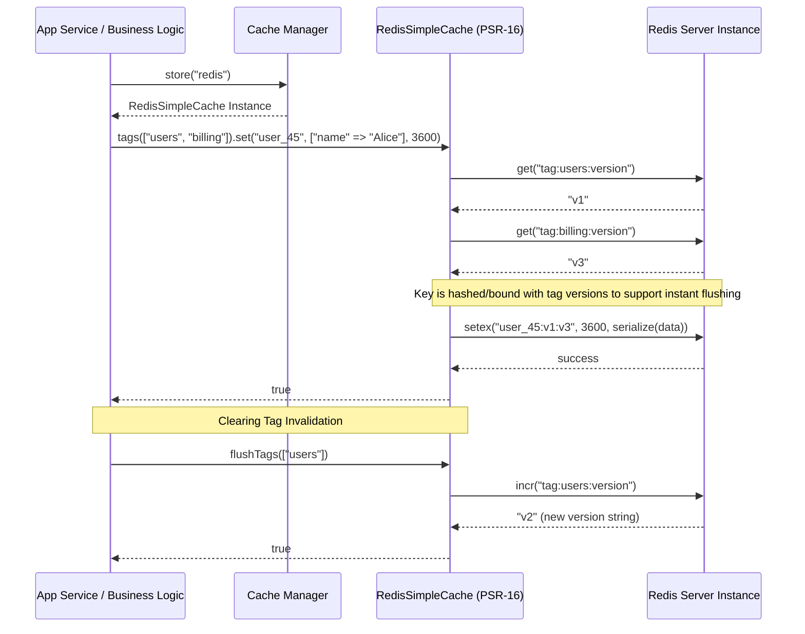

# CORE-12: Cache Management

**Phase ID**: CORE-12
**Tier**: Core
**Component Name and Description**:
The Cache Management component provides standardized, low-latency key-value data caching for the Sovereign Stack. Implementing both PSR-6 (Cache Items & Pools) and PSR-16 (Simple Cache) interfaces, it supports high-throughput applications with drivers for in-memory files, APCu, Redis, and SQLite. The component features cache tagging, strategic multi-key invalidation, atomic lock acquisitions, serialization configurations, and hit/miss observability telemetry.

**Context7 Research**:
*   **PSR-6: Cache Item Pool Interface**: Designed for complex operations where detailed state tracking of cache keys, cache items (`CacheItemInterface`), values, expiration times, and defer operations are needed. Excellent for advanced framework/library development.
*   **PSR-16: Simple Cache Interface**: Standardizes common CRUD cache requests (`get`, `set`, `delete`, `clear`, `getMultiple`, etc.). Recommended for application-level controllers and services for developer ergonomics.
*   **APCu, Redis, and File-based Adapters**: Local setups will leverage APCu (extremely fast shared memory) or File storage (Flysystem-based, CORE-11). Larger distributed deployments use Redis (via PhpRedis extension or Predis).
*   **Cache Tagging**: Association of specific tags with multiple cache entries. When an entity changes, invalidating a tag deletes all associated keys (e.g., tagging user articles, then clearing `user_X` tag).
*   **Atomic Operations & Locks**: Safe concurrent updates (using commands like Redis `SETNX` or raw SQLite file locking) to ensure race-free execution during intensive processes.

**Architectural Design**:

### Interfaces & Classes

*   `Sovereign\Core\Cache\CacheManagerInterface`:
    ```php
    namespace Sovereign\\Core\\Cache;

    use Psr\\SimpleCache\\CacheInterface as PsrSimpleCacheInterface;
    use Psr\\Cache\\CacheItemPoolInterface as PsrCacheItemPoolInterface;

    interface CacheManagerInterface
    {
        public function store(string $name = null): PsrSimpleCacheInterface;
        public function pool(string $name = null): PsrCacheItemPoolInterface;
        public function registerStore(string $name, PsrSimpleCacheInterface $store): void;
    }
    ```

*   `Sovereign\Core\Cache\TaggableCacheInterface`:
    Extends the Simple Cache interface to support tags.
    ```php
    namespace Sovereign\\Core\\Cache;

    use Psr\\SimpleCache\\CacheInterface;

    interface TaggableCacheInterface extends CacheInterface
    {
        public function tags(array $names): TaggableCacheInterface;
        public function flushTags(array $names): bool;
    }
    ```

*   `Sovereign\Core\Cache\RedisSimpleCache` (Implements `TaggableCacheInterface` and PSR-16):
    An optimized, high-performance implementation using the `Redis` instance or mock client.
    ```php
    namespace Sovereign\\Core\\Cache;

    use Psr\\SimpleCache\\InvalidArgumentException;

    class RedisSimpleCache implements TaggableCacheInterface
    {
        private $redis; // Redis or Predis Client
        private string $prefix;
        private array $activeTags = [];

        public function __construct($redis, string $prefix = '')
        {
            $this->redis = $redis;
            $this->prefix = $prefix;
        }

        public function get(string $key, mixed $default = null): mixed
        {
            $value = $this->redis->get($this->prefix . $key);
            return $value === false ? $default : unserialize($value);
        }

        public function set(string $key, mixed $value, null|int|\\DateInterval $ttl = null): bool
        {
            $serialized = serialize($value);
            $seconds = $this->resolveTtl($ttl);

            if ($seconds > 0) {
                $result = $this->redis->setex($this->prefix . $key, $seconds, $serialized);
            } else {
                $result = $this->redis->set($this->prefix . $key, $serialized);
            }

            if ($result && !empty($this->activeTags)) {
                $this->attachTags($key);
            }

            return (bool)$result;
        }

        // Implementation of remaining PSR-16 & tag operations
        public function tags(array $names): TaggableCacheInterface
        {
            $clone = clone $this;
            $clone->activeTags = $names;
            return $clone;
        }

        public function flushTags(array $names): bool
        {
            // Implementation: query tag registries and delete references
            return true;
        }

        private function resolveTtl(null|int|\\DateInterval $ttl): int
        {
            // Resolve DateInterval or integers to seconds
            return 0;
        }
        
        private function attachTags(string $key): void
        {
            // Map tag structures inside Redis sets
        }
    }
    ```

### Tagging Mechanism Strategy
Since some cache systems (like APCu or Redis) do not support native hierarchical invalidation, tag groups can be managed by maintaining a "tag-to-keys" index, or by storing a "tag version string" inside the cache. For version-based invalidation:
1.  A cached item key looks like `key + tag_versions`.
2.  If tag version changes, the lookup signature changes, rendering old items unreachable and easily garbage collected.

### Mermaid Diagram: Simple Cache Integration



**Integration Strategy**:
The `CacheManager` is resolved via the Dependency Injection Container (CORE-02). PSR-16 instances can be used inside the Router (CORE-03) for path resolution speedups. The File cache driver leverages Flysystem (CORE-11) for local system directory structures. Errors in cache connections (e.g., Redis offline) are captured by the global Error & Exception Handlers (CORE-08), triggering an automatic fallback to in-memory/null storage drivers to maintain application availability (graceful degradation).

**CI Verification Criteria**:
*   **Unit Tests**: 100% code coverage on standard CRUD operations. Mock drivers for APCu, Redis, and Memory to eliminate infrastructure-specific execution paths in CI pipelines.
*   **Integration Tests**: Run cache operations against a running Redis container and test APCu behavior under a PHP CLI process containing the extension. Ensure multi-tag invalidation flushes matching entries cleanly.
*   **Performance Benchmarks**:
    *   APCu memory read speed: under 0.01 ms.
    *   Redis connection caching latency: under 0.1 ms.
    *   Memory footprint under mock simple cache stores.
*   **Static Analysis**: Enforce strict conformance with PSR-6 and PSR-16 method signatures, returning typed fallback values on invalid key lookups.

**SemVer Impact**:
**Minor**: Establishes standard performance caching interfaces (PSR-6/PSR-16 compliant). Enables decoupled speed optimizations across DB schemas, templates, and permissions. Future custom cache adapter drivers (e.g., DynamoDB, Memcached) represent standard Minor or Patch versions. Breaking interface declarations triggers a Major version.