# CORE-13: Cryptographic Core Engine

**Phase ID**: CORE-13  
**Tier**: Core  

## Component Name and Description
The Cryptographic Core Engine delivers high‑assurance, FIPS‑compatible encryption and key‑management services for the Sovereign Stack. It provides:

* **AES‑256‑GCM** and **ChaCha20‑Poly1305** authenticated encryption (AEAD) primitives.  
* **HKDF‑SHA256/384** key derivation with configurable salt and info fields.  
* **Secure key derivation** wrappers (`KeyDerivationService`) that enforce minimum iteration counts and memory-hard parameters.  
* **Blind indexing** support for encrypted column search (deterministic encryption for indexed fields).  
* **Driver abstraction** over OpenSSL and libsodium, enabling transparent fallback between the two based on platform availability and policy.  

This engine is the cryptographic foundation for all subsequent tiers (Session, Tenancy, Scheduler, Model, View) and must be versioned to guarantee backward‑compatible key‑handling semantics.

---

## Context7 Research
| Topic | Reference | Key Takeaways |
|-------|-----------|---------------|
| AES‑256‑GCM in PHP | `/websites/php_net_manual_en` – *AES‑256‑GCM decryption* | Use `openssl_decrypt` with `OPENSSL_RAW_DATA` and explicit tag handling; ensure tag length = 16 bytes. |
| ChaCha20‑Poly1305 | `/jedisct1/libsodium-doc` – *Secret‑stream* | libsodium’s `crypto_aead_chacha20poly1305_ietf_encrypt`/`decrypt` provide AEAD with 24‑byte nonces; preferred on ARM where OpenSSL may be unavailable. |
| HKDF | `/websites/php_net_manual_en` – *hash_hkdf()* | `hash_hkdf('sha256', $key, $len, $info, $salt)` produces derived keys; must use cryptographic hash and random salt. |
| Secure Key Derivation | `/websites/php_net_manual_en` – *password_hash()* patterns | Enforce ≥ 2^16 memory cost and ≥ 1 ms time cost; wrap in `KeyDerivationService` to centralize parameters. |
| Blind Indexing | `/thephpleague/flysystem-local` (storage abstraction) | Deterministic encryption for indexed columns; store separate “version” token to allow re‑encryption. |
| Driver Abstraction | `/thephpleague/flysystem-bundle` (strategy pattern) | Define `EncryptionDriverInterface`; implement `OpenSslAesGcmDriver` and `SodiumChaChaDriver`. |

---

## Architectural Design

### Package Layout
```
Sovereign\Core\Crypto\
    ├─ Drivers\
    │    ├─ EncryptionDriverInterface.php
    │    ├─ OpenSslAesGcmDriver.php
    │    └─ SodiumChaChaDriver.php
    ├─ KeyDerivation\
    │    └─ KeyDerivationService.php
    ├─ BlindIndex\
    │    └─ DeterministicEncryption.php
    └─ CryptoFacade.php
```

### Core Interfaces
```php
namespace Sovereign\Core\Crypto\Drivers;

interface EncryptionDriverInterface
{
    public function encrypt(string $plaintext, string $key, string $nonce, string $aad = ''): string;
    public function decrypt(string $ciphertext, string $key, string $nonce, string $aad = ''): string;
}
```

```php
namespace Sovereign\Core\Crypto\KeyDerivation;

interface KeyDerivationInterface
{
    /**
     * Derive an encryption key from a master secret.
     *
     * @param string $masterSecret Random bytes (32‑256)
     * @param string $info         Context string
     * @param int    $length       Desired key length in bytes
     * @return string              Derived key
     */
    public function derive(string $masterSecret, string $info, int $length): string;
}
```

### Implementations
* **OpenSslAesGcmDriver** – wraps `openssl_encrypt`/`openssl_decrypt` with AES‑256‑GCM.  
* **SodiumChaChaDriver** – wraps libsodium’s `crypto_aead_chacha20poly1305_ietf_encrypt`/`decrypt`.  
* **KeyDerivationService** – uses `hash_hkdf` with configurable `memory_cost` and `time_cost`.  
* **DeterministicEncryption** – provides blind indexing by returning `hash($plaintext || $key)` for indexed fields; stores a version token for re‑encryption.

### Mermaid Component Diagram

```mermaid
graph TD
    A[CryptoFacade] --> B[EncryptionDriverInterface]
    A --> C[KeyDerivationService]
    A --> D[BlindIndexService]
    B -->|Uses| E[OpenSslAesGcmDriver]
    B -->|Uses| F[SodiumChaChaDriver]
    C -->|Calls| G[hash_hkdf]
    D -->|Stores| H[DeterministicEncryption]
    style A fill:#001f3f,stroke:#333,stroke-width:2px
    style B fill:#0074D9,stroke:#333,stroke-width:1px
    style C fill:#2ECC40,stroke:#333,stroke-width:1px
    style D fill:#FF4136,stroke:#333,stroke-width:1px
    style E,F,G,H fill:#AAA,stroke:#555,stroke-width:1px
```


### Design Patterns Applied
| Pattern | Purpose |
|---------|---------|
| **Strategy** | Switch between OpenSSL and Sodium drivers at runtime based on `CryptoFacade::driver()` configuration. |
| **Factory** | `CryptoFacade::createDriver()` decides which driver to instantiate. |
| **Decorator** | `BlindIndexDecorator` wraps an `EncryptionDriverInterface` to add deterministic indexing. |
| **Singleton** | `KeyDerivationService` is a singleton to reuse HKDF parameters globally. |
| **Builder** | `EncryptionOptions` builder configures AEAD parameters (nonce length, tag length, cipher). |

---

## Integration Strategy
* **Dependency on CORE‑01**: Provides low‑level primitive `random_bytes()` and `bin2hex()` utilities from the Foundational Kernel for generating master secrets.  
* **Consumer Dependencies**:  
  * **CORE‑15 (Session & Cookie Manager)** – uses the driver to encrypt session payloads.  
  * **CORE‑14 (Multi‑Tenancy Core Isolator)** – encrypts tenant‑specific configuration blobs.  
  * **CORE‑16 (Task Scheduler)** – signs task payloads to prevent tampering.  
  * **CORE‑18 (View & SuperPHP Transpiler)** – encrypts cached view fragments.  
* **Configuration**: The `crypto.yaml` file defines `default_driver`, `aes_key_size`, `chacha_key_size`, `hkdf_iterations`, and `blind_index_enabled`.  
* **Fallback**: If the preferred driver fails (e.g., OpenSSL missing), the `CryptoFacade` automatically falls back to the secondary driver and logs a warning via CORE‑08 (Error & Exception Handlers).  

---

## CI Verification Criteria
| Area | Requirement |
|------|-------------|
| **Unit Tests** | 100 % branch coverage on `EncryptionDriverInterface`, `KeyDerivationService`, and `DeterministicEncryption`. Mock OpenSSL and libsodium functions using `phpunit-mock-objects`. |
| **Integration Tests** | Execute against a real OpenSSL binary and a libsodium PHP extension in a Docker container. Verify that encrypt‑then‑decrypt round‑trip yields identical plaintext for AES‑256‑GCM and ChaCha20‑Poly1305. |
| **Performance Benchmarks** | *Ops/sec* ≥ 150 k AES‑256‑GCM encryptions on a 2 GHz core; ≥ 200 k ChaCha20‑Poly1305 encryptions. Memory usage ≤ 2 MiB per 10 k operations. |
| **Security Tests** | Constant‑time comparison for ciphertext/tag validation; ensure no padding oracle via `openssl_decrypt` error handling. |
| **Static Analysis** | Enforce PSR‑12 coding style; run `phpstan` with level 7; verify that all public methods declare precise return types. |
| **Compliance Checks** | Verify that `hash_hkdf` uses only cryptographic algorithms (`sha256`, `sha384`). Ensure blind index tokens are stored with a version prefix to allow future re‑encryption. |

---

## SemVer Impact
**Minor** – Introduces a new cryptographic engine with backward‑compatible API extensions (new driver interfaces, optional blind indexing). Existing code compiled against CORE‑01’s crypto utilities continues to work; breaking changes only occur if a caller explicitly relied on OpenSSL‑only behavior, which is mitigated by the fallback mechanism.

--- 

*Prepared by the Sovereign Stack Architect Team*  