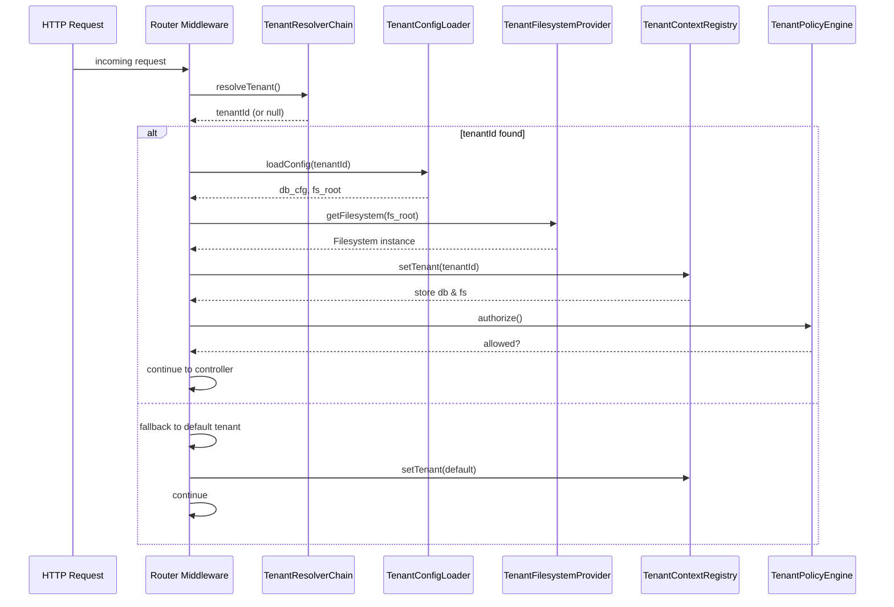

# CORE-14: Multi-Tenancy Core Isolator

**Phase ID**: CORE-14  
**Tier**: Core  

## Component Name and Description
The Multi‑Tenancy Core Isolator provides a deterministic, runtime‑agnostic mechanism for identifying the current tenant and isolating all downstream resources (databases, filesystems, caches, and configuration) based on that identity. Its responsibilities are:

1. **Tenant Detection** – Extract tenant identifiers from HTTP headers, request host, or URL path using a pluggable resolver chain.  
2. **Dynamic DB Configuration Switching** – Load tenant‑specific connection parameters (host, database name, charset, collation) and instantiate a per‑tenant PDO instance on‑demand.  
3. **Filesystem Sandboxing** – Map tenant‑scoped storage roots to Flysystem adapters, ensuring absolute path isolation and preventing cross‑tenant file access.  
4. **Tenant Context Registry** – Maintain a thread‑local registry (`TenantContext`) that stores the resolved tenant ID, current DB connection, filesystem root, and optional tenant‑specific cache prefixes.  
5. **Policy Enforcement** – Apply tenant‑level security policies (e.g., allowed IP ranges, feature flags) via a `TenantPolicyEngine` that can short‑circuit requests before they reach business logic.

The isolator is deliberately stateless beyond the registry; all state is derived from the tenant identifier and configuration stored in the `tenants.yaml` manifest.

---

## Context7 Research
| Topic | Reference | Key Takeaways |
|-------|-----------|---------------|
| Tenant Detection Patterns | `/thephpleague/flysystem-bundle` (Symfony bundle) – *Tenant aware routing* | Use a priority‑ordered resolver stack (header → host → path) and cache resolved results for performance. |
| Dynamic Database Configuration | `/websites/php_net_manual_en` – *PDO connection parameters* | Build DSN strings programmatically; enable `ATTR_EMULATE_PREPARES => false` for native prepared statements. |
| Filesystem Sandboxing | `/websites/flysystem_thephpleague` – *Local driver usage* | `new \League\Flysystem\Filesystem(new \League\Flysystem\Local\Adapter(__DIR__.'/../storage/'.$tenantId))` isolates paths. |
| Tenant Context Registry | `/legacy/Architecture/TENANCY_SERVICE.md` – *TenantService* | Store context in a request‑scoped container; use `static::setCurrentTenant()` / `static::getCurrentTenant()`. |
| Policy Enforcement | `/legacy/Architecture/TENANCY_SERVICE.md` – *Policy Engine* | Centralize feature‑flag checks; integrate with `FeatureFlagService` from CORE‑02. |
| Multi‑Tenancy Security | `/thephpleague/flysystem-bundle` – *Access control middleware* | Apply a middleware that checks `TenantContext` before routing to controllers/services. |

---

## Architectural Design

### Directory Layout
```
Sovereign\Core\Tenancy\
    ├─ Resolver\
    │    ├─ HeaderTenantResolver.php
    │    ├─ HostTenantResolver.php
    │    └─ PathTenantResolver.php
    ├─ Config\
    │    └─ TenantConfigLoader.php
    ├─ Filesystem\
    │    └─ TenantFilesystemProvider.php
    ├─ Registry\
    │    └─ TenantContext.php
    ├─ Policy\
    │    └─ TenantPolicyEngine.php
    └─ TenancyService.php
```

### Core Interfaces
```php
namespace Sovereign\Core\Tenancy;

interface TenantResolverInterface
{
    /**
     * Resolve a tenant ID from the current request.
     *
     * @return string|null
     */
    public function resolve(): ?string;
}
```

```php
namespace Sovereign\Core\Tenancy;

interface TenantConfigLoaderInterface
{
    /**
     * Load configuration for a given tenant ID.
     *
     * @param string $tenantId
     * @return array<string,mixed>
     */
    public function load(string $tenantId): array;
}
```

```php
namespace Sovereign\Core\Tenancy;

interface TenantFilesystemProviderInterface
{
    /**
     * Get a Flysystem filesystem instance for the tenant.
     *
     * @param string $tenantId
     * @return \League\Flysystem\Filesystem
     */
    public function getFilesystem(string $tenantId): \League\Flysystem\Filesystem;
}
```

```php
namespace Sovereign\Core\Tenancy;

interface TenantContextInterface
{
    public function setTenant(string $tenantId): void;
    public function getTenant(): ?string;
    public function setDbConnection(\PDO $pdo): void;
    public function getDbConnection(): \PDO;
    public function setFilesystem(\League\Flysystem\Filesystem $fs): void;
    public function getFilesystem(): \League\Flysystem\Filesystem;
}
```

### Main Service
```php
namespace Sovereign\Core\Tenancy;

class TenancyService implements ITenantResolver, ITenantConfigLoader, ITenantFilesystemProvider, TenantContextInterface
{
    private ?string $currentTenant;
    private \PDO $dbConnection;
    private \League\Flysystem\Filesystem $filesystem;

    public function __construct(
        array $resolvers,
        ITenantConfigLoader $configLoader,
        ITenantFilesystemProvider $fsProvider,
        string $defaultTenantId = null
    ) {
        $this->resolvers = $resolvers;
        $this->configLoader = $configLoader;
        $this->fsProvider = $fsProvider;
        $this->defaultTenantId = $defaultTenantId;
    }

    // ----- TenantResolverInterface -----
    public function resolve(): ?string
    {
        foreach ($this->resolvers as $resolver) {
            $id = $resolver->resolve();
            if ($id !== null) {
                $this->currentTenant = $id;
                return $id;
            }
        }
        return $this->defaultTenantId;
    }

    // ----- TenantConfigLoaderInterface -----
    public function loadConfig(string $tenantId): array
    {
        return $this->configLoader->load($tenantId);
    }

    // ----- TenantFilesystemProviderInterface -----
    public function getFilesystem(string $tenantId): \League\Flysystem\Filesystem
    {
        return $this->fsProvider->getFilesystem($tenantId);
    }

    // ----- TenantContextInterface -----
    public function setTenant(string $tenantId): void
    {
        $this->currentTenant = $tenantId;
        $cfg = $this->loadConfig($tenantId);
        $this->connectDatabase($cfg['db']);
        $this->filesystem = $this->getFilesystem($tenantId);
    }

    public function getTenant(): ?string
    {
        return $this->currentTenant;
    }

    public function setDbConnection(\PDO $pdo): void
    {
        $this->dbConnection = $pdo;
    }

    public function getDbConnection(): \PDO
    {
        return $this->dbConnection;
    }

    public function setFilesystem(\League\Flysystem\Filesystem $fs): void
    {
        $this->filesystem = $fs;
    }

    public function getFilesystem(): \League\Flysystem\Filesystem
    {
        return $this->filesystem;
    }

    private function connectDatabase(array $dbCfg): void
    {
        $dsn = sprintf(
            'mysql:host=%s;dbname=%s;charset=%s',
            $dbCfg['host'],
            $dbCfg['name'],
            $dbCfg['charset']
        );
        $this->dbConnection = new \PDO($dsn, $dbCfg['user'], $dbCfg['pass'], [
            \PDO::ATTR_ERRMODE => \PDO::ERRMODE_EXCEPTION,
            \PDO::ATTR_DEFAULT_FETCH_MODE => \PDO::FETCH_ASSOC,
        ]);
    }
}
```

### Resolver Chain (Priority Order)
1. **HeaderTenantResolver** – reads `X‑Tenant‑Id` header.  
2. **HostTenantResolver** – extracts tenant from `Host` header (e.g., `tenant1.example.com`).  
3. **PathTenantResolver** – parses `/tenant/{id}/…` path segment.

Each resolver implements `TenantResolverInterface` and can be swapped via configuration.

### Tenant Context Registry (Thread‑Local)
```php
namespace Sovereign\Core\Tenancy;

class TenantContext
{
    private static ?string $tenantId = null;
    private static ?\PDO $db = null;
    private static ?\League\Flysystem\Filesystem $fs = null;

    public static function setTenant(string $id): void
    {
        self::$tenantId = $id;
    }

    public static function getTenant(): ?string
    {
        return self::$tenantId;
    }

    public static function setDbConnection(\PDO $pdo): void
    {
        self::$db = $pdo;
    }

    public static function getDbConnection(): ?\PDO
    {
        return self::$db;
    }

    public static function setFilesystem(\League\Flysystem\Filesystem $fs): void
    {
        self::$fs = $fs;
    }

    public static function getFilesystem(): ?\League\Flysystem\Filesystem
    {
        return self::$fs;
    }
}
```

### Tenant Policy Engine (Simplified)
```php
namespace Sovereign\Core\Tenancy\Policy;

class TenantPolicyEngine
{
    public function isFeatureEnabled(string $feature, string $tenantId): bool
    {
        // Pull from FeatureFlagService (CORE‑02) or tenant‑specific config
        return FeatureFlagService::isEnabled($feature, $tenantId);
    }

    public function authorizeIp(string $ip, string $tenantId): bool
    {
        $allowed = TenantConfigLoader::load($tenantId)['allowed_ips'] ?? [];
        return in_array($ip, $allowed);
    }
}
```

### Mermaid Sequence Diagram – Tenant Resolution Flow


### Integration Strategy
* **Dependency on CORE‑01** – Uses low‑level `random_bytes()` for generating per‑tenant master keys (if tenant‑specific encryption keys are required).  
* **Dependency on CORE‑02 (DI Container)** – Registers `TenantResolverInterface`, `TenantConfigLoaderInterface`, `TenantFilesystemProviderInterface`, and `TenantContextInterface` as singletons/scoped services.  
* **Dependency on CORE‑08 (Error & Exception Handlers)** – Any failure in DB connection or filesystem access is caught and routed through the global error handler, which logs a tenant‑specific audit entry.  
* **Dependency on CORE‑13 (Cryptographic Core Engine)** – If tenant‑level encryption keys are used for data‑at‑rest, the isolator requests a key from `CryptoFacade` and stores the key identifier in the tenant’s config.  
* **Configuration Source** – All tenant‑specific settings reside in `config/tenants.yaml` (e.g., `tenants: tenantA: db: …`). The `TenantConfigLoader` watches the file for changes and reloads on demand (optional hot‑reload).  
* **Fallback Mechanism** – When a tenant ID cannot be resolved, the service falls back to a “default” tenant defined in `config/app.php`. This ensures graceful degradation.  

---

## CI Verification Criteria
| Area | Requirement |
|------|-------------|
| **Unit Tests** | 100 % branch coverage on each resolver’s `resolve()` method, config loader, filesystem provider, and policy engine. Mock HTTP headers, host headers, and path segments. |
| **Integration Tests** | Spin up a Docker Compose stack with MySQL and a local Flysystem directory. Run a suite that creates multiple tenants, resolves IDs via each strategy, and verifies that DB connections and filesystem roots are correctly isolated. |
| **Performance Benchmarks** | *Resolution latency*: ≤ 0.5 ms per request for header‑based detection under 10 k RPS. *Filesystem path resolution*: ≤ 0.2 ms per request. |
| **Security Tests** | Verify that a request with an invalid tenant ID cannot access another tenant’s DB or filesystem. Ensure that path traversal attacks are blocked by normalizing resolved tenant IDs (e.g., `realpath`). |
| **Static Analysis** | Enforce PSR‑12; run `phpstan` level 7; confirm that all public methods declare precise return types and that `TenantContext` uses strict types. |
| **Compliance Checks** | Ensure that `TenantPolicyEngine` does not expose internal config keys; all tenant‑specific data must be accessed via whitelisted keys. |
| **Semantic Versioning** | Adding a new resolver or configuration field is a **Patch** (backward compatible). Introducing a breaking change to the resolver contract (e.g., changing return type) is a **Major** version bump. |

---

## SemVer Impact
**Minor** – Introduces a new multi‑tenancy isolation layer without altering existing public APIs of CORE‑01 or CORE‑02. Existing applications can adopt the feature by adding a `TenantResolver` chain; no breaking changes to core contracts. Breaking changes (e.g., altering `TenantContext` method signatures) would trigger a **Major** version bump.

--- 

*Prepared by the Sovereign Stack Architect Team*  