# CORE-16: Task Scheduler & Cron Runner

**Phase ID**: CORE-16  
**Tier**: Core  

## Component Name and Description
The Task Scheduler & Cron Runner provides a robust, cron-like task scheduling system for the Sovereign Stack. It enables:

1. **Schedule Definition Registry** – Define tasks with cron expressions, priority levels, and dependencies.  
2. **Overlap Prevention** – Enforce concurrency controls (e.g., lock files, database locks) to prevent simultaneous execution of conflicting tasks.  
3. **Output Capturing** – Stream task stdout/stderr to files or a centralized log system (e.g., CORE-15 session logs).  
4. **Failure Telemetry** – Track execution errors, timeouts, and retries with tenant-specific context (via CORE-14).  
5. **Task Lifecycle Management** – Support task pausing, resuming, and dynamic schedule updates via API or CLI.  

The scheduler is built on Symfony's `symfony/scheduler` component (or a custom implementation) and integrates with the DI container (CORE-02) for service registration.

---

## Context7 Research
| Topic | Reference | Key Takeaways |
|-------|-----------|---------------|
| Cron Expressions | `/dragonmantank/cron-expression` | Parse complex cron patterns (e.g., `*/5 * * * *` for every 5 minutes). |
| Symfony Scheduler | `/symfony/scheduler` | Define tasks with `PeriodicTask` and `CronExpression`; supports concurrency control via `LockProvider`. |
| Task Locking | `/symfony/scheduler` – *LockProvider* | Use database locks or file locks to prevent overlaps. |
| Output Streaming | `/symfony/scheduler` – *ProcessRunner* | Capture task output via `ProcessBuilder` and `ProcessRunner`. |
| Telemetry | `/symfony/scheduler` – *TaskStatusListener* | Implement listeners to track task states (success/failure). |
| CLI Integration | `/symfony/console` | Expose scheduler commands for task management (start, stop, list). |

---

## Architectural Design

### Package Layout
```
Sovereign\Core\Scheduler\
    ├─ Tasks\
    │    ├─ TaskInterface.php
    │    ├─ CronTask.php
    │    └─ ScheduledTask.php
    ├─ Locking\
    │    └─ DatabaseLockProvider.php
    ├─ Output\
    │    └─ OutputCapturer.php
    ├─ Telemetry\
    │    └─ FailureReporter.php
    ├─ SchedulerService.php
    └─ CronExpressionParser.php
```

### Core Interfaces
```php
namespace Sovereign\Core\Scheduler;

interface TaskInterface
{
    public function execute(): bool;
    public function getSchedule(): string;
}
```

```php
namespace Sovereign\Core\Scheduler\Locking;

interface LockProviderInterface
{
    public function acquireLock(string $taskId): bool;
    public function releaseLock(string $taskId): void;
}
```

### Implementations
* **CronTask** – Implements `TaskInterface` and parses cron expressions via `CronExpressionParser`.  
* **DatabaseLockProvider** – Acquires/releases locks in a `task_locks` table (`task_id`, `locked_at`, `expires_at`).  
* **OutputCapturer** – Uses `ProcessBuilder` to run tasks and captures stdout/stderr to files or CORE-15 logs.  
* **FailureReporter** – Logs failures to a `task_failures` table with tenant ID (CORE-14) and error details.  
* **SchedulerService** – Manages task registry, executes tasks based on cron schedules, and handles concurrency.  
* **CronExpressionParser** – Uses `dragonmantank/cron-expression` to validate and parse cron strings.  

### Mermaid Component Diagram

```mermaid
graph TD
    A[SchedulerService] --> B[CronExpressionParser]
    A --> C[TaskRegistry]
    A --> D[LockProvider]
    A --> E[OutputCapturer]
    A --> F[FailureReporter]
    B -->|Parse| G[CronTask]
    G --> H[TaskExecution]
    H --> I[OutputCapturer]
    H --> J[FailureReporter]
    style A fill:#001f3f,stroke:#333,stroke-width:2px
    style B fill:#0074D9,stroke:#333,stroke-width:1px
    style C fill:#2ECC40,stroke:#333,stroke-width:1px
    style D fill:#FF4136,stroke:#333,stroke-width:1px
    style E fill:#0074D9,stroke:#333,stroke-width:1px
    style F fill:#FF4136,stroke:#333,stroke-width:1px
    style G fill:#AAA,stroke:#555,stroke-width:1px
    style H fill:#001f3f,stroke:#333,stroke-width:1px
    style I fill:#0074D9,stroke:#333,stroke-width:1px
    style J fill:#FF4136,stroke:#333,stroke-width:1px
```


### Integration Strategy
| Dependency | Integration Point | Reason |
|------------|-------------------|--------|
| **CORE-02 (DI Container)** | Register `SchedulerService`, `LockProvider`, and `TaskInterface` implementations as singletons. | Enables automatic task scheduling and dependency injection. |
| **CORE-08 (Error & Exception Handlers)** | Centralize failure logging and telemetry via `FailureReporter`. | Ensures tenant-specific audit entries. |
| **CORE-13 (Cryptographic Core Engine)** | Encrypt sensitive task outputs if required (e.g., logs with PII). | Uses CORE-13 drivers for secure storage. |
| **CORE-14 (Multi-Tenancy Core Isolator)** | Attach tenant ID to task logs and failure reports. | Enforces per-tenant isolation in telemetry. |
| **CORE-15 (Session & Cookie Manager)** | Store task-specific session data if needed (e.g., user context for scheduled tasks). | Shared session space for authenticated tasks. |
| **CORE-18 (View & SuperPHP Transpiler)** | Expose scheduler status via API endpoints rendered by SuperPHP. | Real-time dashboard for task monitoring. |

### CI Verification Criteria
| Area | Requirement |
|------|-------------|
| **Unit Tests** | 100 % coverage on `SchedulerService`, `LockProvider`, `OutputCapturer`, and `FailureReporter`. Mock cron expressions and task executions. |
| **Integration Tests** | Run scheduler in Docker with MySQL for locks and logs. Test overlap prevention, output capture, and failure reporting. |
| **Performance Benchmarks** | *Task execution frequency*: Ensure cron tasks run within ±1 minute of schedule. *Lock acquisition*: ≤ 0.1 ms per lock operation. |
| **Security Tests** | Verify locks prevent concurrent execution; ensure tenant ID is included in all telemetry. |
| **Static Analysis** | Enforce PSR-12; run `phpstan` level 7; confirm strict types in all public methods. |
| **Compliance Checks** | Ensure task logs include tenant ID and are encrypted if sensitive. |
| **Semantic Versioning** | Adding a new lock provider (e.g., Redis) is a **Patch**. Changing `TaskInterface` methods is a **Minor**. Breaking changes (e.g., removing cron support) are **Major**. |

---

## SemVer Impact
**Minor** – Introduces a new task scheduling layer without altering existing public APIs of CORE-01 to CORE-15. Existing applications can adopt the scheduler by registering tasks in the DI container; no breaking changes to core contracts. Breaking changes (e.g., removing cron expression support) would trigger a **Major** version bump.

--- 

*Prepared by the Sovereign Stack Architect Team*  