# CORE-18: View & SuperPHP Transpiler Foundation

**Phase ID**: CORE-18  
**Tier**: Core  

## Component Name and Description
The View & SuperPHP Transpiler Foundation provides the compilation, caching, and rendering infrastructure for Sovereign Stack’s view layer. It translates **SuperPHP** template files (a superset of PHP with custom directives) into optimized intermediate code, caches the compiled artifacts, and executes them within a secure sandbox. Key responsibilities are:

1. **AST‑Based SuperPHP Compiler Entry Point** – Parses SuperPHP source files into an Abstract Syntax Tree (AST) using a dedicated parser.  
2. **Compilation Cache Management** – Stores compiled bytecode in a persistent cache (e.g., Redis or filesystem) keyed by file hash and tenant ID (CORE‑14). Cache entries expire based on configuration or manual invalidation.  
3. **Context Injection** – Merges tenant‑specific data (CORE‑14), session data (CORE‑15), and global variables into the compiled scope before execution.  
4. **View Rendering Loop** – Orchestrates the rendering pipeline: compile → cache → execute → capture output → inject into PSR‑7 response.  
5. **SuperPHP Compiler Service** – Exposes a singleton `SuperPhpCompiler` that coordinates parsing, caching, and execution, integrating with CORE‑13 for encrypted cache keys when required.  

The foundation ensures high‑performance view rendering while maintaining isolation between tenants and enabling hot‑reload of templates in development mode.

---

## Context7 Research
| Topic | Reference | Key Takeaways |
|-------|-----------|---------------|
| SuperPHP Language Specification | `/legacy/Architecture/CORE_FRAMEWORK.md` – *SuperPHP Overview* | Describes custom directives (`@section`, `@slot`, `@extends`) and the parser architecture. |
| AST Generation in PHP | `/thephpleague/parser` (Parser library) | Uses `Parser::parse(file_get_contents($path))` to produce an AST; supports custom node types for SuperPHP constructs. |
| Cache Stampede Prevention | `/symfony/cache` – *CacheInterface* | Implements `get()` with `default` and `fetch()` strategies; uses lockable cache entries to avoid stampede on cache miss. |
| PSR‑7 Response Handling | `/psr/http-message` – *ResponseInterface* | `withHeader()` and `getBody()` methods for injecting rendered view output; ensures immutability. |
| Cache Serialization Formats | `/thephpleague/flysystem` – *Serialization* | Stores compiled bytecode as binary strings; optionally encrypts cache keys with CORE‑13 drivers. |
| Tenant‑Aware Context Injection | `/thephpleague/flysystem-bundle` – *Tenant routing* | Demonstrates injecting tenant ID into service configuration; used to scope variable extraction. |
| Incremental Compilation | `/nikic/php-parser` – *IncrementalParser* | Provides incremental parsing for changed files; can be leveraged to rebuild only affected AST nodes. |

---

## Architectural Design

### Package Layout
```
Sovereign\Core\View\
    ├─ Compiler\
    │    ├─ SuperPhpCompilerInterface.php
    │    └─ SuperPhpCompiler.php
    ├─ Parser\
    │    ├─ SuperPhpParser.php
    │    └─ Node\
    │         ├─ DirectiveNode.php
    │         ├─ SectionNode.php
    │         └─ SlotNode.php
    ├─ Cache\
    │    ├─ CompilationCacheInterface.php
    │    └─ FilesystemCache.php
    ├─ Context\
    │    └─ ContextInjector.php
    └─ Renderer\
         └─ ViewRenderer.php
```

### Core Interfaces
```php
namespace Sovereign\Core\View\Compiler;

interface SuperPhpCompilerInterface
{
    /**
     * Compile a SuperPHP file into executable bytecode.
     *
     * @return string Serialized bytecode
     */
    public function compile(string $sourceFile): string;
}
```

```php
namespace Sovereign\Core\View\Cache;

interface CompilationCacheInterface
{
    public function get(string $key): ?string;
    public function set(string $key, string $value, ?int $ttl = null): bool;
    public function invalidate(string $key): void;
}
```

```php
namespace Sovereign\Core\View\Context;

interface ContextInjectorInterface
{
    /**
     * Inject variables into the compiler context.
     *
     * @param string $bytecode Serialized bytecode
     * @param array $variables Associative variable list
     * @return string Modified bytecode
     */
    public function inject(string $bytecode, array $variables): string;
}
```

### Main Implementations
* **SuperPhpParser** – Leverages `thephpleague/parser` to build an AST; handles custom SuperPHP nodes (`DirectiveNode`, `SectionNode`, `SlotNode`).  
* **SuperPhpCompiler** – Traverses the AST, emits bytecode using a custom `CompilerVisitor`, and serializes the result.  
* **FilesystemCache** – Implements `CompilationCacheInterface` using Flysystem; stores bytecode under `storage/compiled/{hash}.bin`.  
* **ContextInjector** – Merges tenant data (CORE‑14), session data (CORE‑15), and global config into the bytecode’s symbol table before execution.  
* **ViewRenderer** – Executes compiled bytecode via `eval()` in a restricted scope, captures output with `ob_start()`, and returns a PSR‑7 response with the rendered body.  

### Mermaid Component Diagram

```mermaid
graph TD
    A[SuperPhpCompiler] --> B[SuperPhpParser]
    A --> C[CompilationCache]
    A --> D[ContextInjector]
    A --> E[ViewRenderer]
    B -->|Parse| F[AST]
    F -->|Traverse| G[CompilerVisitor]
    G --> H[Serialized Bytecode]
    H --> C[Cache Store]
    C -->|Cache Hit| A
    C -->|Cache Miss| H
    D --> H
    E -->|Execute| H
    E -->|Capture Output| I[PSR‑7 Response]
    I --> J[HTTP Response]
    style A fill:#001f3f,stroke:#333,stroke-width:2px
    style B fill:#0074D9,stroke:#333,stroke-width:1px
    style C fill:#2ECC40,stroke:#333,stroke-width:1px
    style D fill:#FF4136,stroke:#333,stroke-width:1px
    style E fill:#0074D9,stroke:#333,stroke-width:1px
    style F fill:#AAA,stroke:#555,stroke-width:1px
    style G fill:#AAA,stroke:#555,stroke-width:1px
    style H fill:#FF4136,stroke:#333,stroke-width:1px
    style I fill:#AAA,stroke:#555,stroke-width:1px
    style J fill:#001f3f,stroke:#333,stroke-width:1px
```


### Integration Strategy
| Dependency | Integration Point | Reason |
|------------|-------------------|--------|
| **CORE‑01** | Uses `random_bytes()` for generating unique cache keys when encryption is enabled. | Guarantees key entropy. |
| **CORE‑13 (Cryptographic Core Engine)** | Encrypts cache keys and serialized bytecode when `crypto.cache_encryption_enabled` is true. | Provides tenant‑isolated encrypted storage. |
| **CORE‑14 (Multi‑Tenancy Core Isolator)** | Supplies tenant ID for cache key namespacing and context injection. | Enforces per‑tenant view isolation. |
| **CORE‑15 (Session & Cookie Manager)** | Provides session data to `ContextInjector` for variable injection. | Allows views to access session variables securely. |
| **CORE‑16 (Task Scheduler)** | May pre‑compile views for scheduled tasks (e.g., email templates). | Enables async rendering. |
| **CORE‑02 (DI Container)** | Registers `SuperPhpCompilerInterface`, `CompilationCacheInterface`, and related services as singletons. | Facilitates lazy loading and configuration. |
| **CORE‑08 (Error & Exception Handlers)** | Catches compilation errors and renders them as HTTP 500 responses with sanitized messages. | Maintains production stability. |

---

## CI Verification Criteria
| Area | Requirement |
|------|-------------|
| **Unit Tests** | 100 % branch coverage on `SuperPhpCompiler`, `SuperPhpParser`, `CompilationCacheInterface`, and `ContextInjector`. Mock file I/O and cache operations. |
| **Integration Tests** | Run against a Docker Compose stack with Redis and a local filesystem. Verify that compiled bytecode is cached correctly, tenant‑specific contexts are injected, and rendered output matches expected HTML. |
| **Performance Benchmarks** | *Compilation latency*: ≤ 5 ms per SuperPHP file (cached). *Render throughput*: ≥ 10 k views/sec on a 2 GHz core. *Cache hit ratio*: ≥ 95 % under load. |
| **Security Tests** | Ensure that compiled bytecode cannot execute arbitrary PHP functions outside the allowed AST node set. Verify that encrypted cache keys cannot be tampered with (decryption failures result in cache miss). |
| **Static Analysis** | Enforce PSR‑12; run `phpstan` level 7; confirm strict types on all public methods. |
| **Compliance Checks** | Validate that view rendering respects tenant isolation (no cross‑tenant variable leakage). |
| **Semantic Versioning** | Adding a new parser node type is a **Patch**. Changing the `SuperPhpCompilerInterface::compile` signature is a **Minor**. Breaking changes (e.g., removing cache encryption) are **Major**. |

---

## SemVer Impact
**Minor** – Introduces a new view rendering foundation without altering existing public APIs of CORE‑01 to CORE‑17. Existing applications can adopt the compiler by registering it in the DI container; no breaking changes to core contracts. Breaking changes (e.g., removing cache encryption or altering the compile return type) would trigger a **Major** version bump.

--- 

*Prepared by the Sovereign Stack Architect Team*  