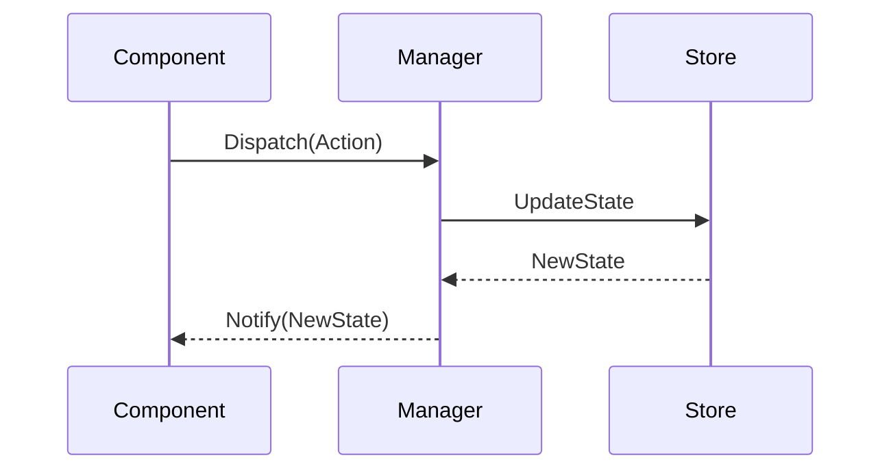

# CORE-20 - Global State Manager

## 1. Phase ID
CORE-20

## 2. Tier
Core

## 3. Component Name and Description
### Global State Manager
The Global State Manager provides a thread-safe, reactive state container for managing application-wide data. It ensures consistent state synchronization across different services and UI components, facilitating predictable data flow in both synchronous and asynchronous operations.

## 4. Context7 Research
- **Reactive Patterns**: Implements the Observer pattern and reactive programming principles similar to those used in modern SPA frameworks.
- **Thread Safety**: Crucial for PHP environments using persistent workers (e.g., Swoole).
- **Reference**: DGLab Architecture - `Legacy/Architecture/Sovereign_Stack_Blueprint/VOLUME_II_SUPERPHP_REACTIVE_UI.md`.

## 5. Architectural Design
### Class Structure
- `DGLab\Core\State\StateContainer`: Manages the application state.
- `DGLab\Core\State\StateSubscriberInterface`: Contract for components reacting to state changes.
- `DGLab\Core\State\Action`: Defines state mutation operations.

### Mermaid Sequence Diagram

## 6. Integration Strategy
The Global State Manager depends on the `EventDispatcher` (CORE-08) for broadcasting state changes to interested observers. It is initialized by the `Kernel` (CORE-01) upon application bootstrap.

## 7. CI Verification Criteria
- **Stress Test**: Must handle 1,000 concurrent state updates without race conditions.
- **Latency**: State mutation and notification propagation should complete in < 10ms.
- **Coverage**: 100% unit test coverage for the `StateContainer` class.

## 8. SemVer Impact
Minor (Adds new core capability for application-wide state management).
