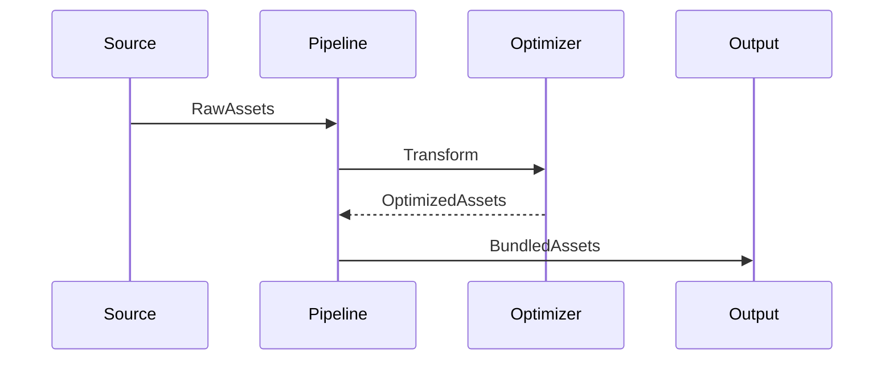

# HUB-19 - Asset Bundler Pipeline

## 1. Phase ID
HUB-19

## 2. Tier
Hub

## 3. Component Name and Description
### Asset Bundler Pipeline
The Asset Bundler Pipeline automates the processing, minification, and packaging of frontend assets (JS, CSS, SCSS). It ensures that all assets are optimized for production delivery, including source map generation and dependency resolution for complex SPA architectures.

## 4. Context7 Research
- **Optimized Delivery**: Focuses on performance benchmarks for PWA and SPA environments.
- **Tools**: Integration with Webpack and modern JavaScript build tools.
- **Reference**: DGLab Architecture - `Legacy/Architecture/ComponentBlueprints/AssetBundler/OVERVIEW.md`.

## 5. Architectural Design
### Design Patterns
- **Strategy Pattern**: For implementing different bundling/minification strategies (e.g., development vs. production).
- **Pipeline/Chain of Responsibility**: For applying sequential transformations (CSS pre-processing -> minification -> hashing).

### Mermaid Sequence Diagram

## 6. Integration Strategy
The Asset Bundler Pipeline integrates with the `Nexus` (CORE tier) to report build status and availability of new bundles. It also interfaces with the file system for resource discovery.

## 7. CI Verification Criteria
- **Asset Size Reduction**: Minification must reduce file size by at least 30% compared to raw assets.
- **Performance**: Build process for total project assets must complete in < 60 seconds.
- **Integrity**: MD5/SHA-256 hash generation for every output bundle for cache busting.

## 8. SemVer Impact
Minor (Enhancement to build pipeline and asset optimization).
