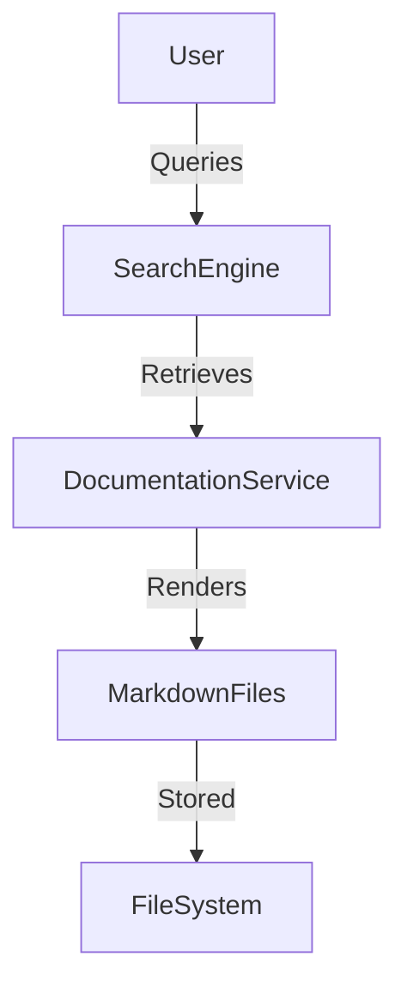

# HUB-20 - Documentation Service

## 1. Phase ID
HUB-20

## 2. Tier
Hub

## 3. Component Name and Description
### Documentation Service
The Documentation Service provides an automated, searchable, and interactive documentation infrastructure for the DGLab framework. It parses markdown files, handles frontmatter, and generates navigable documentation structures.

## 4. Context7 Research
- **Standard**: Follows established practices for technical documentation as code (docs-as-code).
- **Search**: Utilizes RAG (Retrieval-Augmented Generation) for AI-enhanced searchability.
- **Reference**: DGLab Architecture - `Legacy/Architecture/ComponentBlueprints/DocumentationService/PHASE_1_MARKDOWN_FOUNDATION.md`.

## 5. Architectural Design
### Design Patterns
- **Visitor Pattern**: For navigating the documentation structure.
- **Factory Pattern**: For creating different types of documentation renderers.

### Mermaid Diagram

## 6. Integration Strategy
Integrates with the filesystem to discover documentation sources. Provides an API endpoint for the frontend SPA to consume documentation content.

## 7. CI Verification Criteria
- **Accessibility**: Documentation must meet WCAG 2.1 AA standards.
- **Coverage**: 100% of the documentation source directory must be indexed.
- **Performance**: Search response time < 200ms.

## 8. SemVer Impact
Minor (New feature offering improved developer experience).
