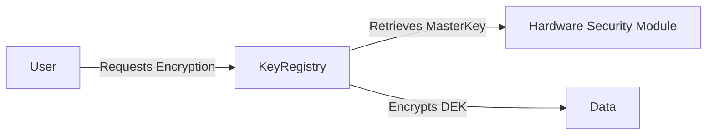

# HUB-22 - Encryption Key Registry

## 1. Phase ID
HUB-22

## 2. Tier
Hub

## 3. Component Name and Description
### Encryption Key Registry
The Encryption Key Registry is a secure component for managing cryptographic keys, rotation schedules, and access policies. It supports multi-tenant key isolation and provides robust primitives for data-at-rest encryption.

## 4. Context7 Research
- **Security Standard**: Implements best practices for Key Management Systems (KMS).
- **Compliance**: Adheres to FIPS 140-2/3 standards where applicable.
- **Reference**: DGLab Architecture - `Legacy/Architecture/ComponentBlueprints/EncryptionService/KEY_MANAGEMENT.md`.

## 5. Architectural Design
### Design Patterns
- **Registry Pattern**: Centralized lookup for cryptographic keys.
- **Envelope Encryption**: Using Master Keys to encrypt Data Encryption Keys (DEKs).

### Mermaid Diagram

## 6. Integration Strategy
Integrates with the `AuthService` for authorization policies and provides secure primitives to the `DatabaseCore` for field-level encryption.

## 7. CI Verification Criteria
- **Security**: Master Keys must never be exposed to application code.
- **Performance**: Key rotation operations must occur without downtime.
- **Audit**: All key access must be logged in a write-only, tamper-proof audit trail.

## 8. SemVer Impact
Major (Changes to encryption infrastructure affect data integrity and security posture).
