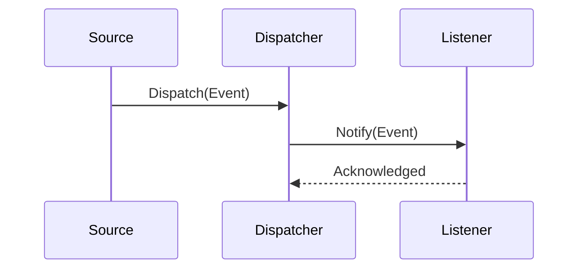

# HUB-23 - Event Dispatcher Engine

## 1. Phase ID
HUB-23

## 2. Tier
Hub

## 3. Component Name and Description
### Event Dispatcher Engine
The Event Dispatcher Engine is the central nervous system for asynchronous communication within DGLab. It enables decoupled component interaction via an event-driven architecture, supporting both synchronous and asynchronous listeners.

## 4. Context7 Research
- **Standards**: Follows PSR-14 (Event Dispatcher) standards.
- **Async Pattern**: Utilizes PHP fibers or external queues (Redis/RabbitMQ) for asynchronous processing.
- **Reference**: DGLab Architecture - `Legacy/Architecture/ComponentBlueprints/EventDispatcher/OVERVIEW.md`.

## 5. Architectural Design
### Class Structure
- `DGLab\Core\Events\EventDispatcher`: Main engine.
- `DGLab\Core\Events\EventListenerInterface`: Defines the listener contract.
- `DGLab\Core\Events\Event`: Abstract class for event objects.

### Mermaid Sequence Diagram

## 6. Integration Strategy
Integrates with all system components. It relies on the `ServiceRegistry` (CORE-19) for efficient listener resolution.

## 7. CI Verification Criteria
- **Throughput**: Must handle > 5,000 events/second in an asynchronous configuration.
- **Integrity**: Guaranteed event delivery for critical system events.
- **Coverage**: 100% unit test coverage for the core dispatcher engine.

## 8. SemVer Impact
Minor (Infrastructure enhancement for event-driven behavior).
