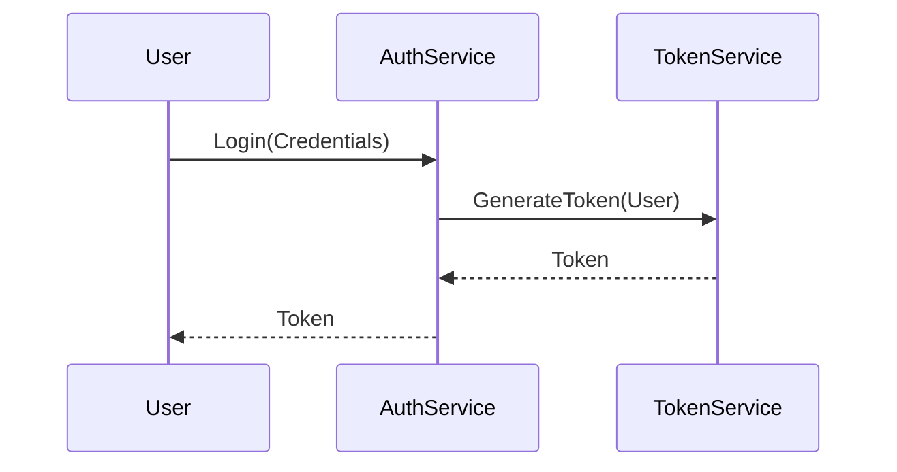

# HUB-27 - Auth Token Service

## 1. Phase ID
HUB-27

## 2. Tier
Hub

## 3. Component Name and Description
### Auth Token Service
The Auth Token Service manages the issuance, validation, and revocation of authentication tokens (JWTs, session tokens) for user sessions and API access.

## 4. Context7 Research
- **Standard**: JWT (JSON Web Tokens) adhering to RFC 7519.
- **Reference**: DGLab Architecture - `Legacy/Architecture/ComponentBlueprints/EncryptionService/Archive/PHASE_2_SEARCHABLE_MODELS.md`.

## 5. Architectural Design
### Design Patterns
- **Factory Pattern**: Token generation strategies.
- **Repository Pattern**: Managing token storage/invalidation.

### Mermaid Sequence Diagram

## 6. Integration Strategy
Integrates with the `TenantIsolationService` to ensure tokens are scoped to the correct tenant context.

## 7. CI Verification Criteria
- **Security**: Expired tokens must be rejected. Token signatures must be verified.
- **Performance**: Token validation < 5ms.
- **Revocation**: Token revocation must propagate globally within < 1 second.

## 8. SemVer Impact
Major (Changes to authentication mechanism directly affect security).
