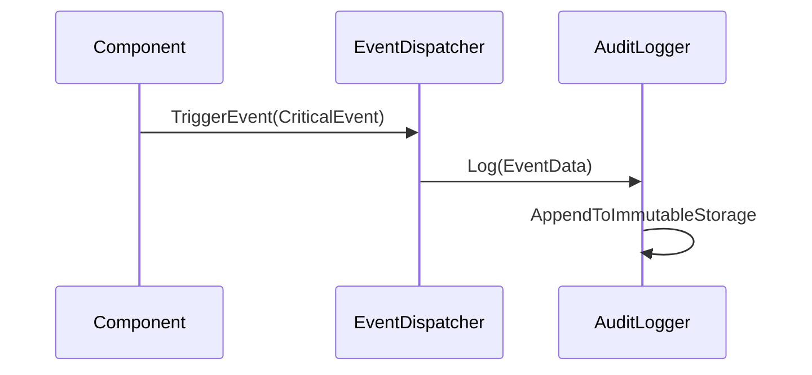

# HUB-28 - Audit Logging Service

## 1. Phase ID
HUB-28

## 2. Tier
Hub

## 3. Component Name and Description
### Audit Logging Service
The Audit Logging Service provides a tamper-proof mechanism for recording security-critical events across the entire DGLab platform. It ensures audit trails are complete, chronological, and immutable.

## 4. Context7 Research
- **Security**: Essential for compliance and forensic analysis.
- **Standards**: Implements Write-Once-Read-Many (WORM) storage patterns for audit data.
- **Reference**: DGLab Architecture - `Legacy/Architecture/ComponentBlueprints/EventDispatcher/PHASE_4_OBSERVABILITY_AUDIT.md`.

## 5. Architectural Design
### Design Patterns
- **Observer Pattern**: To capture system events.
- **Singleton Pattern**: Ensures a single entry point for logging to maintain sequence integrity.

### Mermaid Sequence Diagram

## 6. Integration Strategy
Integrates with `EventDispatcher` (HUB-23) to subscribe to all critical system events and ensures that logs are securely pushed to external monitoring/storage systems.

## 7. CI Verification Criteria
- **Integrity**: Logs must contain cryptographic hashes of the previous log entry to detect tampering.
- **Performance**: Audit logging must not block the main request thread (asynchronous execution).
- **Availability**: Audit service must persist events to a local buffer if primary storage is unreachable.

## 8. SemVer Impact
Minor (Enhancement to audit logging capabilities).
