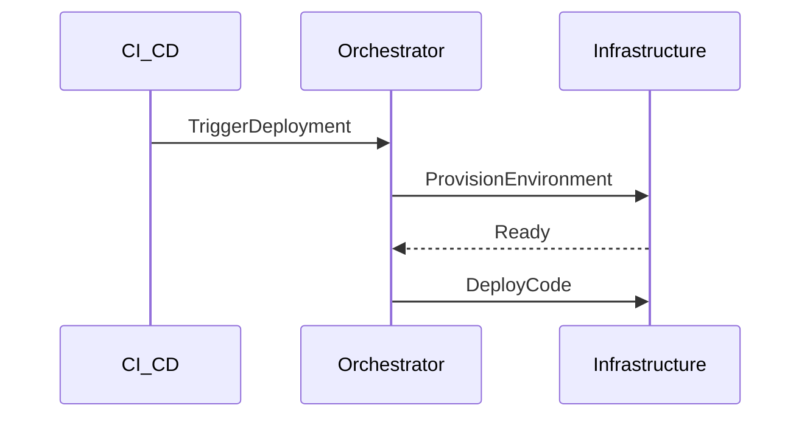

# HUB-30 - Deployment Orchestrator

## 1. Phase ID
HUB-30

## 2. Tier
Hub

## 3. Component Name and Description
### Deployment Orchestrator
The Deployment Orchestrator manages automated deployment pipelines, ensuring zero-downtime updates, blue-green deployment strategies, and automatic rollback capabilities.

## 4. Context7 Research
- **Standard**: Follows CI/CD automation best practices.
- **Reference**: DGLab Architecture - `Legacy/Architecture/ComponentBlueprints/Nexus/DEPLOYMENT_TESTING.md`.

## 5. Architectural Design
### Design Patterns
- **Command Pattern**: To execute deployment steps (e.g., `git pull`, `composer install`, `migrate`).
- **State Machine**: To manage deployment status (Pending, Deploying, Succeeded, Failed, RollingBack).

### Mermaid Sequence Diagram

## 6. Integration Strategy
Integrates with CI/CD tools (GitHub Actions, Jenkins) to trigger deployments and interacts with infrastructure APIs to manage environments.

## 7. CI Verification Criteria
- **Uptime**: Deployment must occur with 0 downtime.
- **Rollback**: Automatic rollback if health checks fail within 30 seconds post-deployment.
- **Integrity**: Deployment verification must validate code hash against repository hash.

## 8. SemVer Impact
Major (Changes to deployment procedures impact infrastructure stability).
