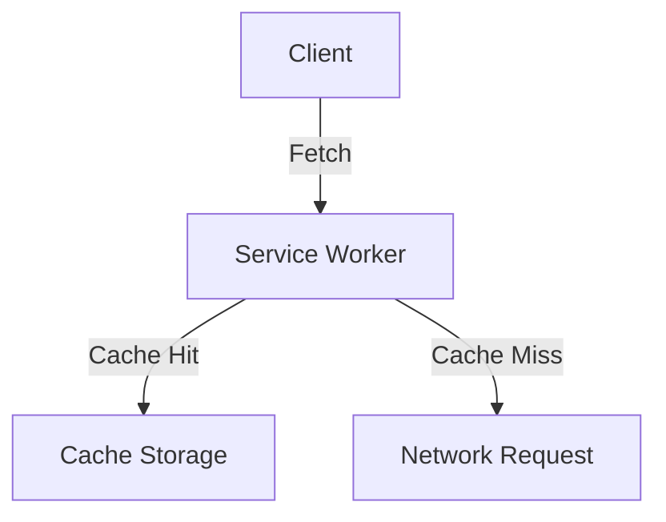

# SPOKE-01 - PWA Service Worker

## 1. Phase ID
SPOKE-01

## 2. Tier
Spoke

## 3. Component Name and Description
### PWA Service Worker
The PWA Service Worker provides offline capabilities, asset caching strategies, and background sync functionality to enhance the user experience for web clients.

## 4. Context7 Research
- **Technology**: Service Worker API (Fetch Event, Cache API).
- **Patterns**: Cache-first, network-first, or stale-while-revalidate strategies.
- **Reference**: DGLab Architecture - `Legacy/public/sw.js`.

## 5. Architectural Design
### Design Patterns
- **Strategy Pattern**: For implementing various caching policies.

### Mermaid Diagram

## 6. Integration Strategy
Operates within the browser environment. Interacts with the `AssetService` (Core/Hub) for cache manifest generation.

## 7. CI Verification Criteria
- **Offline Mode**: Application must load the core shell without an internet connection.
- **Caching**: Assets must be cached according to the defined caching strategy.

## 8. SemVer Impact
Minor (Improves PWA functionality/performance).
