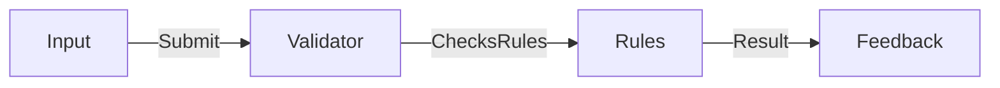

# SPOKE-03 - Form Validation Engine

## 1. Phase ID
SPOKE-03

## 2. Tier
Spoke

## 3. Component Name and Description
### Form Validation Engine
The Form Validation Engine provides declarative, client-side and server-side form validation, ensuring data integrity and providing immediate feedback to users during data entry.

## 4. Context7 Research
- **Standard**: Declarative validation rules.
- **Reference**: DGLab Architecture - `Legacy/resources/views/auth/login.super.php`.

## 5. Architectural Design
### Design Patterns
- **Specification Pattern**: To encapsulate validation rules.
- **Adapter Pattern**: To standardize validation messages across client and server.

### Mermaid Diagram

## 6. Integration Strategy
Components consume the validation service to display errors and handle input constraints.

## 7. CI Verification Criteria
- **Coverage**: 100% test coverage for validation rules.
- **Performance**: Validation must occur in < 50ms.

## 8. SemVer Impact
Patch (Updating validation rules).
