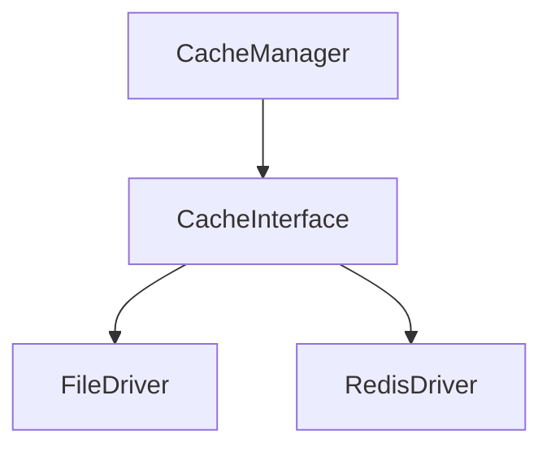

# Phase ID: SPOKE-05
## Tier: Spoke
## Component: CacheManager
The `CacheManager` provides a unified, PSR-6/PSR-16 compliant caching layer for the application, designed to abstract underlying storage mechanisms (File, Redis, Array) to enhance performance across spokes.

## Context7 Research
- **PSR-6: Caching Interface**: Standardized caching structures for PHP.
- **PSR-16: Simple Cache**: Simplified interface for common caching tasks.
- **Industry Patterns**: LRU (Least Recently Used) eviction policy implementation for memory management.

## Architectural Design
### Class Structure
- `\DGLab\Spoke\Cache\CacheManager`: Facade for cache access.
- `\DGLab\Spoke\Cache\Contracts\CacheInterface`: Contract for drivers.
- `\DGLab\Spoke\Cache\Drivers\FileDriver`: Filesystem-based storage.
- `\DGLab\Spoke\Cache\Drivers\RedisDriver`: Redis-based storage.

### Mermaid Diagram

## Integration Strategy
The `CacheManager` is registered within the `Hub` service container. Spokes consume it through dependency injection, requiring no knowledge of the storage implementation.

## CI Verification Criteria
- 95%+ unit test coverage for drivers.
- Cache hit/miss latency benchmarked at < 10ms per operation.

## SemVer Impact
Minor (New feature extension).
