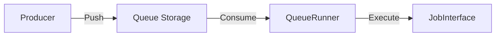

# Phase ID: SPOKE-06
## Tier: Spoke
## Component: WorkerQueue
The `WorkerQueue` provides a robust, decoupled mechanism for handling long-running background tasks, preventing UI blocking and ensuring reliable task execution.

## Context7 Research
- **Pattern**: Producer-Consumer pattern.
- **Industry Standards**: Task queuing systems (Redis, Database-backed queues), Dead Letter Queues (DLQ).

## Architectural Design
### Class Structure
- `\DGLab\Spoke\Queue\WorkerQueue`: Interface for pushing tasks.
- `\DGLab\Spoke\Queue\Job\JobInterface`: Contract for actionable units.
- `\DGLab\Spoke\Queue\Runner\QueueRunner`: CLI command to process the queue.

### Mermaid Diagram

## Integration Strategy
Spokes register jobs, which are serialized and stored. A centralized CLI runner, managed by the Hub, dispatches jobs to isolated worker processes.

## CI Verification Criteria
- 100% successful job retry mechanism verification.
- Task throughput > 50 jobs/second under load.

## SemVer Impact
Minor (New subsystem).
