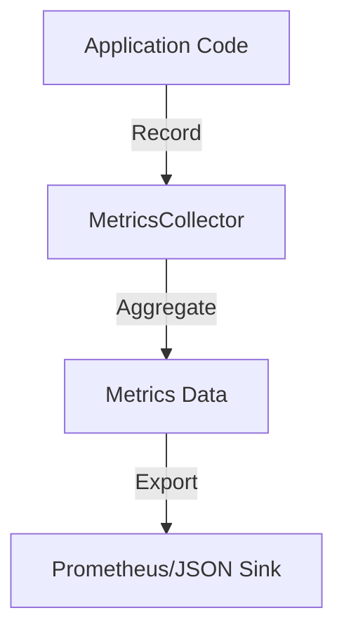

# Phase ID: SPOKE-07
## Tier: Spoke
## Component: MetricsCollector
The `MetricsCollector` provides instrumentation to gather operational metrics (timers, counters, gauges) across all spokes, enabling proactive monitoring and performance tuning.

## Context7 Research
- **Industry Patterns**: Prometheus/OpenTelemetry instrumentation patterns.
- **Concepts**: Observability pillars (Metrics, Traces, Logs).

## Architectural Design
### Class Structure
- `\DGLab\Spoke\Metrics\MetricsCollector`: Registry and aggregation point.
- `\DGLab\Spoke\Metrics\MetricTypes\Counter`: Incrementing values.
- `\DGLab\Spoke\Metrics\MetricTypes\Gauge`: Current value snapshot.
- `\DGLab\Spoke\Metrics\Export\ExporterInterface`: Exporting metrics to sinks.

### Mermaid Diagram

## Integration Strategy
Instrumentation is injected into services via middleware or service decorators. The Hub provides a centralized endpoint for metrics retrieval.

## CI Verification Criteria
- Zero impact on critical path latency (async reporting).
- 100% metrics emission validation in integration tests.

## SemVer Impact
Minor (New subsystem).
