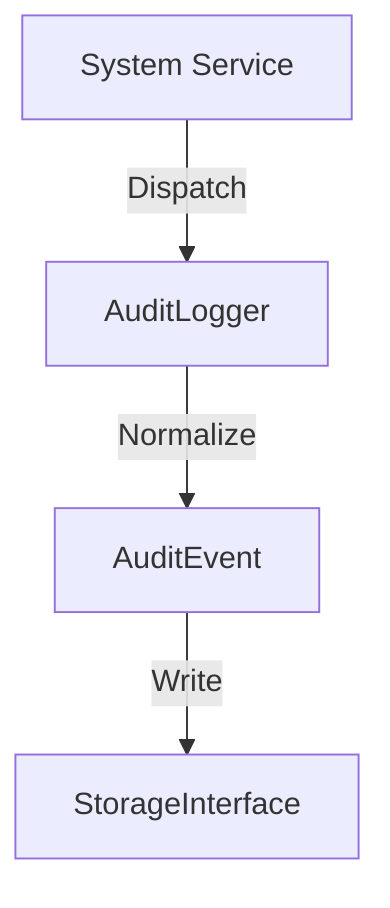

# Phase ID: SPOKE-08
## Tier: Spoke
## Component: AuditLogger
The `AuditLogger` ensures comprehensive, tamper-evident recording of system-wide security and operational events, essential for compliance and forensic analysis.

## Context7 Research
- **Industry Patterns**: Immutable logging, Event sourcing principles.
- **Standards**: Security logging best practices (NIST).

## Architectural Design
### Class Structure
- `\DGLab\Spoke\Audit\AuditLogger`: Main service for recording events.
- `\DGLab\Spoke\Audit\Event\AuditEvent`: Data class representing a security event.
- `\DGLab\Spoke\Audit\Storage\StorageInterface`: Immutable persistence layer.

### Mermaid Diagram

## Integration Strategy
The `AuditLogger` is invoked by security-critical services (Auth, Data access) through event subscribers.

## CI Verification Criteria
- 100% audit log persistence verification.
- Log immutability check (checksum/signature verification tests).

## SemVer Impact
Minor (New subsystem).
