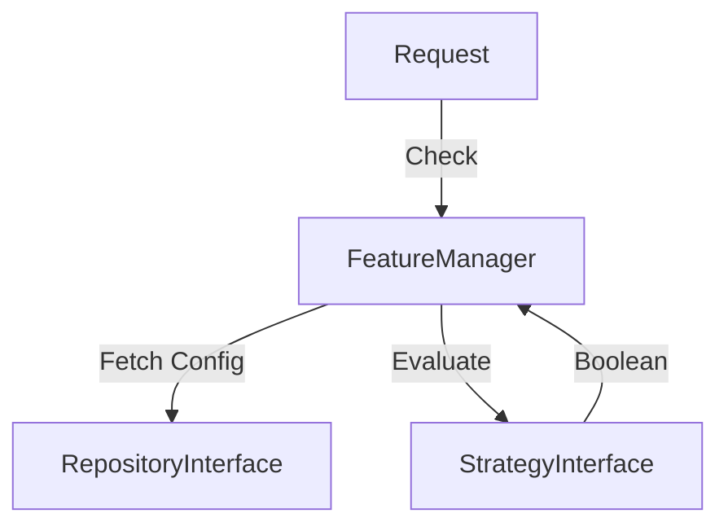

# Phase ID: SPOKE-09
## Tier: Spoke
## Component: FeatureFlagService
The `FeatureFlagService` enables dynamic toggling of application features without code deployment, facilitating canary releases and safe testing in production.

## Context7 Research
- **Industry Patterns**: Feature toggles, Condition-based feature release.

## Architectural Design
### Class Structure
- `\DGLab\Spoke\Feature\FeatureManager`: Evaluator and manager.
- `\DGLab\Spoke\Feature\Strategy\StrategyInterface`: Logic for enabling features based on context (e.g., User ID, Environment).
- `\DGLab\Spoke\Feature\Repository\RepositoryInterface`: Fetching flag configurations.

### Mermaid Diagram

## Integration Strategy
Features use the `FeatureManager` to check availability before execution paths. Configuration can be dynamically updated via cache invalidation.

## CI Verification Criteria
- 100% flag evaluation accuracy for all defined strategies.
- Negligible latency overhead for flag checks (< 0.1ms).

## SemVer Impact
Minor (New feature control).
