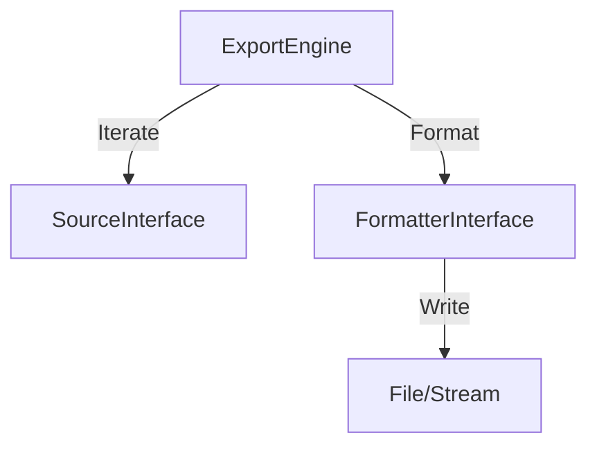

# Phase ID: SPOKE-10
## Tier: Spoke
## Component: DataExportEngine
The `DataExportEngine` provides a standardized, batch-capable facility for exporting large datasets from system models to various formats (CSV, JSON, XML), optimized for memory efficiency.

## Context7 Research
- **Industry Patterns**: Batch processing, Streaming data export.

## Architectural Design
### Class Structure
- `\DGLab\Spoke\Export\ExportEngine`: Orchestrator for export processes.
- `\DGLab\Spoke\Export\Formatter\FormatterInterface`: Transformation logic (CSV/JSON/XML).
- `\DGLab\Spoke\Export\Source\SourceInterface`: Data fetching iterator to prevent memory overflow.

### Mermaid Diagram

## Integration Strategy
Spokes register exportable data sources. The engine consumes sources lazily and streams output, ensuring scalability.

## CI Verification Criteria
- Memory usage consistently < 256MB for datasets > 100k rows.
- 100% format validation (CSV structure, JSON schema compliance).

## SemVer Impact
Minor (New subsystem).
