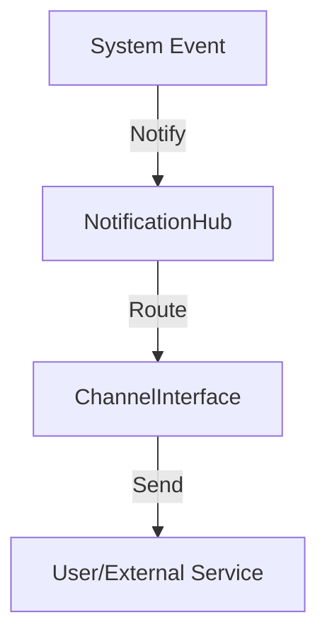

# Phase ID: SPOKE-11
## Tier: Spoke
## Component: NotificationHub
The `NotificationHub` provides a unified, multi-channel (Email, SMS, Webhook, Internal) messaging infrastructure to inform users and system services of important events.

## Context7 Research
- **Industry Patterns**: Observer pattern, Pub/Sub architecture, Message routing.

## Architectural Design
### Class Structure
- `\DGLab\Spoke\Notification\NotificationHub`: Main entry point for notifications.
- `\DGLab\Spoke\Notification\Channel\ChannelInterface`: Defines delivery logic (Email, SMS, etc.).
- `\DGLab\Spoke\Notification\Message\MessageInterface`: Data contract for notifications.

### Mermaid Diagram

## Integration Strategy
Events are dispatched to the `NotificationHub`, which routes them based on user preferences and event priority to configured channels.

## CI Verification Criteria
- 100% channel delivery testing simulation (mocked).
- Notification latency < 2s for high-priority events.

## SemVer Impact
Minor (New subsystem).
