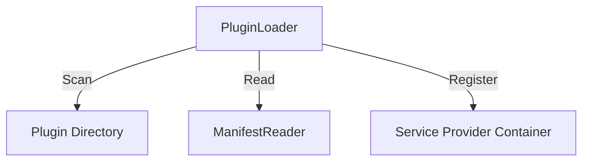

# Phase ID: SPOKE-12
## Tier: Spoke
## Component: PluginLoader
The `PluginLoader` provides a dynamic, decoupled extension mechanism, allowing third-party or isolated spoke code to be loaded and registered into the system at runtime.

## Context7 Research
- **Industry Patterns**: Dependency Injection, Service Provider pattern, Plugin architecture.

## Architectural Design
### Class Structure
- `\DGLab\Spoke\Plugin\PluginLoader`: Orchestrates discovery and loading.
- `\DGLab\Spoke\Plugin\PluginInterface`: Contract for plugin lifecycle (install, activate, deactivate).
- `\DGLab\Spoke\Plugin\Manifest\ManifestReader`: Parses plugin metadata.

### Mermaid Diagram

## Integration Strategy
Plugins are registered via manifests, enabling auto-loading of services, routes, and events into the central Hub.

## CI Verification Criteria
- 100% plugin activation/deactivation safety.
- Zero impact on core system performance if plugins fail to load.

## SemVer Impact
Minor (New subsystem).
