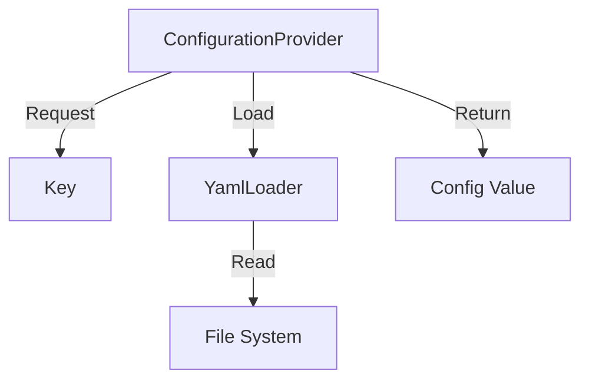

# Phase ID: SPOKE-13
## Tier: Spoke
## Component: ConfigurationProvider
The `ConfigurationProvider` manages environment-specific settings in an isolated, immutable manner, providing a secure interface for Spoke components to access required configurations without direct access to the global environment.

## Context7 Research
- **Industry Patterns**: Configuration Injection, Read-only Provider pattern.

## Architectural Design
### Class Structure
- `\DGLab\Spoke\Config\ConfigurationProvider`: Handles key-value retrieval.
- `\DGLab\Spoke\Config\ConfigInterface`: Defines the access contract.
- `\DGLab\Spoke\Config\Loader\YamlLoader`: Parses configuration files securely.

### Mermaid Diagram

## Integration Strategy
Spoke components inject the `ConfigurationProvider` via their constructor, ensuring dependency inversion.

## CI Verification Criteria
- 100% configuration immutability.
- Strict schema validation for all configuration files.

## SemVer Impact
Minor (New subsystem).
