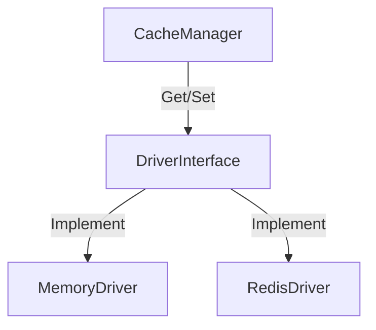

# Phase ID: SPOKE-14
## Tier: Spoke
## Component: CacheManager
The `CacheManager` provides a unified, abstract interface for caching frequently accessed data, ensuring Spoke components can improve performance without needing to know the underlying storage technology (e.g., Redis, File, Memory).

## Context7 Research
- **Industry Patterns**: Strategy Pattern, Cache-Aside Pattern.

## Architectural Design
### Class Structure
- `\DGLab\Spoke\Cache\CacheManager`: Facade for cache operations.
- `\DGLab\Spoke\Cache\Driver\DriverInterface`: Contract for storage drivers.
- `\DGLab\Spoke\Cache\Driver\MemoryDriver`: In-memory implementation for testing/short-lived processes.

### Mermaid Diagram

## Integration Strategy
Spoke components interact with the `CacheManager` interface. The specific driver is injected via the `ConfigurationProvider` in the bootstrap phase.

## CI Verification Criteria
- 100% cache hit/miss accuracy in tests.
- Zero data corruption on driver swap.

## SemVer Impact
Minor (New feature).
