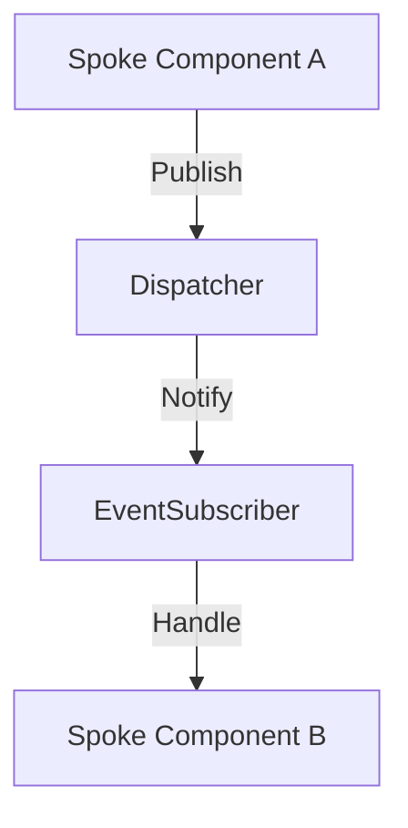

# Phase ID: SPOKE-15
## Tier: Spoke
## Component: EventSubscriber
The `EventSubscriber` enables loosely coupled interaction between Spoke components by allowing them to subscribe to and publish events, facilitating an event-driven architecture that maintains Spoke isolation.

## Context7 Research
- **Industry Patterns**: Observer Pattern, Pub/Sub.

## Architectural Design
### Class Structure
- `\DGLab\Spoke\Event\EventSubscriber`: Main entry point for subscription.
- `\DGLab\Spoke\Event\EventInterface`: Contract for event data.
- `\DGLab\Spoke\Event\Dispatcher`: Handles the delivery of events.

### Mermaid Diagram

## Integration Strategy
Spoke components register their interest in events via a central service container, ensuring minimal direct coupling.

## CI Verification Criteria
- 100% event delivery confirmation in test environments.
- Zero cyclic event dependencies.

## SemVer Impact
Minor (New subsystem).
