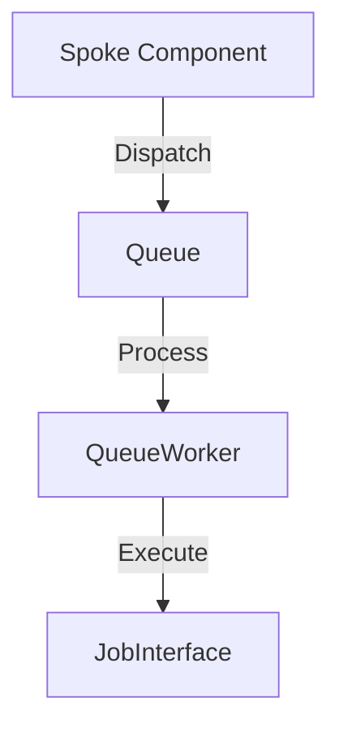

# Phase ID: SPOKE-16
## Tier: Spoke
## Component: QueueWorker
The `QueueWorker` provides an asynchronous task processing mechanism, allowing Spoke components to offload heavy operations (e.g., mail sending, data processing) to background tasks, maintaining system responsiveness.

## Context7 Research
- **Industry Patterns**: Worker Pattern, Task Queue.

## Architectural Design
### Class Structure
- `\DGLab\Spoke\Queue\QueueWorker`: Orchestrates worker process.
- `\DGLab\Spoke\Queue\JobInterface`: Contract for queued tasks.
- `\DGLab\Spoke\Queue\Driver\DatabaseDriver`: Persistence layer for jobs.

### Mermaid Diagram

## Integration Strategy
Tasks are dispatched to the QueueWorker via the EventSubscriber when asynchronous execution is required.

## CI Verification Criteria
- 100% job completion accuracy in asynchronous tests.
- Graceful handling of job failure (retry mechanisms).

## SemVer Impact
Minor (New feature).
