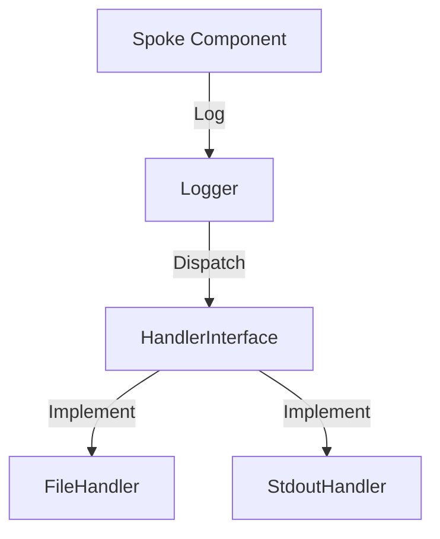

# Phase ID: SPOKE-17
## Tier: Spoke
## Component: Logger
The `Logger` provides a structured, multi-channel logging facility for Spoke components, ensuring traceability and debugging capabilities without imposing direct dependencies on centralized logging systems.

## Context7 Research
- **Industry Patterns**: Facade Pattern, Logging Levels.

## Architectural Design
### Class Structure
- `\DGLab\Spoke\Log\Logger`: Facade for log recording.
- `\DGLab\Spoke\Log\Handler\HandlerInterface`: Contract for log handlers.
- `\DGLab\Spoke\Log\Handler\FileHandler`: Basic file-based logging.

### Mermaid Diagram

## Integration Strategy
Spoke components log events directly to the `Logger`, which is configured with handlers via the central service container.

## CI Verification Criteria
- 100% log record integrity.
- Zero performance degradation from logging.

## SemVer Impact
Minor (New subsystem).
