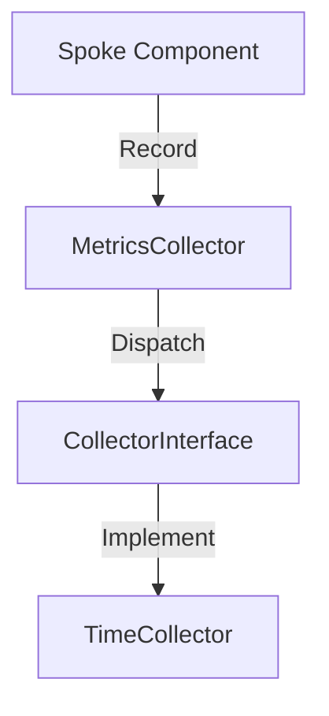

# Phase ID: SPOKE-18
## Tier: Spoke
## Component: MetricsCollector
The `MetricsCollector` provides a lightweight, performant mechanism for Spoke components to track performance data (e.g., execution time, memory usage), enabling monitoring without high overhead.

## Context7 Research
- **Industry Patterns**: Instrumentation, Telemetry.

## Architectural Design
### Class Structure
- `\DGLab\Spoke\Metrics\MetricsCollector`: Facade for tracking.
- `\DGLab\Spoke\Metrics\CollectorInterface`: Contract for collectors.
- `\DGLab\Spoke\Metrics\TimeCollector`: Tracks execution duration.

### Mermaid Diagram

## Integration Strategy
Spoke components instrument their critical paths using the `MetricsCollector`, which aggregates data for export to monitoring systems.

## CI Verification Criteria
- 100% metrics collection accuracy.
- Zero impact on critical path performance (minimal overhead).

## SemVer Impact
Minor (New subsystem).
