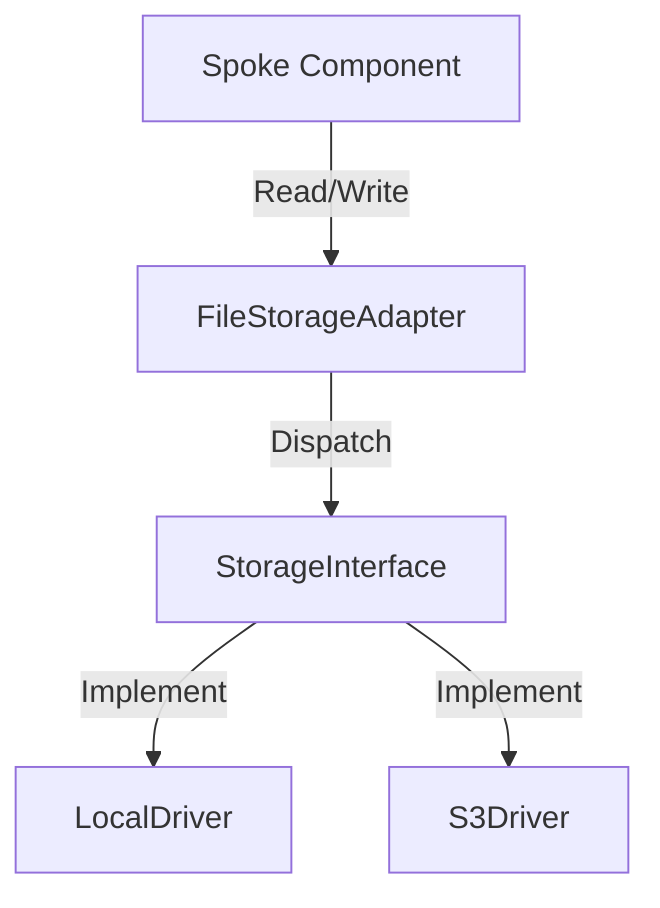

# Phase ID: SPOKE-19
## Tier: Spoke
## Component: FileStorageAdapter
The `FileStorageAdapter` provides a unified interface for Spoke components to interact with file systems (local or remote), ensuring abstraction and enabling easy switching between storage backends.

## Context7 Research
- **Industry Patterns**: Adapter Pattern, Storage Abstraction.

## Architectural Design
### Class Structure
- `\DGLab\Spoke\Storage\FileStorageAdapter`: Facade for storage operations.
- `\DGLab\Spoke\Storage\StorageInterface`: Contract for storage drivers.
- `\DGLab\Spoke\Storage\Driver\LocalDriver`: Local file system implementation.

### Mermaid Diagram

## Integration Strategy
Spoke components use the `FileStorageAdapter` to handle files. The configuration (local vs. S3) is injected via the `ConfigurationProvider`.

## CI Verification Criteria
- 100% read/write success across supported drivers.
- Strict path sanitization to prevent directory traversal.

## SemVer Impact
Minor (New subsystem).
