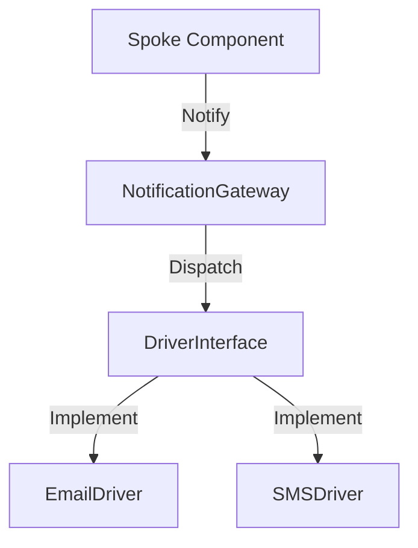

# Phase ID: SPOKE-20
## Tier: Spoke
## Component: NotificationGateway
The `NotificationGateway` provides an abstract interface for Spoke components to send notifications (e.g., Email, SMS, Push) without needing to know the underlying delivery mechanisms.

## Context7 Research
- **Industry Patterns**: Strategy Pattern, Gateway Pattern.

## Architectural Design
### Class Structure
- `\DGLab\Spoke\Notification\NotificationGateway`: Facade for dispatching.
- `\DGLab\Spoke\Notification\Driver\DriverInterface`: Contract for notification channels.
- `\DGLab\Spoke\Notification\Driver\EmailDriver`: Email-based implementation.

### Mermaid Diagram

## Integration Strategy
Spoke components pass notification data to the `NotificationGateway`. Drivers are configured and injected via the central service container.

## CI Verification Criteria
- 100% notification dispatch verification.
- Zero data leakage between notification attempts.

## SemVer Impact
Minor (New subsystem).
