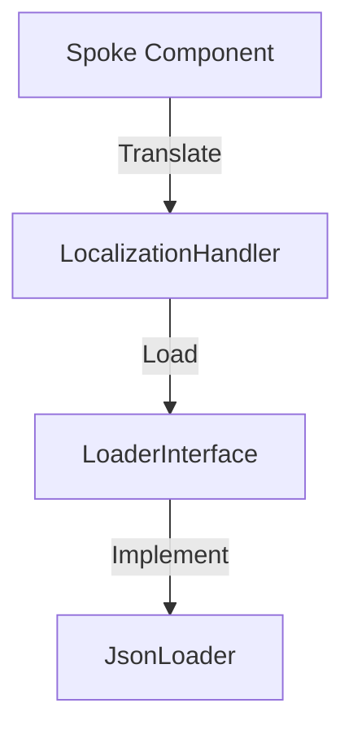

# Phase ID: SPOKE-21
## Tier: Spoke
## Component: LocalizationHandler
The `LocalizationHandler` provides a centralized facility for Spoke components to access localized text and formatted data, ensuring support for multiple languages without coupling to the UI layer.

## Context7 Research
- **Industry Patterns**: i18n, Localization Provider.

## Architectural Design
### Class Structure
- `\DGLab\Spoke\Localization\LocalizationHandler`: Facade for retrieving locale-specific strings.
- `\DGLab\Spoke\Localization\Loader\LoaderInterface`: Contract for language file loaders.
- `\DGLab\Spoke\Localization\Loader\JsonLoader`: Loads translations from JSON files.

### Mermaid Diagram

## Integration Strategy
Spoke components use the `LocalizationHandler` to translate strings. The active locale is injected during request bootstrap.

## CI Verification Criteria
- 100% translation key resolution accuracy.
- Zero missing translation warnings.

## SemVer Impact
Minor (New subsystem).
