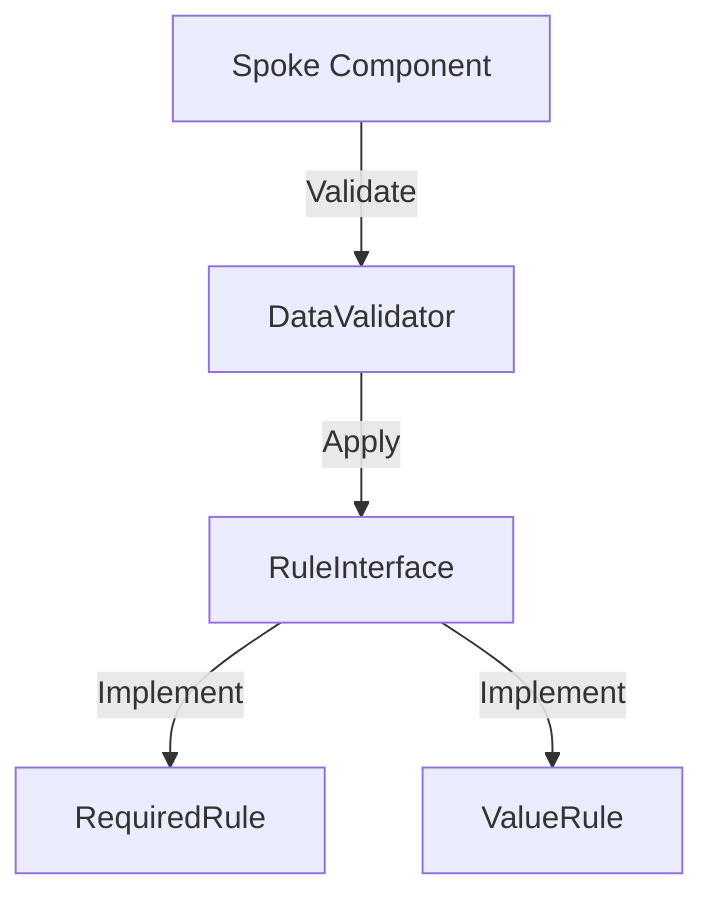

# Phase ID: SPOKE-22
## Tier: Spoke
## Component: DataValidator
The `DataValidator` provides a robust mechanism for Spoke components to validate input data (e.g., requests, configuration), ensuring data integrity and security before processing.

## Context7 Research
- **Industry Patterns**: Strategy Pattern, Data Transfer Object (DTO) Validation.

## Architectural Design
### Class Structure
- `\DGLab\Spoke\Validation\DataValidator`: Facade for validation operations.
- `\DGLab\Spoke\Validation\Rule\RuleInterface`: Contract for validation rules.
- `\DGLab\Spoke\Validation\Rule\RequiredRule`: Example rule (checks if field is present).

### Mermaid Diagram

## Integration Strategy
Spoke components pass data to the `DataValidator`, which applies a set of configured rules. Validation failures are returned as structured exception data.

## CI Verification Criteria
- 100% data validation accuracy (positive and negative tests).
- Zero bypasses of security-critical validation rules.

## SemVer Impact
Minor (New subsystem).
