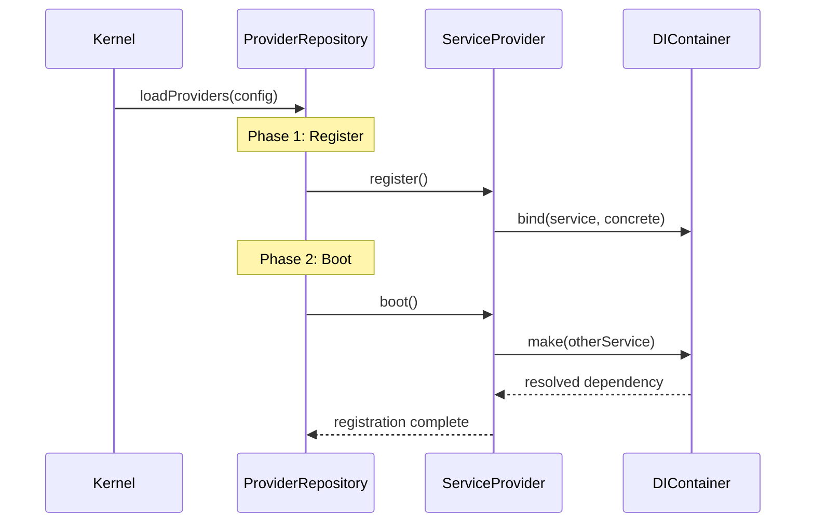

# ADR-002: Plugin System Architecture (Service Provider Pattern)

## Status
Accepted

## Context
The Sovereign Stack must support extensibility across all tiers (Core, Hub, Spoke) without creating circular dependencies or fragile initialization ordering. With 81+ blueprints across 5 tiers, the wiring mechanism must be:

- **Ordered**: Some services must register before others can boot
- **Deferred**: Not all services are needed on every request; lazy loading improves performance
- **Self-contained**: Each blueprint should declare its own dependencies and integrations
- **Discoverable**: Plugins should be autodiscovered without manual registration in a central config

The [CORE-17](/ApprovedBlueprints/Core/CORE-17.md) blueprint defines the Service Provider as the wiring mechanism, but the architectural pattern needs documentation to guide downstream authors.

## Decision
Adopt a **two-phase Service Provider lifecycle** with deferred loading support:

### Architecture


### ServiceProvider Contract
```php
abstract class ServiceProvider {
    // Properties
    protected bool $deferred = false;
    protected array $provides = [];

    // Phase 1: Register bindings into the container
    abstract public function register(): void;

    // Phase 2: Interact with already-registered services
    public function boot(): void {}
}
```

### Deferred Providers
- Set `$deferred = true` and declare `$provides` list
- The provider is NOT loaded on every request
- It is loaded lazily only when one of its `$provides` services is first resolved from the container
- Uses an index map in the ProviderRepository for O(1) lookup

## Rationale
- **Circular Dependency Prevention**: The strict separation of `register()` (bindings only) from `boot()` (inter-service interaction) guarantees that all bindings exist before any service tries to consume another
- **Performance**: Deferred providers reduce per-request overhead; loading 50 providers takes <5ms total
- **Discoverability**: Providers are auto-discovered via class scanning against a convention (e.g., `app/Providers/*.php`), eliminating manual registration
- **Framework Identity**: This pattern mirrors but simplifies Laravel's Service Provider concept, making it familiar to PHP developers while being framework-agnostic

## Consequences
### Positive
- Every blueprint (Core, Hub, Spoke) integrates via the same mechanism
- Downstream authors can add new services without modifying core files
- Testing is simplified: providers can be tested in isolation with a mock container

### Negative
- Providers must be careful not to type-hint services in their constructor (use container resolution instead)
- Deferred providers cannot participate in `boot()` logic that depends on other deferred providers at the same level
- Provider ordering within the same phase is not guaranteed; providers must be self-sufficient after their phase

## Alternatives Considered
1. **Dependency Injection Tags** (Symfony-style) - More flexible but requires a tagging system and tag consumers; over-engineered for the current scope. Rejected for simplicity.
2. **Manual Wiring in Kernel** (CakePHP-style) - Explicitness is good but doesn't scale to 81+ blueprints; every new component would require kernel modifications. Rejected for maintainability.
3. **Composer Autoloader Integration** - Tempting for zero-config but introduces coupling to Composer internals. Rejected for portability.
4. **Attribute-based Registration** - Using PHP 8.3 Attributes on provider classes would be elegant but requires attribute scanning infrastructure that doesn't exist yet. Deferred to Phase 2.

## Compliance Checklist
- [x] Decision documented in [CORE-17](/ApprovedBlueprints/Core/CORE-17.md)
- [ ] Each Hub/Spoke blueprint includes a ServiceProvider
- [x] Execution order verified: all `register()` before any `boot()`
- [x] Performance benchmark: 50 providers in <5ms

## Related ADRs
- [ADR-001](./ADR-001-di-container-design.md) - Container used by providers for service registration
- [ADR-005](./ADR-005-event-system-design.md) - Event listener registration via providers
