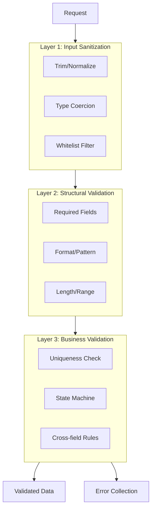

# ADR-003: Validation Framework Strategy

## Status
Accepted

## Context
The Sovereign Stack requires a validation framework to ensure data integrity across all tiers. Key requirements:

- **Immutable rule definitions**: Validation rules must be declarative, reusable, and independent of HTTP context (usable in CLI, API, and internal service calls)
- **Attribute-based declaration**: Leverage PHP 8.3 Attributes for declaring validation rules directly on DTOs/models
- **Layered validation**: Support for input sanitization, business rule validation, and cross-field constraints
- **Error aggregation**: Collect all validation errors before returning, rather than failing on first error
- **Extensibility**: Downstream blueprint authors must be able to define custom rules without modifying core

While no single core blueprint defines "validation" explicitly, validation is a cross-cutting concern referenced by [CORE-04](/ApprovedBlueprints/Core/CORE-04.md) (HTTP Message, PSR-7), [CORE-05](/ApprovedBlueprints/Core/CORE-05.md) (Middleware), [CORE-19](/ApprovedBlueprints/Core/CORE-19.md) (DBAL), and multiple Hub blueprints.

## Decision
Adopt a **three-layer Validation Pipeline** with Attribute-driven rule definitions:

### Architecture Layers


### Core Interfaces
```php
// Attribute-based rule declaration
#[Attribute(\Attribute::TARGET_PROPERTY)]
class Rule {
    public function __construct(
        public string $validator,
        public mixed $options = null,
        public ?string $message = null
    ) {}
}

// Validator Interface
interface ValidatorInterface {
    public function validate(array $data, array $rules): ValidationResult;
    public function addRule(string $name, callable $rule): void;
}

// Result
class ValidationResult {
    public function passes(): bool;
    public function fails(): bool;
    public function errors(): array;     // field => [messages]
    public function valid(): array;      // sanitized valid data only
}
```

### Built-in Rules (Minimum Viable Set)
| Rule | Purpose | PHP 8.3 Attribute |
|------|---------|-------------------|
| `required` | Field must be present and non-empty | `#[Rule('required')]` |
| `string` | Must be a string | `#[Rule('string')]` |
| `numeric` | Must be numeric | `#[Rule('numeric')]` |
| `min`/`max` | Min/max length or value | `#[Rule('min', 1)]` |
| `email` | RFC-compliant email | `#[Rule('email')]` |
| `in` | Allowed values list | `#[Rule('in', ['a','b'])]` |
| `regex` | PCRE pattern match | `#[Rule('regex', '/^[a-z]+$/')]` |
| `unique` | DB unique constraint | `#[Rule('unique', 'users.email')]` |
| `confirmed` | Matches `_confirmation` field | `#[Rule('confirmed')]` |

## Rationale
- **Layered approach** reflects a mature validation strategy: catch format errors early (Layer 1/2) before expensive business logic checks (Layer 3)
- **Attribute syntax** is native to PHP 8.3, keeping rules co-located with data definitions for readability
- **Error aggregation** (rather than fail-fast) provides better developer experience in API contexts where consumers need all errors at once
- **Extensibility** via `addRule()` allows downstream blueprints to register domain-specific validators without core changes

## Consequences
### Positive
- Validators can be reused across HTTP (form requests), CLI (argument validation), and internal service boundaries
- Error messages are customizable per rule, supporting localization (future)
- Rule definitions are testable in isolation without HTTP or database dependency

### Negative
- Attribute scanning adds ~1-2ms overhead on first parse (cached thereafter)
- Complex cross-field validation (Layer 3) may require custom validator classes rather than simple attributes
- The validation framework is not PSR-standardized (no PSR for validation exists), limiting ecosystem compatibility

## Alternatives Considered
1. **Symfony Validator Component** - Feature-complete but introduces external dependency with ~30+ classes. Violates core principle of minimizing third-party coupling. Rejected.
2. **Fluent Object-based Validation** (e.g., `$validator->required('name')->email()`) - More expressive but more verbose; attributes are more declarative and DRY. Rejected for verbosity.
3. **Middleware-only Validation** - Validate only at HTTP boundary. Rejected because validation is needed in CLI commands and service-to-service calls, not just HTTP.

## Compliance Checklist
- [ ] Validation integrated with [CORE-04](/ApprovedBlueprints/Core/CORE-04.md) (PSR-7 Request) for HTTP input
- [ ] Validation integrated with [CORE-13](/ApprovedBlueprints/Core/CORE-13.md) (CLI) for command argument validation
- [ ] Custom rule extension point documented in extensibility map
- [ ] Error collection format documented for API consumers

## Related ADRs
- [ADR-004](./ADR-004-routing-strategy.md) - Route parameters validated before controller dispatch
- [ADR-001](./ADR-001-di-container-design.md) - Custom validators resolved through container
