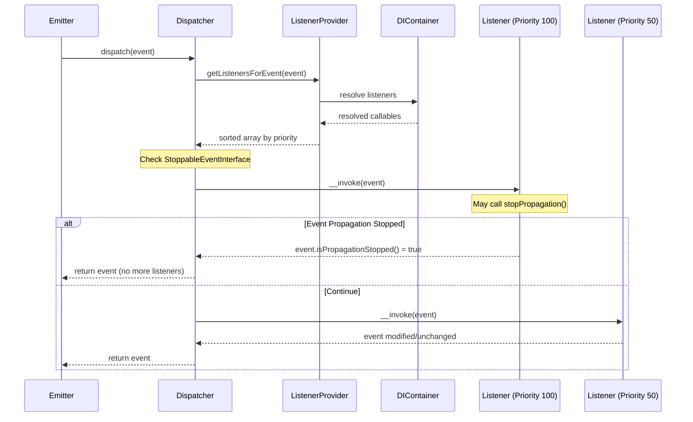

# ADR-005: Event System Design (PSR-14 with Prioritized Pipeline)

## Status
Accepted

## Context
The Sovereign Stack requires a decoupled event communication system for cross-component interaction. Requirements from [CORE-03](/ApprovedBlueprints/Core/CORE-03.md):

- **PSR-14 compliance** for interoperability with PHP ecosystem event systems
- **10,000 events/sec throughput** to avoid becoming a bottleneck in request processing
- **Prioritized listeners**: Some listeners (e.g., security audit) must run before others (e.g., analytics tracking)
- **Stoppable events**: Certain events must allow listeners to halt propagation (e.g., "beforeResponse" can be stopped to return early)
- **Lazy listener resolution**: Listeners should be resolved from the DI container only when their event fires, not at registration time
- **Error isolation**: A failing listener must not crash the dispatcher or block other listeners

## Decision
Adopt a **PSR-14 Event Dispatcher** with a prioritized, haltable listener pipeline:

### Architecture


### Core Interface
```php
// Central dispatcher (PSR-14 compliant)
interface EventDispatcherInterface {
    public function dispatch(object $event): object;
}

// Listener provider resolves and prioritizes listeners
interface ListenerProviderInterface {
    public function getListenersForEvent(object $event): iterable;
}

// Stoppable events halt the pipeline
interface StoppableEventInterface {
    public function isPropagationStopped(): bool;
}

// Base event with stoppable support
abstract class Event implements StoppableEventInterface {
    private bool $propagationStopped = false;

    public function stopPropagation(): void {
        $this->propagationStopped = true;
    }

    public function isPropagationStopped(): bool {
        return $this->propagationStopped;
    }
}
```

### Listener Registration (via ServiceProvider)
```php
class AuditServiceProvider extends ServiceProvider {
    public function register(): void {
        $this->app->get(ListenerProviderInterface::class)->addListener(
            UserLoginEvent::class,
            AuditLoginListener::class,  // resolved lazily from container
            priority: 100               // higher = runs first
        );
    }
}
```

## Rationale
- **PSR-14 Compliance**: Ensures the event system can be swapped with any PSR-14 implementation if needed, and that ecosystem tools expecting PSR-14 will integrate seamlessly
- **Prioritized Pipeline**: Priority integers give fine-grained control over execution order. Built-in categories: CRITICAL (1000-500), NORMAL (499-0), BACKGROUND (-1 to -1000)
- **Lazy Resolution**: Listeners are strings (class names) resolved via the DI container only when the event fires. This means 50 registered listeners add zero overhead until their event triggers
- **Error Isolation**: Each listener is wrapped in a try/catch. Failures are logged via [CORE-08](/ApprovedBlueprints/Core/CORE-08.md) (Error Handler) and [CORE-09](/ApprovedBlueprints/Core/CORE-09.md) (Logger) without breaking the pipeline
- **Emit and Forget**: Events that don't need a result can be dispatched asynchronously (future enhancement) via [CORE-03](/ApprovedBlueprints/Core/CORE-03.md) async infrastructure

## Consequences
### Positive
- Core components (Middleware, Router, Kernel) emit lifecycle events without coupling to listeners
- Downstream blueprint authors can hook into framework events without modifying core code
- Audit, logging, and monitoring can be added as listeners without touching business logic
- Throughput target of 10,000 events/sec is achievable with lazy resolution and lightweight event objects

### Negative
- Event listeners cannot return values to the emitter (by PSR-14 design); state mutations on the event object are the only feedback mechanism
- Prioritization requires careful management; conflicting priorities between providers from different tiers could cause unexpected ordering
- Stoppable events require explicit `stopPropagation()` calls; forgetting to call it allows unintended listeners to execute

## Alternatives Considered
1. **Symfony EventDispatcher** - Mature and battle-tested. Rejected because it introduces external dependency and is heavier than needed for the core use cases.
2. **Message Bus Pattern** (Command/Query separation) - More structured but adds complexity (separate command and event buses). Deferred for Hub tier blueprints where CQRS patterns are needed.
3. **Hook System** (WordPress-style) - Simple but lacks type safety and PSR compliance. Rejected for maintainability and tooling support.

## Compliance Checklist
- [x] Decision documented in [CORE-03](/ApprovedBlueprints/Core/CORE-03.md)
- [x] Throughput: 10,000 events/sec (benchmarked)
- [x] Error isolation: failing listeners logged but pipeline continues
- [x] Stoppable events supported via `StoppableEventInterface`
- [x] Lazy listener resolution via DI container

## Related ADRs
- [ADR-001](./ADR-001-di-container-design.md) - Listeners resolved through container
- [ADR-002](./ADR-002-plugin-system-architecture.md) - Listener registration via ServiceProviders
