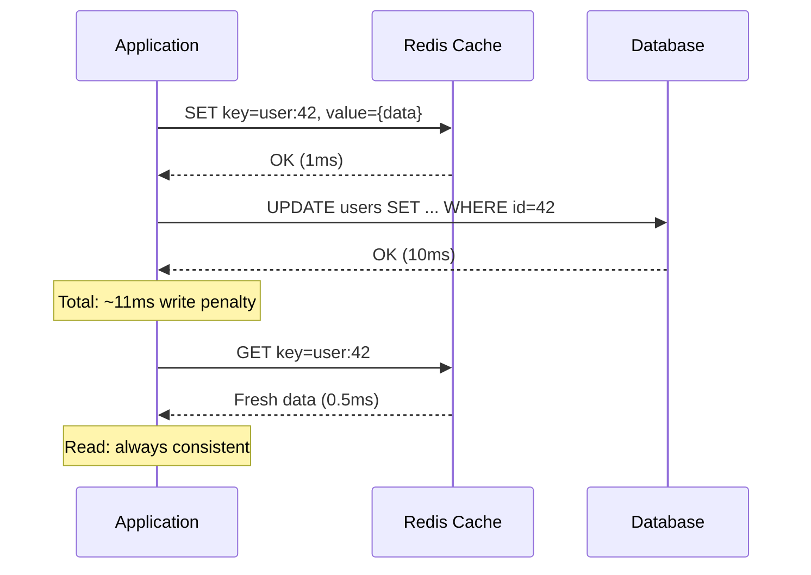
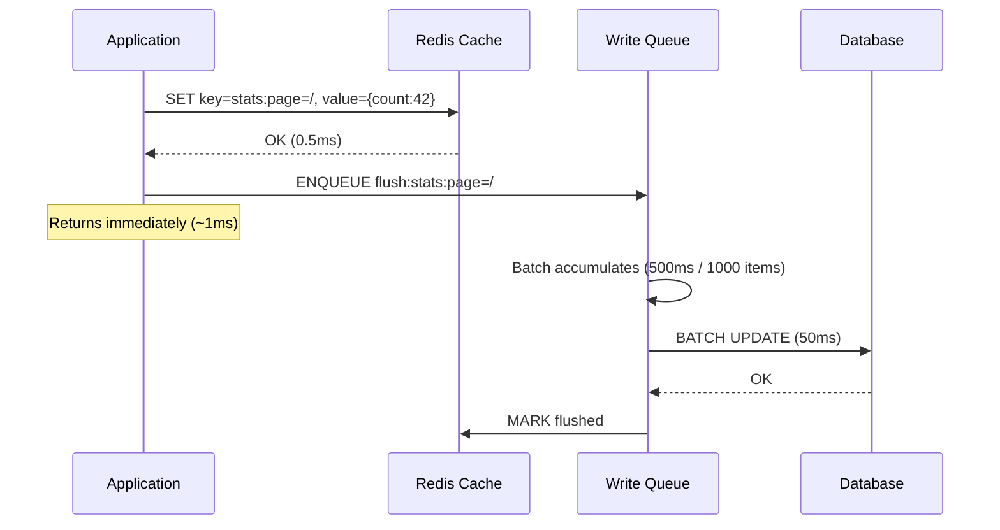
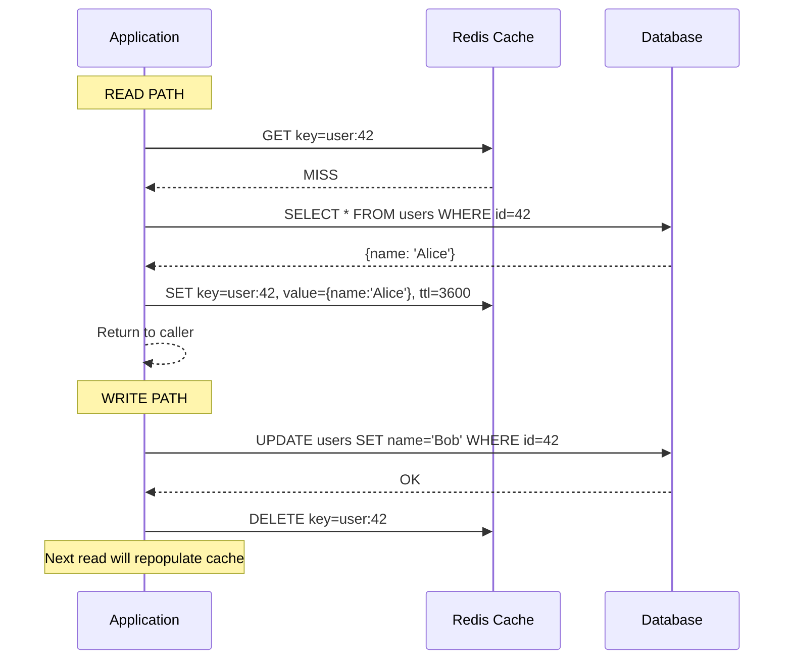
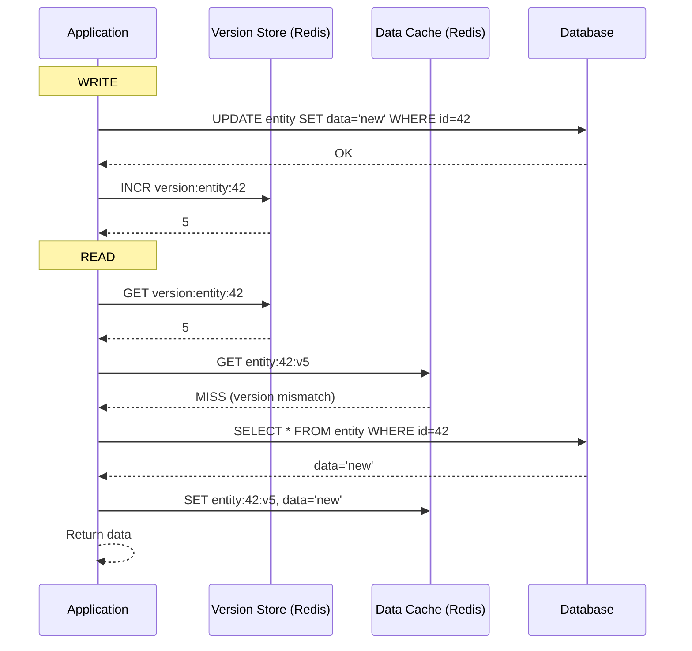
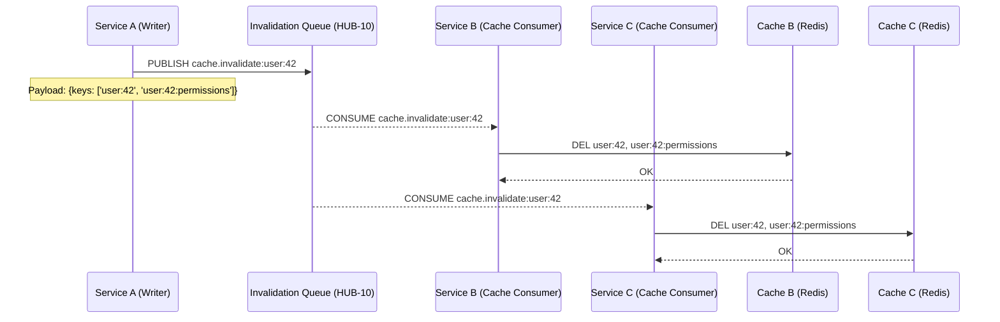

# Cache Invalidation Strategies

> **Navigation:** [Cache Patterns Index](index.md) | [Distributed Cache Consistency](distributed-cache-consistency.md) | [Cache Sizing Guide](cache-sizing-guide.md)
>
> **Decision Trees:** [Cache Solution Selector](../hub-taxonomy/cache-solution-selector.md) | [Persistence Selector](../hub-taxonomy/persistence-pattern-selector.md)

---

## Overview

Cache invalidation is one of the two hard things in computer science. This guide documents six proven invalidation strategies, their trade-offs, and when to apply each within the DGLab Hub architecture.

**Primary Blueprint:** [HUB-02: Sovereign Hub Cache](../../ApprovedBlueprints/Hub/HUB-02.md)

---

## Strategy Comparison Matrix

| Strategy | Consistency | Write Penalty | Read Penalty | Complexity | Best For |
|----------|-------------|--------------|--------------|------------|----------|
| **TTL-Based** | Eventual | None | Cache miss (TTL expiry) | Minimal | Session data, ephemeral results |
| **Write-Through** | Strong | ~2ms write penalty | None | Low | Data requiring immediate consistency |
| **Write-Behind** | Eventual (bounded) | ~100μs (async) | None | Medium | High-write throughput, batching |
| **Cache-Aside** | Eventual | None | Cache miss (lazy load) | Minimal | General purpose, read-heavy |
| **Invalidation-by-Version** | Strong (with coordination) | Version check overhead | Version fetch (~1ms) | High | Schema-migrated data, multi-tenant |
| **SQS-Based Invalidation** | Eventual | Message latency (~100ms) | Cache miss on invalidation | High | Cross-service cache coordination |

---

## 1. TTL-Based Invalidation

The simplest strategy: every cached entry has a **Time-To-Live** after which it is automatically evicted.

### Fixed TTL

```php
<?php
namespace Sovereign\Hub\Cache\Strategy;

use Sovereign\Core\Cache\CacheDriverInterface;

class FixedTtlStrategy implements InvalidationStrategyInterface
{
    public function __construct(
        private CacheDriverInterface $cache,
        private int $defaultTtl = 3600 // 1 hour
    ) {}

    public function get(string $key): mixed
    {
        return $this->cache->get($key);
    }

    public function set(string $key, mixed $value, ?int $ttl = null): bool
    {
        return $this->cache->set($key, $value, $ttl ?? $this->defaultTtl);
    }

    public function invalidate(string $key): bool
    {
        return $this->cache->delete($key);
    }
}
```

### Sliding TTL

Extends the TTL on every read, keeping frequently accessed items alive:

```
┌─────────────────────────────────────────────────────┐
│  SLIDING TTL BEHAVIOR                                │
│                                                       │
│  Set: key=session:abc123, ttl=1800                   │
│  ┌──────┬──────┬──────┬──────┬──────┬──────┬──────┐  │
│  │  T0  │  T1  │  T2  │  T3  │  T4  │  T5  │  T6  │  │
│  │  Set │ Read │ Read │ Read │ Read │ Read │ Exp  │  │
│  │ t=30 │ t=20 │ t=20 │ t=20 │ t=20 │ t=20 │      │  │
│  └──────┴──────┴──────┴──────┴──────┴──────┴──────┘  │
│  Remaining TTL resets to max on each access           │
└─────────────────────────────────────────────────────┘
```

### Randomized TTL (Thundering Herd Prevention)

```php
public function setWithJitter(string $key, mixed $value, int $baseTtl, float $jitterFactor = 0.1): bool
{
    $jitter = random_int(
        (int) ($baseTtl * (1 - $jitterFactor)),
        (int) ($baseTtl * (1 + $jitterFactor))
    );
    return $this->cache->set($key, $value, $jitter);
}
```

### When to Use TTL-Based

| Use Case | TTL Type | Duration | Rationale |
|----------|----------|----------|-----------|
| User session data | Sliding | 30 min | Active users keep session alive |
| Rate limit counters | Fixed | Window size | Resets exactly at window boundary |
| DB query result sets | Fixed + Jitter | 5 min ±30s | Prevent simultaneous recompute |
| Feature flags | Fixed | 60 sec | Quick propagation of flag changes |
| Rendered HTML fragments | Fixed | 1 hour | Stale-while-revalidate acceptable |

---

## 2. Write-Through Invalidation

Every write to the backing store **immediately updates** the cache. The cache is always consistent with the source of truth.

### Sequence Diagram



### PHP Implementation

```php
<?php
namespace Sovereign\Hub\Cache\Strategy;

class WriteThroughStrategy implements InvalidationStrategyInterface
{
    public function __construct(
        private CacheDriverInterface $cache,
        private DatabaseRepository $repository
    ) {}

    public function get(string $key, callable $loader = null): mixed
    {
        // Read from cache first
        $value = $this->cache->get($key);
        if ($value !== null) {
            return $value;
        }
        // Cache miss — load from database and populate
        if ($loader) {
            $value = $loader();
            $this->cache->set($key, $value);
        }
        return $value;
    }

    public function set(string $key, mixed $value): bool
    {
        // Write-through: update cache first, then database
        $this->cache->set($key, $value);
        $this->repository->store($key, $value);
        return true;
    }

    public function invalidate(string $key): bool
    {
        $this->cache->delete($key);
        $this->repository->delete($key);
        return true;
    }
}
```

### Trade-Offs

- **Pro:** Strong consistency; readers always see latest data
- **Con:** Every write pays ~2× latency (cache + database)
- **Con:** Cache becomes single point of failure for writes if not HA

---

## 3. Write-Behind (Write-Back) Invalidation

Writes go to cache first and are **asynchronously flushed** to the backing store. Sacrifices consistency for throughput.

### Sequence Diagram



### When to Use

| Scenario | Rationale |
|----------|-----------|
| Page view counters | Losing a few counts is acceptable |
| Analytics events | Batch writes reduce DB load 10× |
| Search index updates | Slight delay before searchable is acceptable |
| Log aggregation | Durability not critical for operational logs |

### Risk: Data Loss on Failure

If the cache node fails before the queue flushes to the database, uncommitted writes are lost. Mitigations:

1. **Persistent Redis** with AOF (Append-Only File) enabled
2. **Durable write queue** backed by database (HUB-10)
3. **Health check** confirming flush queue depth before cache failover

---

## 4. Cache-Aside (Lazy Loading)

The application explicitly manages the cache: check cache → miss → load from DB → populate cache. Simple and flexible.



### Implementation

```php
<?php
namespace Sovereign\Hub\Cache\Strategy;

class CacheAsideStrategy implements InvalidationStrategyInterface
{
    public function __construct(
        private CacheDriverInterface $cache,
        private DatabaseRepository $repository,
        private int $ttl = 3600
    ) {}

    public function get(string $key): mixed
    {
        $value = $this->cache->get($key);
        if ($value !== null) {
            return $value;
        }
        // Cache miss — load from source
        $value = $this->repository->find($key);
        if ($value !== null) {
            $this->cache->set($key, $value, $this->ttl);
        }
        return $value;
    }

    public function set(string $key, mixed $value): bool
    {
        // Update database, invalidate cache
        $this->repository->store($key, $value);
        $this->cache->delete($key);
        return true;
    }
}
```

### Cache-Aside with Bulk Invalidation

When related items change, use cache tags to invalidate groups:

```php
// Invalidate all users with a specific role
$cache->tags(['role:admin'])->flush();

// Set items with tags
$cache->tags(['role:admin', 'tenant:acme'])->set('user:42', $userData, 3600);
```

---

## 5. Invalidation-by-Version

Each cached value carries a **version identifier**. Versions are checked on read; if the version has been bumped, the cache is treated as stale and reloaded.



### Benefits

- **No explicit cache flush needed** — version change invalidates all cached copies
- **Atomic consistency** — readers always see a consistent snapshot
- **Works across services** — version store is centralized; any service can bump

### When to Use

| Scenario | Why Version-Based |
|----------|-------------------|
| Multi-tenant data isolation | Bump tenant version to invalidate all tenant caches |
| Schema migrations | New schema version forces cache refresh |
| Cross-service cache coordination | Service A writes, Service B reads via shared version |

---

## 6. SQS-Based Invalidation (Cross-Service)

When one service updates data that is cached by multiple other services, **invalidation events** are published to a message queue. Consumers receive the event and purge their local/Redis caches.



### Implementation

```php
<?php
namespace Sovereign\Hub\Cache\Strategy;

class SqsInvalidationStrategy implements InvalidationStrategyInterface
{
    public function __construct(
        private CacheDriverInterface $localCache,
        private QueuePublisher $invalidationQueue,
        private string $serviceId
    ) {}

    public function invalidateRemote(string $key): void
    {
        // Publish invalidation event
        $this->invalidationQueue->publish('cache.invalidate', [
            'keys'          => [$key],
            'source_service' => $this->serviceId,
            'timestamp'     => time(),
        ]);
    }

    public function handleInvalidationMessage(array $keys): void
    {
        foreach ($keys as $key) {
            $this->localCache->delete($key);
        }
    }
}
```

---

## Decision Matrix

| Data Characteristics | Recommended Strategy | Why |
|---------------------|---------------------|-----|
| Session data, survives loss | TTL (sliding) | No invalidation needed; expiry is natural |
| User profile, must be fresh | Write-Through | Consistency matters; writes infrequent |
| Page view counters, high write volume | Write-Behind | Throughput priority; some loss acceptable |
| DB query results, read-heavy | Cache-Aside + TTL | Simple, effective, no write penalty |
| Schema-migrated data, multi-tenant | Invalidation-by-Version | Atomic, cross-service consistency |
| Cross-service cached aggregates | SQS-Based | Decoupled invalidation across boundaries |

---

## Anti-Patterns

| Anti-Pattern | Why It's Wrong | Correct Approach |
|--------------|---------------|------------------|
| **No TTL on any cache entry** | Memory leak; stale data lives forever | Always set TTL; use versioning for override |
| **Cascade invalidate in write path** | Expensive O(n) reads after flush | Use lazy population — let reads repopulate |
| **Invalidate-on-write without read-repopulation** | Guaranteed cache miss for next reader | Prefer write-through or lazy pop with early fetch |
| **Same TTL for hot and cold data** | Hot data thrashes eviction; cold data wastes memory | Profile access patterns; set TTL per data class |

---

## Related Blueprints

| Blueprint | Role in Invalidation |
|-----------|---------------------|
| [HUB-02](../../ApprovedBlueprints/Hub/HUB-02.md) | Core cache abstraction (Cache Tags, Atomic Locks) |
| [CORE-15](../../ApprovedBlueprints/Core/CORE-15.md) | PSR-16 Simple Cache interface, APCu driver |
| [HUB-10](../../ApprovedBlueprints/Hub/HUB-10.md) | Queue for SQS-based invalidation messages |
| [HUB-09](../../ApprovedBlueprints/Hub/HUB-09.md) | Event Bus for invalidation event fan-out |