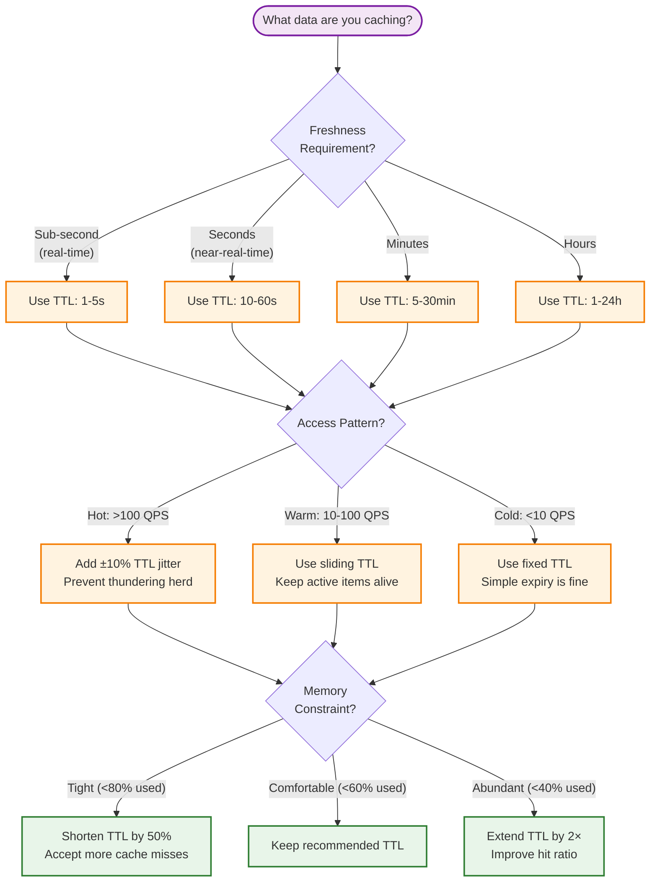
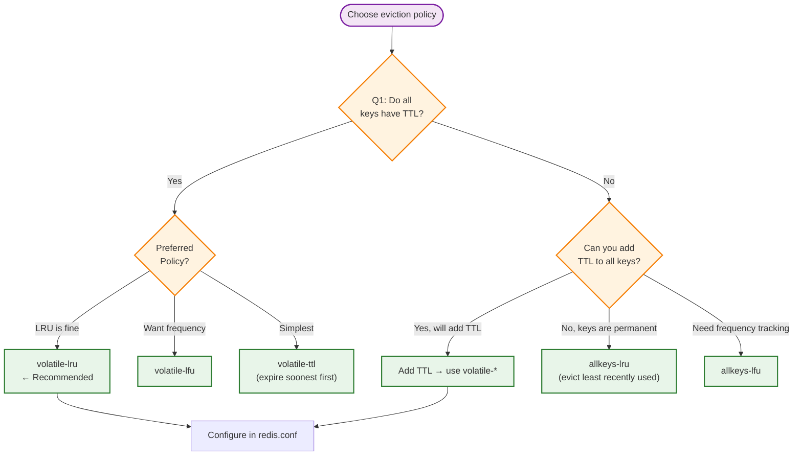

# Cache Sizing Guide

> **Navigation:** [Cache Patterns Index](index.md) | [Cache Invalidation Strategies](cache-invalidation-strategies.md) | [Distributed Cache Consistency](distributed-cache-consistency.md)
>
> **Decision Trees:** [Cache Solution Selector](../hub-taxonomy/cache-solution-selector.md)

---

## Overview

Proper cache sizing prevents two common failure modes: **out-of-memory crashes** (undersized) and **wasted resources** (oversized). This guide provides formulas, heuristics, and configuration guidance for sizing caches in the DGLab Hub architecture.

**Primary Blueprint:** [HUB-02: Sovereign Hub Cache](../../ApprovedBlueprints/Hub/HUB-02.md)

---

## Sizing Formulas

### Working Set Estimation

The **working set** is the data actively accessed within a time window. This determines your memory requirement.

```
Working Set = (Average item size) × (Number of active keys) × (Overhead factor)

Where:
  Average item size   = Σ(key_size + value_size + metadata) / item_count
  Number active keys  = Keys accessed within TTL window
  Overhead factor     = 1.5 to 2.0 (Redis jemalloc overhead + fragmentation)
```

### Step-by-Step Calculation

| Step | Formula | Example |
|------|---------|---------|
| 1. Estimate item count | `Items = (QPS × TTL_seconds)` | 5,000 QPS × 3,600s = 18M items |
| 2. Estimate item size | `Key + Value + Metadata` | 50B + 2KB + 100B = ~2.15KB |
| 3. Raw data size | `Items × Item_size` | 18M × 2.15KB = ~38.7GB |
| 4. Apply overhead | `Raw × 1.5 (Redis overhead)` | 38.7GB × 1.5 = ~58GB |
| 5. Peak buffer | `Total × 1.2 (20% headroom)` | 58GB × 1.2 = ~70GB |

### Data-Type-Specific Sizing

| Data Type | Avg Key Size | Avg Value Size | Redis Overhead | Estimated Per Item |
|-----------|-------------|----------------|----------------|-------------------|
| Session data | 64 bytes (session_id) | 1-5 KB (user data) | 200 bytes | ~3.3 KB |
| DB query result | 48 bytes (md5 hash) | 2-50 KB (row set) | 200 bytes | ~30 KB |
| HTML fragment | 128 bytes (route path) | 10-100 KB (rendered HTML) | 200 bytes | ~70 KB |
| Rate limit counter | 64 bytes (IP:endpoint) | 16 bytes (counter + TTL) | 200 bytes | ~280 bytes |
| Feature flags | 32 bytes (flag name) | 256 bytes (JSON config) | 200 bytes | ~488 bytes |
| Cache tags index | 48 bytes (tag name) | 1-5 KB (key list) | 200 bytes | ~3.5 KB |

### Quick Sizing Table

| Scenario | QPS | TTL | Items | Item Size | Memory Required |
|----------|-----|-----|-------|-----------|----------------|
| Small app | 100 | 300s | 30,000 | 1 KB | ~50 MB |
| Medium app | 1,000 | 600s | 600,000 | 5 KB | ~4.5 GB |
| Large app | 5,000 | 3,600s | 18,000,000 | 2 KB | ~54 GB |
| Enterprise | 20,000 | 7,200s | 144,000,000 | 5 KB | ~1 TB |

---

## TTL Strategy Selection

### Freshness Requirements by Data Class

| Data Class | Freshness Window | Recommended TTL | Example |
|------------|-----------------|----------------|---------|
| **Real-time** | <1 second | 1-5 seconds | Rate limit counters, live status |
| **Near-real-time** | 1-30 seconds | 10-60 seconds | User preferences, feature flags |
| **Session** | Active session duration | Sliding 30 min | Auth tokens, cart contents |
| **Stale-ok** | 1-60 minutes | 5-30 minutes | Blog posts, product catalog |
| **Long-lived** | Hours to days | 1-24 hours | Reference data, configuration |

### TTL Decision Tree



### Jitter Calculation

Prevents simultaneous cache expiry (thundering herd):

```php
<?php
namespace Sovereign\Hub\Cache\Sizing;

class TtlCalculator
{
    /**
     * Calculate TTL with jitter to prevent thundering herd.
     *
     * @param int $baseTtl Base TTL in seconds
     * @param float $factor Jitter factor (0.0 - 1.0)
     * @return int TTL in seconds with applied jitter
     */
    public static function withJitter(int $baseTtl, float $factor = 0.1): int
    {
        $range = (int) ($baseTtl * $factor);
        return $baseTtl + random_int(-$range, $range);
    }

    /**
     * Calculate sliding TTL — resets on read.
     */
    public static function sliding(int $remainingTtl, int $maxTtl): int
    {
        return max($remainingTtl, $maxTtl);
    }
}
```

---

## Eviction Policy Comparison

When memory is full, the eviction policy determines which keys to remove.

### Policy Overview

| Policy | Algorithm | Best For | Worst For |
|--------|-----------|----------|-----------|
| **LRU** (Least Recently Used) | Approximate LRU via sampled keys | General-purpose, access patterns with temporal locality | One-time scans (cache pollution) |
| **LFU** (Least Frequently Used) | Frequency counter with decay | Stable, popular items | Bursty traffic patterns |
| **FIFO** (First In, First Out) | Queue insertion order | Streaming data, ordered processing | Frequently accessed old items |
| **TTL-based** | Expire by TTL only (no eviction) | Data with natural expiry | Items without TTL |
| **Random** | Random key selection | Testing, uniform access patterns | Unpredictable eviction |

### Detailed Analysis



### Performance Characteristics

| Policy | Eviction Overhead | Memory Overhead | Hit Rate (typical) |
|--------|------------------|----------------|-------------------|
| LRU (default) | ~50μs per eviction | ~24 bytes per key | ~85-90% |
| LFU | ~100μs per eviction | ~32 bytes per key | ~87-92% |
| FIFO | ~10μs per eviction | ~16 bytes per key | ~70-80% |
| TTL | ~5μs per eviction | ~8 bytes per key | ~75-85% |
| Random | ~1μs per eviction | ~0 bytes | ~60-70% |

### Configuration Example: Redis

```conf
# redis.conf
maxmemory 4gb

# Recommended for most Hub deployments
maxmemory-policy volatile-lru

# For access patterns with strong popularity skew
# maxmemory-policy volatile-lfu

# Sampling precision (higher = more accurate, slower)
maxmemory-samples 10

# LFU decay time (minutes to halve frequency counter)
lfu-decay-time 1

# LFU log factor (counter growth rate)
lfu-log-factor 10
```

---

## Capacity Planning

### Growth Projection Model

```php
<?php
namespace Sovereign\Hub\Cache\Sizing;

class CapacityPlanner
{
    /**
     * @param int $currentItems Current number of cached items
     * @param float $monthlyGrowthRate Monthly growth rate (e.g., 0.15 for 15%)
     * @param int $monthsToProject Months to project forward
     * @param float $itemSize Average item size in bytes
     * @param float $overheadFactor Redis overhead multiplier (typically 1.5)
     * @return array{months: int, estimatedGb: float, requiredGb: float}
     */
    public function projectGrowth(
        int $currentItems,
        float $monthlyGrowthRate,
        int $monthsToProject,
        float $itemSize,
        float $overheadFactor = 1.5
    ): array {
        $estimate = $currentItems;
        $projections = [];

        for ($m = 1; $m <= $monthsToProject; $m++) {
            $estimate = (int) ($estimate * (1 + $monthlyGrowthRate));
            $rawBytes = $estimate * $itemSize;
            $withOverhead = $rawBytes * $overheadFactor;
            $projections[] = [
                'months'       => $m,
                'estimatedGb'  => round($rawBytes / (1024**3), 2),
                'requiredGb'   => round($withOverhead / (1024**3), 2),
            ];
        }

        return $projections;
    }
}

// Usage
$planner = new CapacityPlanner();
$projections = $planner->projectGrowth(
    currentItems: 1_000_000,
    monthlyGrowthRate: 0.10, // 10% growth
    monthsToProject: 12,
    itemSize: 2048, // 2KB average
);
```

### Sample Projection (10% Monthly Growth)

| Month | Items | Raw Size | Redis Required | Warning |
|-------|-------|----------|----------------|---------|
| 1 | 1,100,000 | 2.0 GB | 3.0 GB | Safe |
| 3 | 1,331,000 | 2.4 GB | 3.6 GB | Safe |
| 6 | 1,771,561 | 3.2 GB | 4.8 GB | Plan upgrade |
| 9 | 2,357,948 | 4.3 GB | 6.4 GB | ⚠ Action needed |
| 12 | 3,138,428 | 5.7 GB | 8.6 GB | 🚨 Critical |

### Fragmentation Overhead

Redis uses jemalloc, which can cause fragmentation, especially with varying key sizes.

| Pattern | Fragmentation Ratio | Cause | Mitigation |
|---------|-------------------|-------|------------|
| Uniform key sizes | 1.01 - 1.05 | Minimal fragmentation | None needed |
| Mixed key sizes | 1.05 - 1.20 | Varied allocations | Consider slab allocator |
| Large keys + small keys | 1.20 - 1.50 | Extreme size variance | Separate instances |
| After mass eviction | 1.50 - 2.00 | Empty pages | `MEMORY PURGE` or restart |

Monitor via: `INFO memory` → `used_memory_rss / used_memory`

---

## Memory Budget Template

### Per-Service Allocation

```yaml
# Example: service-cache-budget.yml
service:
  name: "user-service"
  cache_budget: 2GB

  data_types:
    user_profiles:
      count_estimate: 500,000
      item_size: 5KB
      raw_estimate: 2.5GB
      action: "Reduce TTL or increase budget"

    session_data:
      count_estimate: 100,000
      item_size: 2KB
      raw_estimate: 200MB
      feasible: true

    permission_cache:
      count_estimate: 10,000
      item_size: 10KB
      raw_estimate: 100MB
      feasible: true

  totals:
    raw_required: 2.8GB
    with_overhead: 4.2GB
    budget: 2.0GB
    status: "OVER_BUDGET"
    recommendations:
      - "Reduce user profile TTL from 1h to 30min"
      - "Profile only active users (last 7 days)"
      - "Consider per-tenant cache instances"
```

---

## Monitoring Sizing Health

| Metric | Warning | Critical | Action |
|--------|---------|----------|--------|
| `used_memory / maxmemory` | >75% | >90% | Increase memory or reduce TTL |
| `evicted_keys / sec` | >100 | >1000 | Check eviction policy |
| `rejected_connections` | >0 | >10% | Increase `maxclients` |
| `hit_ratio` | <80% | <60% | Adjust TTL or working set |
| `fragmentation_ratio` | >1.5 | >2.0 | `MEMORY PURGE` or restart |

---

## Related Blueprints

| Blueprint | Role in Sizing |
|-----------|----------------|
| [HUB-02](../../ApprovedBlueprints/Hub/HUB-02.md) | Core cache implementation (Redis Cluster) |
| [HUB-15](../../ApprovedBlueprints/Hub/HUB-15.md) | Cache health monitoring and alerting |
| [HUB-04](../../ApprovedBlueprints/Hub/HUB-04.md) | Session data sizing inputs |
| [CORE-15](../../ApprovedBlueprints/Core/CORE-15.md) | PSR-16 cache abstraction |