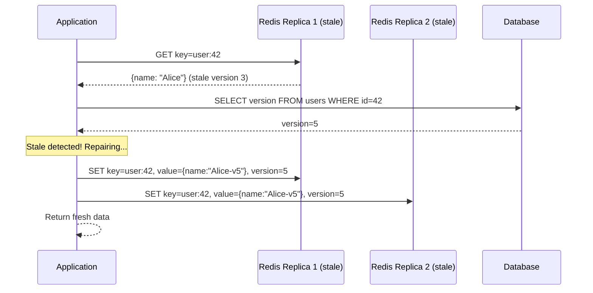
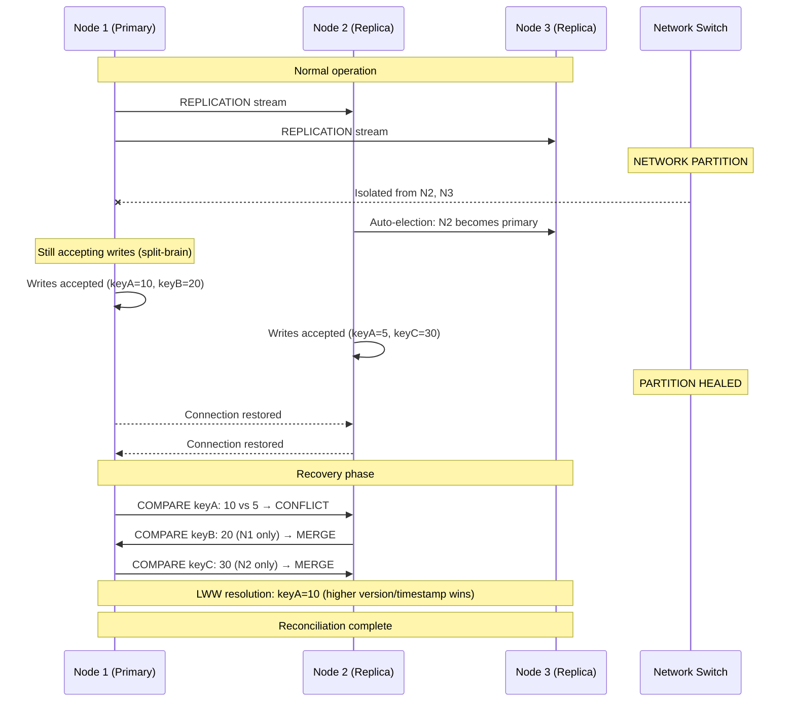

# Distributed Cache Consistency

> **Navigation:** [Cache Patterns Index](index.md) | [Cache Invalidation Strategies](cache-invalidation-strategies.md) | [Cache Sizing Guide](cache-sizing-guide.md)
>
> **Decision Trees:** [Cache Solution Selector](../hub-taxonomy/cache-solution-selector.md)

---

## Overview

Distributed cache consistency is the discipline of ensuring all nodes in a distributed caching system see the same data at the same time. This guide covers consistency models, conflict resolution strategies, and split-brain scenarios within the DGLab Hub architecture.

**Primary Blueprint:** [HUB-02: Sovereign Hub Cache](../../ApprovedBlueprints/Hub/HUB-02.md)

---

## Consistency Models

### Eventual Consistency

The cache converges to a consistent state over time. Reads may return stale data for a bounded period.

```mermaid
graph LR
    A[(Database)] -->|Write: key=x| B[Redis Primary]
    B -->|Async Replication| C[Redis Replica 1]
    B -->|Async Replication| D[Redis Replica 2]

    E[Service A] -->|Read @ T0| C
    F[Service B] -->|Read @ T1| D

    Note over C: Returns value from T0
    Note over D: Returns value from T1
    Note over A: Eventual consistency window: ~5-50ms
```

**Characteristics:**
- **Stale read window:** Typically 5-50ms with Redis replication
- **Write availability:** High (no write coordination needed)
- **Read throughput:** Maximum (all replicas serve reads)
- **Trade-off:** Temporary inconsistency acceptable

### Strong Consistency (Linearizability)

Every read returns the most recent write. Writes must be acknowledged by a quorum before returning.

```mermaid
graph LR
    A[(Database)] -->|Write: key=x| B[Redis Primary]
    B -->|Synchronous Replication| C[Redis Replica 1]
    B -->|Synchronous Replication| D[Redis Replica 2]

    E[Service A] -->|Read| B
    F[Service B] -->|Read| B

    Note over E,F: All reads go to PRIMARY
    Note over B: WAIT 2 replicas before acknowledging write
```

**Characteristics:**
- **Stale read window:** Zero (if all reads go to primary)
- **Write availability:** Lower (requires quorum)
- **Read throughput:** Single-node bottleneck
- **Trade-off:** Higher latency, lower throughput

### Comparison Table

| Property | Eventual | Strong (Read-Through) | Strong (Write-Through) |
|----------|----------|----------------------|----------------------|
| Read consistency | May be stale | Always latest | Always latest |
| Write latency | ~0.5ms | ~1ms | ~2ms (cache + DB) |
| Read throughput | High (all replicas) | Medium (primary only) | High (all replicas) |
| Write availability | High | Medium | Low (cache + DB must accept) |
| Complexity | Low | Medium | Medium |
| Use case | Sessions, counters | Rate limits, locks | User profiles, payments |

---

## Consistency Strategies in Detail

### 1. Read Repair (Lazy Repair)

On read, if a replica returns stale data, the cache automatically fetches the latest from the source of truth and patches the stale replica.



### 2. Quorum-Based Consistency (Redlock)

Require a majority of nodes (N/2 + 1) to acknowledge writes. Used for distributed locks in [HUB-02](../../ApprovedBlueprints/Hub/HUB-02.md).

```
┌────────────────────────────────────────────────────────┐
│ REDLOCK: Distributed Lock with Quorum                   │
│                                                         │
│ Nodes: [R1, R2, R3, R4, R5]  Quorum: 3/5              │
│                                                         │
│ Lock Acquisition:                                       │
│  1. Get current timestamp (T1)                          │
│  2. SET key:lock:resource → R1: OK, R2: OK, R3: OK     │
│     R4: FAIL, R5: FAIL                                  │
│  3. Quorum achieved (3/5) → Lock acquired               │
│  4. Lock validity = TTL - (Tcurrent - T1)               │
│                                                         │
│ If quorum NOT achieved, rollback all acquired locks     │
└────────────────────────────────────────────────────────┘
```

### 3. Version-Based Consistency

Each cached entry carries a version number. The version is checked on every read; if it's stale, the cache entry is refreshed.

```php
<?php
namespace Sovereign\Hub\Cache\Consistency;

class VersionedCacheEntry
{
    public function __construct(
        public readonly mixed $data,
        public readonly int $version,
        public readonly int $createdAt
    ) {}

    public function isStale(int $currentVersion): bool
    {
        return $this->version < $currentVersion;
    }
}

class VersionAwareCacheService
{
    public function __construct(
        private CacheDriverInterface $cache,
        private VersionStore $versionStore
    ) {}

    public function get(string $key): mixed
    {
        $entry = $this->cache->get($key);
        $currentVersion = $this->versionStore->get("version:{$key}");

        if (!$entry || $entry->isStale($currentVersion)) {
            return null; // Trigger cache reload
        }

        return $entry->data;
    }
}
```

---

## Conflict Resolution Strategies

### Last-Write-Wins (LWW)

The default strategy. The most recent write (by timestamp or version) wins. Simple but can lose data.

| Write | Timestamp | Version | Winner |
|-------|-----------|---------|--------|
| Service A: SET key=x, value="A" | T=100 | 1 | |
| Service B: SET key=x, value="B" | T=101 | 2 | ✓ (B wins) |
| Service A: SET key=x, value="A2" | T=99 | 1 | ✗ (lost, older timestamp) |

**Use when:** Data loss on concurrent writes is acceptable; timestamps are monotonically increasing.

### CRDTs (Conflict-Free Replicated Data Types)

Data types that mathematically guarantee convergence without conflict resolution. Each replica independently applies operations, and all replicas eventually converge.

| Data Type | Operation | Merge Behavior |
|-----------|-----------|----------------|
| **G-Counter** (Grow-only Counter) | Increment only | Sum all increments |
| **PN-Counter** (Positive-Negative Counter) | Increment/Decrement | Separate P and N vectors, merge by element-wise max |
| **G-Set** (Grow-only Set) | Add only | Union of all sets |
| **LWW-Register** | Assign value | Last write wins by wall clock |
| **OR-Set** (Observed-Remove Set) | Add/Remove | Tombstone-based, add wins over remove |

```php
<?php
namespace Sovereign\Hub\Cache\Consistency\CRDT;

class PNCounter
{
    private array $p = []; // Positive increments per node
    private array $n = []; // Negative increments per node

    public function increment(string $nodeId, int $amount = 1): void
    {
        $this->p[$nodeId] = ($this->p[$nodeId] ?? 0) + $amount;
    }

    public function decrement(string $nodeId, int $amount = 1): void
    {
        $this->n[$nodeId] = ($this->n[$nodeId] ?? 0) + $amount;
    }

    public function value(): int
    {
        return array_sum($this->p) - array_sum($this->n);
    }

    public function merge(PNCounter $other): void
    {
        foreach ($other->p as $node => $count) {
            $this->p[$node] = max($this->p[$node] ?? 0, $count);
        }
        foreach ($other->n as $node => $count) {
            $this->n[$node] = max($this->n[$node] ?? 0, $count);
        }
    }
}
```

### Version Vectors

Each node tracks the version it has seen from every other node. Conflicts are detected when concurrent updates produce divergent version vectors.

```
Node A writes: v1 = {A:1}
Node A writes: v2 = {A:2}

Node B writes: v1 = {A:1, B:1}

Conflict: v2 ({A:2}) and v3 ({A:1, B:1}) are concurrent
          Neither descends from the other

Resolution: Manual merge or LWW
```

---

## Split-Brain Scenarios

A **split-brain** occurs when a network partition isolates cache nodes into two (or more) groups, each believing they are the primary. Both groups accept writes, leading to divergent data.

### Detection

| Symptom | Indicator | Threshold |
|---------|-----------|-----------|
| Replica lag spikes | `INFO replication` → `master_link_status:down` | >100ms |
| Cluster node failure | `CLUSTER NODES` → `fail` state | 2+ node timeouts |
| Quorum loss | `redis-cli --cluster check` | < N/2+1 nodes reachable |
| Connection pool exhaustion | `connected_clients` at max | 90% of `maxclients` |

### Sequence Diagram: Split-Brain Recovery



### Prevention: Sentinel/Cluster Configuration

```conf
# Redis Sentinel: minimum quorum for failover
sentinel monitor mymaster 127.0.0.1 6379 2
sentinel down-after-milliseconds mymaster 5000
sentinel failover-timeout mymaster 30000

# Redis Cluster: node timeout and replica migration
cluster-node-timeout 5000
cluster-replica-validity-factor 10
cluster-migration-barrier 1
```

### Auto-Recovery Checklist

| Step | Action | Verification |
|------|--------|-------------|
| 1 | Detect partition: check cluster node states | All nodes in `connected` state |
| 2 | Identify split set: compare data on both sides | Version vector comparison |
| 3 | Select authoritative node: highest epoch/term | `cluster_current_epoch` |
| 4 | Replicate authoritative data to other nodes | `replication_backlog` sync |
| 5 | Reconcile divergent writes: LWW or manual | Conflict log reviewed |
| 6 | Restore replication links | `master_link_status:up` |
| 7 | Verify consistency | Key count match within tolerance |

---

## Consistency Configuration Quick Reference

| Deployment | Model | Strategy | Redis Config |
|------------|-------|----------|-------------|
| Development | Eventual | Cache-Aside + TTL | Single node, no replicas |
| Small (2-5 services) | Eventual | Read Repair | 1 primary + 1 replica |
| Medium (6-15 services) | Strong (locks) | Write-Through + Quorum | Redis Sentinel, 3 nodes |
| Large (16-30+ services) | Strong (versioned) | Invalidation-by-Version | Redis Cluster, 6+ nodes |

---

## Related Blueprints

| Blueprint | Role in Consistency |
|-----------|--------------------|
| [HUB-02](../../ApprovedBlueprints/Hub/HUB-02.md) | Cache Tags, Atomic Locks (Redlock), consistency drivers |
| [HUB-15](../../ApprovedBlueprints/Hub/HUB-15.md) | Health monitoring for cache nodes |
| [HUB-06](../../ApprovedBlueprints/Hub/HUB-06.md) | Audit logging for consistency violations |
| [CORE-15](../../ApprovedBlueprints/Core/CORE-15.md) | PSR-16 Simple Cache, driver abstraction |