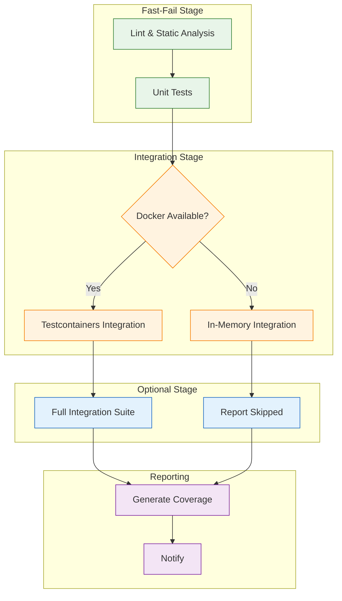
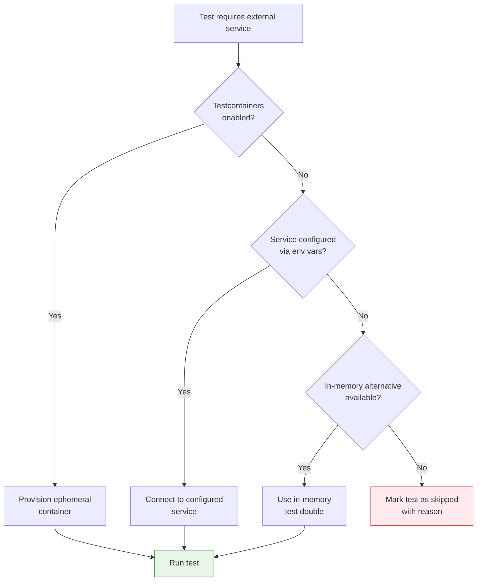

# CI Configuration & Fallback Strategies

> **Navigation:** [CI Home](index.md) | [Testcontainers Integration](testcontainers-integration.md) | [In-Memory Alternatives](in-memory-alternatives.md) | [Local Development Setup](local-development-setup.md)
>
> **Related:** [Testing Recipes](../testing/recipes.md) | [Service Dependency Analyzer](../operations/service-dependency-analyzer.md)

---

## Overview

This document defines the CI pipeline configuration with **fallback mechanisms** and **conditional test skipping** to ensure CI passes regardless of external service availability. This addresses **Weakness 4: CI Assumes External Service Availability**.

### Design Principles

1. **Graceful Degradation** — Tests adapt to available infrastructure
2. **Fail-Fast for Code Issues** — Unit tests run first, integration tests later
3. **Explicit Service Contracts** — Each test declares its dependencies via annotations
4. **No False Positives** — Skipped tests are reported, not silently ignored

---

## Pipeline Structure



---

## PHPUnit Configuration

### Test Suites

Define separate test suites in [`phpunit.xml`](../../Legacy.old/phpunit.xml) for dependency-tagged tests:

```xml
<phpunit>
    <testsuites>
        <testsuite name="unit">
            <directory>tests/Unit</directory>
        </testsuite>

        <testsuite name="integration">
            <directory>tests/Integration</directory>
            <exclude>tests/Integration/External</exclude>
        </testsuite>

        <testsuite name="integration-external">
            <directory>tests/Integration/External</directory>
        </testsuite>

        <testsuite name="full">
            <directory>tests</directory>
        </testsuite>
    </testsuites>

    <php>
        <!-- Default: in-memory fallback -->
        <env name="CI_REDIS_HOST" value=""/>
        <env name="CI_ELASTICSEARCH_HOST" value=""/>
        <env name="CI_MYSQL_HOST" value=""/>
        <env name="CI_USE_TESTCONTAINERS" value="false"/>
        <env name="CI_SKIP_EXTERNAL_TESTS" value="false"/>
    </php>
</phpunit>
```

### PHPUnit Annotations for Service Dependencies

Test classes declare their external dependencies using custom annotations:

```php
<?php

namespace DGLab\Tests\Integration\External;

use DGLab\Tests\IntegrationTestCase;

/**
 * @requiresExtension redis
 * @requiresEnv CI_REDIS_HOST
 * @group external-service
 * @group requires-redis
 */
class RedisIntegrationTest extends IntegrationTestCase
{
    // ...
}
```

| Annotation | Purpose | Example |
|-----------|---------|---------|
| `@requiresExtension redis` | Skip if PHP `redis` extension missing | Web server CI without Redis extension |
| `@requiresEnv CI_REDIS_HOST` | Skip if environment variable not set | CI without configured Redis |
| `@group external-service` | Exclude via `--exclude-group external-service` | Quick test runs |

---

## Graceful Skip Mechanisms

### 1. PHPUnit `@requires` Annotations

PHPUnit natively supports conditional test execution:

```php
/**
 * @test
 * @requires extension redis
 * @requires env CI_REDIS_HOST
 * @requires function curl_init
 */
public function test_cache_with_redis(): void
{
    // This test is skipped if Redis extension or host is not available
}
```

### 2. Trait-Based Service Availability Check

```php
<?php

namespace DGLab\Tests\Support;

/**
 * Trait for checking Redis availability and skipping tests gracefully.
 *
 * Usage:
 *   use RedisAvailable;
 *   $this->skipIfRedisUnavailable();
 */
trait RedisAvailable
{
    protected function skipIfRedisUnavailable(): void
    {
        $host = env('CI_REDIS_HOST', '');
        $port = env('CI_REDIS_PORT', '6379');

        if (empty($host)) {
            $host = env('REDIS_HOST', '127.0.0.1');
        }

        try {
            $redis = new \Redis();
            $connected = $redis->connect($host, (int)$port, 2.0); // 2-second timeout
            if (!$connected) {
                $this->markTestSkipped("Redis at {$host}:{$port} is not available.");
            }
            $redis->ping();
        } catch (\Exception $e) {
            $this->markTestSkipped("Redis at {$host}:{$port} is not available: {$e->getMessage()}");
        }
    }
}
```

Similarly for Elasticsearch and MySQL:

```php
<?php

namespace DGLab\Tests\Support;

trait ElasticsearchAvailable
{
    protected function skipIfElasticsearchUnavailable(): void
    {
        $host = env('CI_ELASTICSEARCH_HOST', '');
        $port = env('CI_ELASTICSEARCH_PORT', '9200');

        if (empty($host)) {
            $host = env('ELASTICSEARCH_HOST', '127.0.0.1');
        }

        try {
            $client = new \GuzzleHttp\Client(['base_uri' => "http://{$host}:{$port}", 'timeout' => 3]);
            $response = $client->get('/');
            if ($response->getStatusCode() !== 200) {
                $this->markTestSkipped("Elasticsearch at {$host}:{$port} returned status {$response->getStatusCode()}.");
            }
        } catch (\Exception $e) {
            $this->markTestSkipped("Elasticsearch at {$host}:{$port} is not available: {$e->getMessage()}");
        }
    }
}

trait MysqlAvailable
{
    protected function skipIfMysqlUnavailable(): void
    {
        $host = env('CI_MYSQL_HOST', env('DB_HOST', '127.0.0.1'));
        $port = env('CI_MYSQL_PORT', env('DB_PORT', '3306'));

        try {
            $pdo = new \PDO(
                "mysql:host={$host};port={$port}",
                env('DB_USERNAME', 'root'),
                env('DB_PASSWORD', ''),
                [\PDO::ATTR_TIMEOUT => 2]
            );
        } catch (\PDOException $e) {
            $this->markTestSkipped("MySQL at {$host}:{$port} is not available: {$e->getMessage()}");
        }
    }
}
```

### 3. Conditional Test Case Base Class

```php
<?php

namespace DGLab\Tests\Support;

use DGLab\Tests\IntegrationTestCase;

/**
 * Base class for tests that require external services.
 * Automatically determines the best available testing strategy.
 */
abstract class ExternalServiceTestCase extends IntegrationTestCase
{
    use RedisAvailable, ElasticsearchAvailable, MysqlAvailable;

    protected function setUp(): void
    {
        parent::setUp();

        // If Testcontainers is enabled, start appropriate containers
        if ($this->useTestcontainers()) {
            $this->startContainersIfNeeded();
        }
    }

    protected function useTestcontainers(): bool
    {
        return env('CI_USE_TESTCONTAINERS', 'false') === 'true'
            || (env('TESTCONTAINERS_ENABLED', 'false') === 'true');
    }

    protected function startContainersIfNeeded(): void
    {
        // Override in subclasses that use traits from testcontainers-integration.md
    }

    /**
     * Determine if a service is available, and skip if not.
     */
    protected function requireService(string $service): void
    {
        switch ($service) {
            case 'redis':
                $this->skipIfRedisUnavailable();
                break;
            case 'elasticsearch':
                $this->skipIfElasticsearchUnavailable();
                break;
            case 'mysql':
                $this->skipIfMysqlUnavailable();
                break;
            default:
                throw new \InvalidArgumentException("Unknown service: {$service}");
        }
    }
}
```

---

## CI Pipeline Configurations

### GitHub Actions

```yaml
name: DGLab CI

on:
  push:
    branches: [main, develop]
  pull_request:
    branches: [main]

env:
  COMPOSER_NO_INTERACTION: 1

jobs:
  # ── Stage 1: Static Analysis & Unit Tests (fast) ────────────
  static-analysis:
    runs-on: ubuntu-latest
    steps:
      - uses: actions/checkout@v4
      - uses: shivammathur/setup-php@v2
        with:
          php-version: 8.3
          tools: composer, phpstan, phpcs

      - run: composer install --no-progress
      - run: php vendor/bin/phpcs --standard=phpcs.xml
      - run: php vendor/bin/phpstan analyse --level=max app

  unit-tests:
    runs-on: ubuntu-latest
    steps:
      - uses: actions/checkout@v4
      - uses: shivammathur/setup-php@v2
        with:
          php-version: 8.3
          coverage: xdebug

      - run: composer install --no-progress
      - run: php vendor/bin/phpunit --testsuite=unit --coverage-clover=coverage.xml

  # ── Stage 2: Integration Tests (conditional) ────────────────
  integration-tests:
    runs-on: ubuntu-latest
    strategy:
      matrix:
        mode: [in-memory, testcontainers]

    steps:
      - uses: actions/checkout@v4

      - name: Setup PHP
        uses: shivammathur/setup-php@v2
        with:
          php-version: 8.3
          extensions: pdo, pdo_mysql, redis, json

      - name: Install dependencies
        run: composer install --no-progress

      - name: Integration tests (in-memory)
        if: matrix.mode == 'in-memory'
        run: php vendor/bin/phpunit --testsuite=integration

      - name: Integration tests (testcontainers)
        if: matrix.mode == 'testcontainers'
        run: php vendor/bin/phpunit --testsuite=integration-external
        env:
          TESTCONTAINERS_ENABLED: "true"
          CI_USE_TESTCONTAINERS: "true"

  # ── Stage 3: Reporting ──────────────────────────────────────
  report:
    needs: [static-analysis, unit-tests, integration-tests]
    runs-on: ubuntu-latest
    if: always()
    steps:
      - run: echo "CI complete. Check individual job results above."
      - name: Annotate skipped tests
        run: |
          echo "::notice title=Test Report::Integration tests completed."
```

### GitLab CI

```yaml
stages:
  - lint
  - test
  - integration

variables:
  COMPOSER_NO_INTERACTION: "1"

lint:
  stage: lint
  image: composer:latest
  script:
    - composer install --no-progress
    - php vendor/bin/phpcs --standard=phpcs.xml

test:unit:
  stage: test
  image: php:8.3-cli
  services:
    - mysql:8.0
  variables:
    MYSQL_DATABASE: dglab_test
    MYSQL_ROOT_PASSWORD: root_test
  script:
    - apt-get update && apt-get install -y git unzip libpq-dev
    - docker-php-ext-install pdo_mysql
    - curl -sS https://getcomposer.org/installer | php -- --install-dir=/usr/local/bin --filename=composer
    - composer install --no-progress
    - php vendor/bin/phpunit --testsuite=unit

test:integration:
  stage: integration
  image: php:8.3-cli
  services:
    - docker:dind
  variables:
    TESTCONTAINERS_ENABLED: "true"
    DOCKER_HOST: "tcp://docker:2375"
  script:
    - apt-get update && apt-get install -y git unzip libpq-dev docker.io
    - docker-php-ext-install pdo_mysql
    - curl -sS https://getcomposer.org/installer | php
    - composer install --no-progress
    - php vendor/bin/phpunit --testsuite=integration-external
  only:
    - main
    - develop
```

### Jenkins Pipeline

```groovy
pipeline {
    agent any

    stages {
        stage('Lint & Static Analysis') {
            steps {
                sh 'composer install --no-progress'
                sh 'php vendor/bin/phpcs --standard=phpcs.xml'
                sh 'php vendor/bin/phpstan analyse --level=max app'
            }
        }

        stage('Unit Tests') {
            steps {
                sh 'php vendor/bin/phpunit --testsuite=unit --coverage-clover=coverage.xml'
            }
        }

        stage('Integration Tests') {
            parallel {
                stage('In-Memory') {
                    environment {
                        CI_SKIP_EXTERNAL_TESTS = 'true'
                    }
                    steps {
                        sh 'php vendor/bin/phpunit --testsuite=integration'
                    }
                }
                stage('Testcontainers') {
                    agent {
                        docker { image 'php:8.3-cli' }
                    }
                    environment {
                        TESTCONTAINERS_ENABLED = 'true'
                        DOCKER_HOST = 'unix:///var/run/docker.sock'
                    }
                    steps {
                        sh 'composer install --no-progress'
                        sh 'php vendor/bin/phpunit --testsuite=integration-external'
                    }
                }
            }
        }
    }

    post {
        always {
            junit 'reports/*.xml'
            cleanWs()
        }
    }
}
```

---

## Fallback Chain

When a test needs an external service, it follows this fallback chain:



### Implementation

```php
<?php

namespace DGLab\Tests\Support;

trait ServiceFallback
{
    /**
     * Resolve a service connection using the fallback chain:
     *   1. Testcontainers (if enabled)
     *   2. Configured external service (via env)
     *   3. In-memory alternative
     *   4. Skip test
     *
     * @return array{type: string, params: array}
     */
    protected function resolveService(string $service): array
    {
        // Level 1: Testcontainers
        if ($this->useTestcontainers()) {
            $container = $this->startTestcontainer($service);
            if ($container !== null) {
                return ['type' => 'testcontainers', 'params' => $container];
            }
        }

        // Level 2: Configured external service
        $external = $this->getExternalServiceConfig($service);
        if ($external !== null) {
            return ['type' => 'external', 'params' => $external];
        }

        // Level 3: In-memory alternative
        $inMemory = $this->getInMemoryService($service);
        if ($inMemory !== null) {
            return ['type' => 'in-memory', 'params' => $inMemory];
        }

        // Level 4: Skip
        $this->markTestSkipped("No available implementation for service: {$service}");
    }

    private function startTestcontainer(string $service): ?array
    {
        // Implemented in specific test classes using Testcontainers traits
        return null;
    }

    private function getExternalServiceConfig(string $service): ?array
    {
        $configs = [
            'redis' => [
                'host' => env('CI_REDIS_HOST', env('REDIS_HOST', '')),
                'port' => env('CI_REDIS_PORT', env('REDIS_PORT', '6379')),
            ],
            'elasticsearch' => [
                'host' => env('CI_ELASTICSEARCH_HOST', env('ELASTICSEARCH_HOST', '')),
                'port' => env('CI_ELASTICSEARCH_PORT', env('ELASTICSEARCH_PORT', '9200')),
            ],
            'mysql' => [
                'host' => env('CI_MYSQL_HOST', env('DB_HOST', '')),
                'port' => env('CI_MYSQL_PORT', env('DB_PORT', '3306')),
            ],
        ];

        $config = $configs[$service] ?? null;
        if ($config && !empty($config['host'])) {
            return $config;
        }

        return null;
    }

    private function getInMemoryService(string $service): ?array
    {
        $alternatives = [
            'redis' => ['driver' => 'in-memory-cache', 'class' => \DGLab\Cache\InMemoryCacheDriver::class],
            'elasticsearch' => ['driver' => 'stub-es', 'class' => \DGLab\Search\StubElasticsearchClient::class],
            'mysql' => ['driver' => 'sqlite', 'database' => ':memory:'],
        ];

        return $alternatives[$service] ?? null;
    }
}
```

---

## Build Matrix Strategy

For maximum coverage, run CI across multiple configurations in parallel:

| Matrix Entry | External Services | Execution Time | Confidence |
|-------------|------------------|---------------|------------|
| **fast** | None (in-memory doubles) | ~2 min | Medium |
| **standard** | Testcontainers (core services) | ~8 min | High |
| **full** | Testcontainers (all services) | ~15 min | Maximum |

```yaml
# .github/workflows/ci.yml
jobs:
  test:
    strategy:
      matrix:
        mode: [fast, standard]
        php: [8.3]
        include:
          - mode: full
            php: 8.3
    # ...
```

---

## Reporting Skipped Tests

Skipped tests must be visible in CI reports to avoid silent gaps:

```bash
# Run tests with verbose output showing skipped tests
php vendor/bin/phpunit --testsuite=integration --verbose

# Output:
# DGLab\Tests\Integration\External\RedisIntegrationTest
#  ✘ test cache with redis                        ⚑ skipped
#   └─ Redis at 127.0.0.1:6379 is not available.
#
# Tests: 42, Assertions: 38, Skipped: 4.
```

In CI, configure the test runner to fail on unexpected skips:

```yaml
- name: Integration tests
  run: |
    php vendor/bin/phpunit --testsuite=integration --log-junit=results.xml
    # Alert if more than 10% of tests are skipped
    SKIPPED=$(grep -c 'skipped' results.xml || true)
    TOTAL=$(grep -c 'testcase' results.xml || true)
    if [ $((SKIPPED * 100 / TOTAL)) -gt 10 ]; then
      echo "::warning::More than 10% of tests were skipped ($SKIPPED of $TOTAL)"
    fi
```

---

## References

- [Testcontainers Integration Guide](testcontainers-integration.md) — Ephemeral service provisioning
- [In-Memory Alternatives](in-memory-alternatives.md) — Test double implementations
- [Local Development Setup](local-development-setup.md) — Local environment guide
- [DGLab Testing Recipes](../testing/recipes.md) — General testing patterns