# CLI Framework — Complexity Tiers Map

## Overview

The DGLab CLI framework (`cli/` scripts) is designed with layered complexity, allowing developers to start with minimal knowledge and progressively adopt advanced features. This document maps all CLI capabilities across three tiers and helps you determine which tier applies to your role and task.

> **Reference**: [ADR-004 Routing Strategy](../architecture/decisions/ADR-004-routing-strategy.md) | [Implementation Guide: Routing Configuration](../implementation-guides/routing-configuration.md)

---

## Tier Architecture

```mermaid
flowchart TD
    A["CLI Framework<br/>php cli/*.php"] --> B["🟢 Essential Tier<br/>Day 1 — All Developers"]
    A --> C["🟡 Intermediate Tier<br/>Week 1 — Feature Developers"]
    A --> D["🔴 Advanced Tier<br/>Week 2+ — Infra & Plugin Devs"]

    B --> B1["Script skeleton"]
    B --> B2["$argv parsing"]
    B --> B3["echo / ANSI output"]
    B --> B4["Exit codes (0/1)"]
    B --> B5["Help text"]
    B --> B6["--flags (--verbose)"]

    C --> C1["Command-map routing"]
    C --> C2["Subcommands"]
    C --> C3["Arg validation"]
    C --> C4["Event dispatch"]
    C --> C5["Config loading"]
    C --> C6["Pre/post middleware"]
    C --> C7["Test scaffolding"]

    D --> D1["DI container injection"]
    D --> D2["Plugin command registration"]
    D --> D3["Daemon / worker loops"]
    D --> D4["Parallel (pcntl_fork)"]
    D --> D5["Progress bars / spinners"]
    D --> D6["JSON / table output"]
    D --> D7["Signal handling"]
    D --> D8["State management"]
```



---

## Tier Details

### 🟢 Essential Tier (Day 1 — Everyone)

| Capability | Description | Example |
|-----------|-------------|---------|
| **Script skeleton** | The minimal `#!/usr/bin/env php` structure with autoload | [Legacy.old/cli/cleanup.php](Legacy.old/cli/cleanup.php) |
| **`$argv` parsing** | Reading positional arguments from `$argv[1]`, `$argv[2]`, etc. | [`$command = $argv[1] ?? 'help'`](../Legacy.old/cli/super.php) |
| **`echo` / ANSI output** | Uncolored output + ANSI color codes for success/error/info | `"\033[1mTitle\033[0m"`, `"\033[32m✓ OK\033[0m"` |
| **Exit codes** | `exit(0)` for success, `exit(1)` for errors | [`exit($resultCode)`](../Legacy.old/cli/test.php) |
| **Help text** | Built-in `help` command showing available commands | [`displayHelp()`](../Legacy.old/cli/super.php) |
| **`--flags`** | Simple boolean flags like `--verbose`, `--dry-run`, `--force` | [`in_array('--force', $argv)`](../Legacy.old/cli/super.php) |

**Who needs this**: Every developer. All CLI scripts start here.

**Learning time**: 30–60 minutes (see [Beginner Guide](./beginner-guide.md))

---

### 🟡 Intermediate Tier (Week 1 — Feature Developers)

| Capability | Description | Example |
|-----------|-------------|---------|
| **Command-map routing** | Associative array mapping command names → descriptions/handlers | [`$this->commands = [ 'run' => '...', 'make:test' => '...' ]`](../Legacy.old/cli/test.php) |
| **Subcommands** | Nested command namespacing (`make:test`, `make:component`) | [`case 'make:test':`](../Legacy.old/cli/test.php) |
| **Argument validation** | Required param checks, type coercion, error messages | [`$argv[2] ?? null` with null checks](../Legacy.old/cli/test.php) |
| **Event dispatch** | Publishing events from CLI for observability | [`$this->dispatch(new TestSuiteStarted(...))`](../Legacy.old/cli/test.php) |
| **Config loading** | Reading config files, environment variables | [`$app->config('database')`](../Legacy.old/cli/deploy.php) |
| **Pre/post middleware** | Before/after hooks (auth check, cleanup) | Deploy steps with sequential orchestration |
| **Test scaffolding** | `make:*` commands that generate files from templates | [`make:test <name>`](../Legacy.old/cli/test.php) |

**Who needs this**: Feature developers building production CLI tools, CI commands, or scaffolding.

**Learning time**: 1–2 days (see [Intermediate Guide](./intermediate-guide.md))

---

### 🔴 Advanced Tier (Week 2+ — Infrastructure & Plugin Developers)

| Capability | Description | Example |
|-----------|-------------|---------|
| **DI container injection** | Using the Application container for service resolution | [`$app->get(DispatcherInterface::class)`](../Legacy.old/cli/test.php) |
| **Plugin command registration** | Extensible command sets that plugins can contribute to | Dynamic command registration pattern |
| **Daemon / worker loops** | Long-running processes (queue workers, event watchers) | [`cli/worker.php`](../Legacy.old/cli/worker.php) |
| **Parallel execution** | `pcntl_fork`-based parallel test/command execution | [`runParallel()`](../Legacy.old/cli/test.php) |
| **Progress bars / spinners** | Visual feedback for long operations | Progress bar character animation |
| **JSON / table output** | Machine-readable output for pipe/CI consumption | `--json` flag, table formatter |
| **Signal handling** | `SIGTERM`, `SIGINT` handlers for graceful shutdown | `pcntl_signal(SIGTERM, $handler)` |
| **State management** | Lock files, status files for idempotent commands | Deployment state tracking |

**Who needs this**: Infrastructure engineers, plugin authors, CI/CD pipeline maintainers.

**Learning time**: 3–5 days (see [Advanced Guide](./advanced-guide.md))

---

## Role-to-Tier Mapping

| Role | Essential | Intermediate | Advanced |
|------|:---------:|:------------:|:--------:|
| **Junior Developer** | ✅ Required | Optional | — |
| **Feature Developer** | ✅ Required | ✅ Required | Optional |
| **Infrastructure Engineer** | ✅ Required | ✅ Required | ✅ Required |
| **Plugin Author** | ✅ Required | ✅ Required | ✅ Required |
| **CI/CD Pipeline Maintainer** | ✅ Required | ✅ Required | ✅ Required |
| **Tooling Developer** | ✅ Required | ✅ Required | ✅ Required |
| **QA / Test Engineer** | ✅ Required | ✅ Required | Optional |

---

## Decision Tree: "Which Tier Do I Need?"

```
Q: What are you building?
│
├─ A simple utility script (cleanup, report, one-off task)
│   → 🟢 Essential Tier ✅
│
├─ A developer-facing tool with multiple subcommands (test runner, scaffold)
│   → 🟢 Essential + 🟡 Intermediate ✅
│
├─ A background worker or daemon process (queue consumer, event watcher)
│   → 🟢 Essential + 🟡 Intermediate + 🔴 Advanced ✅
│
├─ A plugin system with dynamically registered commands
│   → 🟢 Essential + 🟡 Intermediate + 🔴 Advanced ✅
│
└─ I don't know yet
    → Start with 🟢 Essential, then add 🟡 Intermediate as needed
```

---

## Quick Reference Cards

### 🟢 Essential Quick Card

```php
#!/usr/bin/env php
<?php
require_once __DIR__ . '/../vendor/autoload.php';

$command = $argv[1] ?? 'help';
$verbose = in_array('--verbose', $argv);
$force   = in_array('--force', $argv);

switch ($command) {
    case 'help':
        echo "Usage: php cli/script.php <command> [options]\n";
        echo "Commands:\n";
        echo "  greet <name>  Say hello\n";
        exit(0);
    case 'greet':
        $name = $argv[2] ?? 'World';
        echo $verbose ? "\033[34m[INFO]\033[0m " : "";
        echo "Hello, {$name}!\n";
        exit(0);
    default:
        echo "\033[31mUnknown command: {$command}\033[0m\n";
        exit(1);
}
```

### 🟡 Intermediate Quick Card

```php
private array $commands = [
    'run'    => 'Execute tests. Filters: --unit, --integration',
    'make:test' => 'Scaffold test. Usage: make:test <name>',
];

public function run(array $argv): void {
    $command = $argv[1] ?? 'help';
    if (!isset($this->commands[$command])) {
        echo "\033[31mUnknown command: {$command}\033[0m\n";
        exit(1);
    }
    $this->execute($command, array_slice($argv, 2));
}

private function hasOption(array $argv, string $opt): bool {
    return in_array($opt, $argv);
}

private function getOption(array $argv, string $opt): ?string {
    foreach ($argv as $i => $arg) {
        if (str_starts_with($arg, "--{$opt}=")) return substr($arg, strlen("--{$opt}="));
        if ($arg === "--{$opt}" && isset($argv[$i+1])) return $argv[$i+1];
    }
    return null;
}
```

### 🔴 Advanced Quick Card

```php
// DI integration
$app->singleton(MyService::class, fn() => new MyService());
$service = $app->get(MyService::class);

// Progress bar
function progressBar(int $current, int $total, string $label = ''): void {
    $pct = round(($current / $total) * 100);
    $bar = str_repeat('█', round($pct / 2)) . str_repeat('░', 50 - round($pct / 2));
    printf("\r%s [%s] %d%%", $label, $bar, $pct);
    if ($current === $total) echo "\n";
}

// JSON output
if (in_array('--json', $argv)) {
    echo json_encode($result, JSON_PRETTY_PRINT);
    exit(0);
}
```

---

## Learning Path Progression

```
┌──────────────────────────────────────────────────────────────┐
│  Day 1:  🟢 Essential Tier → Beginner Guide                  │
│         Your first working CLI command                       │
├──────────────────────────────────────────────────────────────┤
│  Week 1: 🟡 Intermediate Tier → Intermediate Guide           │
│         Routed commands, validation, events, scaffolding     │
├──────────────────────────────────────────────────────────────┤
│  Week 2: 🔴 Advanced Tier → Advanced Guide                   │
│         DI, plugins, daemons, parallel execution             │
└──────────────────────────────────────────────────────────────┘
```

---

## See Also

- [Beginner Guide: Your First CLI Command](./beginner-guide.md)
- [Intermediate Guide: Routing, Middleware & Validation](./intermediate-guide.md)
- [Advanced Guide: Custom Commands & Service Integration](./advanced-guide.md)
- [Diagnostic Commands](./diagnostic-commands.md)
- [Testing Recipes](../testing/recipes.md)
- [ADR-004 Routing Strategy](../architecture/decisions/ADR-004-routing-strategy.md)
- [Implementation Guide: Routing Configuration](../implementation-guides/routing-configuration.md)