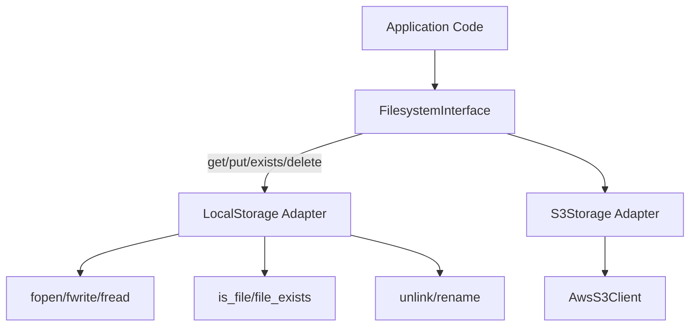

# Design Pattern: Adapter

## Purpose
Convert the interface of a class into another interface that clients expect. Adapter lets classes work together that couldn't otherwise because of incompatible interfaces.

## When to Use
- Integrating third-party libraries or legacy code with different interfaces
- Creating a uniform API over multiple implementations with varying interfaces
- Isolating external dependencies behind an interface your application controls
- Testing: adapting a fast in-memory implementation where a slow external service would normally be used

**Used in Core**: [CORE-14 Filesystem Abstraction](/docs/blueprints/Core/CORE-14.md) adapts PHP native filesystem functions into a unified `FilesystemInterface`. [CORE-19 DBAL](/docs/blueprints/Core/CORE-19.md) adapts PDO drivers (SQLite, MySQL, PostgreSQL) behind a `DriverInterface`.

## Diagram



## Code Example

```php
<?php
// Target Interface (what the application expects)
interface FilesystemInterface {
    public function get(string $path): string;
    public function put(string $path, string $contents): bool;
    public function exists(string $path): bool;
    public function delete(string $path): bool;
    public function move(string $from, string $to): bool;
}

// Adaptee 1: Local filesystem (PHP native functions)
// No class to adapt - we're adapting procedural functions

// Adapter 1: Local storage implementation
class LocalStorageAdapter implements FilesystemInterface
{
    public function __construct(
        private string $root
    ) {}

    private function resolve(string $path): string
    {
        // Prevent directory traversal
        $realPath = realpath($this->root . '/' . ltrim($path, '/'));
        if (!str_starts_with($realPath, realpath($this->root))) {
            throw new SecurityException('Path traversal detected');
        }
        return $realPath;
    }

    public function get(string $path): string
    {
        return file_get_contents($this->resolve($path));
    }

    public function put(string $path, string $contents): bool
    {
        // Atomic write using tempnam + rename
        $target = $this->resolve($path);
        $tmp = tempnam(dirname($target), '.tmp');
        file_put_contents($tmp, $contents);
        return rename($tmp, $target);
    }

    public function exists(string $path): bool
    {
        return file_exists($this->resolve($path));
    }

    public function delete(string $path): bool
    {
        return unlink($this->resolve($path));
    }

    public function move(string $from, string $to): bool
    {
        return rename($this->resolve($from), $this->resolve($to));
    }
}

// Adaptee 2: AWS S3 SDK (has different interface)
// class S3Client { putObject, getObject, deleteObject, doesObjectExist }

// Adapter 2: S3 storage implementation
class S3StorageAdapter implements FilesystemInterface
{
    public function __construct(
        private \Aws\S3\S3Client $client,
        private string $bucket
    ) {}

    public function get(string $path): string
    {
        $result = $this->client->getObject([
            'Bucket' => $this->bucket,
            'Key' => $path,
        ]);
        return $result['Body']->getContents();
    }

    public function put(string $path, string $contents): bool
    {
        $this->client->putObject([
            'Bucket' => $this->bucket,
            'Key' => $path,
            'Body' => $contents,
        ]);
        return true;
    }

    public function exists(string $path): bool
    {
        return $this->client->doesObjectExist($this->bucket, $path);
    }

    public function delete(string $path): bool
    {
        $this->client->deleteObject([
            'Bucket' => $this->bucket,
            'Key' => $path,
        ]);
        return true;
    }

    public function move(string $from, string $to): bool
    {
        $this->client->copyObject([
            'Bucket' => $this->bucket,
            'Key' => $to,
            'CopySource' => "{$this->bucket}/{$from}",
        ]);
        return $this->delete($from);
    }
}

// Usage
$filesystem = new LocalStorageAdapter('/var/data');
// or swap to S3 without changing consumer code:
// $filesystem = new S3StorageAdapter($s3Client, 'my-bucket');

$logs = $filesystem->get('logs/app.log');
$filesystem->put('exports/report.csv', $csvContent);
```

## Anti-Patterns to Avoid

1. **Adapter Proliferation**: Don't create an adapter for every possible implementation. Use the Factory pattern to select adapters based on configuration.
2. **Leaking Adaptee API**: The adapter should hide adaptee-specific details. Don't expose adaptee methods through the adapter interface.
3. **Over-abstracting**: If you only ever have one implementation, an interface + adapter is premature. Add the abstraction when a second implementation is needed.
4. **Performance Overhead**: Simple adapters add minimal overhead. But if the adapter is transforming data formats (like XML to JSON), consider caching the transformation.

## Verification
- Application code only depends on the target interface, never on adaptee directly
- Adding a new adapter (e.g., GCS storage) requires zero changes to application code
- Adapter fully implements the target interface without throwing `NotImplementedException`
- Adapter does not expose adaptee-specific exceptions; wraps them in application exceptions
- Adapter can be tested with a mock adaptee