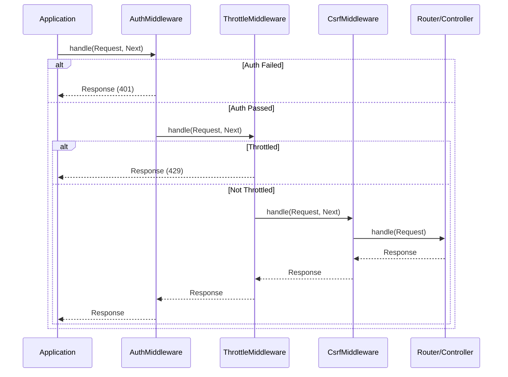

# Design Pattern: Chain of Responsibility

## Purpose
Avoid coupling the sender of a request to its receiver by giving more than one object a chance to handle the request. Chain the receiving objects and pass the request along the chain until an object handles it.

## When to Use
- Multiple handlers can process a request, but the specific handler is determined at runtime
- You want to issue a request to one of several objects without specifying the receiver explicitly
- The set of handlers should be dynamically configurable
- Cross-cutting concerns (logging, auth, caching) applied in a pipeline before the core handler

**Used in Core**: [CORE-05 Middleware Engine](/docs/blueprints/Core/CORE-05.md) is a Chain of Responsibility implementation. Each middleware either handles the request (returns a Response early) or passes it to the next middleware in the chain. The Router is the final handler in the chain.

## Diagram



## Code Example

```php
<?php
// Handler Interface (PSR-15)
interface MiddlewareInterface {
    public function process(
        ServerRequestInterface $request,
        RequestHandlerInterface $handler
    ): ResponseInterface;
}

// Request Handler (orchestrates the chain)
class RequestHandler implements RequestHandlerInterface
{
    private int $index = 0;

    /** @param MiddlewareInterface[] $queue */
    public function __construct(
        private array $queue,
        private RequestHandlerInterface $coreHandler
    ) {}

    public function handle(ServerRequestInterface $request): ResponseInterface
    {
        if ($this->index < count($this->queue)) {
            $middleware = $this->queue[$this->index];
            $this->index++;
            return $middleware->process($request, $this);
        }

        return $this->coreHandler->handle($request);
    }
}

// Concrete Middleware 1: Authentication
class AuthMiddleware implements MiddlewareInterface
{
    public function process(
        ServerRequestInterface $request,
        RequestHandlerInterface $handler
    ): ResponseInterface {
        $token = $request->getHeaderLine('Authorization');

        if (empty($token)) {
            // Handle the request early - break the chain
            return new JsonResponse(['error' => 'Unauthorized'], 401);
        }

        // Authenticate and pass modified request to next
        $user = $this->authenticate($token);
        $request = $request->withAttribute('user', $user);

        return $handler->handle($request);
    }
}

// Concrete Middleware 2: Rate Limiting
class ThrottleMiddleware implements MiddlewareInterface
{
    public function process(
        ServerRequestInterface $request,
        RequestHandlerInterface $handler
    ): ResponseInterface {
        $ip = $request->getServerParams()['REMOTE_ADDR'] ?? 'unknown';

        if ($this->isRateLimited($ip)) {
            return new JsonResponse(['error' => 'Too Many Requests'], 429);
        }

        return $handler->handle($request);
    }
}

// Usage
$middlewareStack = [
    new AuthMiddleware(),
    new ThrottleMiddleware(),
    new CsrfMiddleware(),
];

$coreHandler = new class implements RequestHandlerInterface {
    public function handle(ServerRequestInterface $request): ResponseInterface {
        // This is where the Router/Controller takes over
        $controller = $request->getAttribute('controller');
        return $controller->execute($request);
    }
};

$handler = new RequestHandler($middlewareStack, $coreHandler);
$response = $handler->handle($request);
```

## Anti-Patterns to Avoid

1. **Broken Chain**: A middleware that neither handles the request nor calls `$handler->handle()` breaks the chain and hangs the request. Always call `handle()` unless intentionally short-circuiting.
2. **Mutable Handler Queue**: Modifying the middleware queue while a request is being processed leads to unpredictable behavior. Configure the queue at startup.
3. **Too Many Middleware Layers**: 10+ middleware layers add overhead. Consolidate related concerns (e.g., one "SecurityMiddleware" that handles auth + CSRF + CORS).
4. **Skipping Response Propagation**: When a middleware calls `$handler->handle()`, it must return the response it receives. Failing to do so discards downstream modifications.

## Verification
- Any middleware can short-circuit the chain by returning a response without calling `handle()`
- The chain continues normally if no middleware handles the request
- Each middleware can modify the request before passing it to the next handler
- Each middleware can modify the response after receiving it from downstream
- The chain is configurable without modifying individual middleware classes
- Adding a new middleware requires zero changes to existing middleware