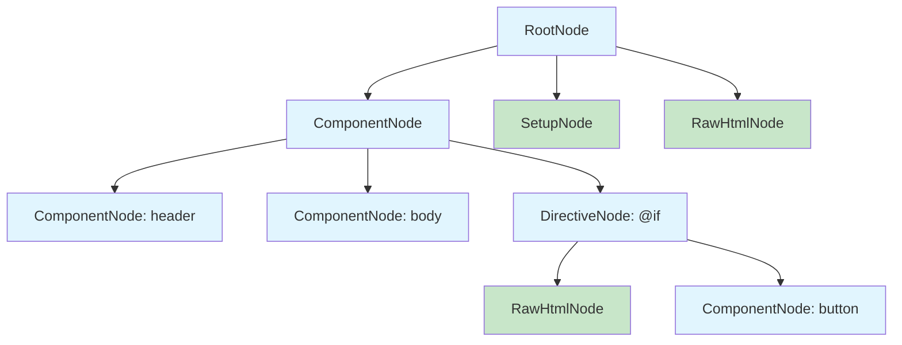

# Design Pattern: Composite

## Purpose
Compose objects into tree structures to represent part-whole hierarchies. Composite lets clients treat individual objects and compositions of objects uniformly.

## When to Use
- Hierarchical data needs to be represented and manipulated (UI components, file systems, organizational charts)
- Clients should be able to ignore the difference between compositions of objects and individual objects
- Operations need to be applied recursively across a tree structure
- The structure is dynamic and can have arbitrary depth

**Used in Core**: [CORE-11 SuperPHP Parser](/docs/blueprints/Core/CORE-11.md) builds an AST (Abstract Syntax Tree) where nodes like `ComponentNode`, `SetupNode`, and `DirectiveNode` form a composite tree. The [CORE-12 Compiler](/docs/blueprints/Core/CORE-12.md) traverses this composite structure to generate PHP code.

## Diagram



## Code Example

```php
<?php
// Component (abstract)
abstract class AstNode
{
    protected array $children = [];

    public function add(AstNode $node): void
    {
        $this->children[] = $node;
    }

    public function remove(AstNode $node): void
    {
        $this->children = array_filter(
            $this->children,
            fn($c) => $c !== $node
        );
    }

    abstract public function compile(): string;
}

// Leaf: Raw HTML (no children)
class RawHtmlNode extends AstNode
{
    public function __construct(
        private string $html
    ) {}

    public function compile(): string
    {
        return $this->html;
    }

    // Override to prevent adding children to leaf nodes
    public function add(AstNode $node): void
    {
        throw new \LogicException('Cannot add children to leaf node');
    }
}

// Leaf: Variable expression
class VariableNode extends AstNode
{
    public function __construct(private string $name) {}

    public function compile(): string
    {
        return "<?= htmlspecialchars(\${$this->name}) ?>";
    }
}

// Composite: Component with children
class ComponentNode extends AstNode
{
    public function __construct(
        private string $name,
        private array $attributes = []
    ) {}

    public function compile(): string
    {
        $children = '';
        foreach ($this->children as $child) {
            $children .= $child->compile();
        }

        return sprintf(
            '<s:%s %s>%s</s:%s>',
            $this->name,
            $this->compileAttributes(),
            $children,
            $this->name
        );
    }

    private function compileAttributes(): string
    {
        return implode(' ', array_map(
            fn($k, $v) => "{$k}=\"{$v}\"",
            array_keys($this->attributes),
            $this->attributes
        ));
    }
}

// Composite: If directive
class DirectiveIfNode extends AstNode
{
    public function __construct(
        private string $condition
    ) {}

    public function compile(): string
    {
        $body = '';
        foreach ($this->children as $child) {
            $body .= $child->compile();
        }

        return "<?php if({$this->condition}): ?>{$body}<?php endif; ?>";
    }
}

// Usage - building the AST tree
$root = new ComponentNode('layout');
$header = new ComponentNode('header');
$header->add(new RawHtmlNode('<h1>Welcome</h1>'));

$body = new ComponentNode('content');
$greeting = new DirectiveIfNode('$user !== null');
$greeting->add(new RawHtmlNode('<p>Hello, </p>'));
$greeting->add(new VariableNode('user.name'));
$body->add($greeting);

$root->add($header);
$root->add($body);

// Compile recursively
echo $root->compile();
// Outputs: <s:layout><s:header><h1>Welcome</h1></s:header><s:content><?php if($user !== null): ?><p>Hello, </p><?= htmlspecialchars($user.name) ?><?php endif; ?></s:content></s:layout>
```

## Anti-Patterns to Avoid

1. **Ignoring Leaf/Composite Distinction**: If leaf nodes need different behavior, don't force them to implement composite methods. Throw `LogicException` or split into separate interfaces.
2. **Overly Generic Components**: The composite interface should be specific enough to be useful. Too generic (just `execute()`) loses the benefits of type safety.
3. **Deep Tree Traversal Performance**: Recursive operations on deeply nested composites (1000+ levels) can cause stack overflow. Consider iterative traversal for production code.
4. **Mutating While Iterating**: Modifying the composite tree while traversing it (adding/removing children) leads to unpredictable behavior. Collect changes and apply after traversal.

## Verification
- Client code can treat leaf and composite nodes identically via the common interface
- Operations on the tree are applied recursively to all children
- Adding a new node type does not require changing the traversal logic
- Leaf nodes correctly prevent adding children
- The composite structure can represent arbitrarily deep hierarchies