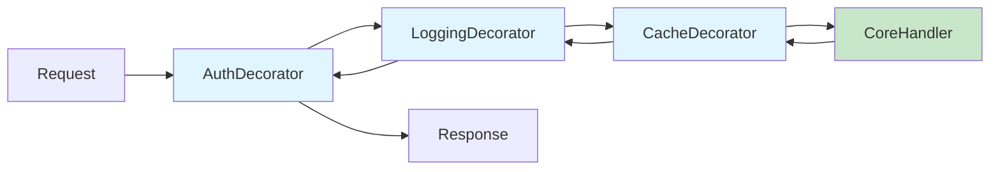

# Design Pattern: Decorator

## Purpose
Attach additional responsibilities to an object dynamically. Decorators provide a flexible alternative to subclassing for extending functionality by wrapping an object with one or more layers of behavior.

## When to Use
- Adding cross-cutting concerns (logging, caching, authentication, timing) without modifying the original class
- Responsibilities need to be added or removed at runtime
- Subclassing would lead to an explosion of classes (e.g., `LoggedAuthService`, `CachedAuthService`, `LoggedCachedAuthService`)
- The Open/Closed Principle: classes should be open for extension but closed for modification

**Used in Core**: [CORE-05 Middleware Engine](/docs/blueprints/Core/CORE-05.md) is a variation of the Decorator pattern (specifically Chain of Responsibility) where each middleware layer "decorates" the request/response processing.

## Diagram



## Code Example

```php
<?php
// Component Interface
interface ReportGeneratorInterface {
    public function generate(array $data): string;
}

// Concrete Component
class SimpleReportGenerator implements ReportGeneratorInterface {
    public function generate(array $data): string {
        return json_encode($data);
    }
}

// Base Decorator
abstract class ReportDecorator implements ReportGeneratorInterface {
    public function __construct(
        protected ReportGeneratorInterface $wrapped
    ) {}
}

// Concrete Decorator 1: Add CSV format
class CsvReportDecorator extends ReportDecorator {
    public function generate(array $data): string {
        $inner = $this->wrapped->generate($data);
        $decoded = json_decode($inner, true);

        $csv = implode(',', array_keys($decoded[0] ?? [])) . "\n";
        foreach ($decoded as $row) {
            $csv .= implode(',', $row) . "\n";
        }
        return $csv;
    }
}

// Concrete Decorator 2: Add compression
class CompressedReportDecorator extends ReportDecorator {
    public function generate(array $data): string {
        $inner = $this->wrapped->generate($data);
        return gzencode($inner, 9);
    }
}

// Concrete Decorator 3: Add encryption
class EncryptedReportDecorator extends ReportDecorator {
    public function __construct(
        ReportGeneratorInterface $wrapped,
        private Encrypter $encrypter
    ) {
        parent::__construct($wrapped);
    }

    public function generate(array $data): string {
        $inner = $this->wrapped->generate($data);
        return $this->encrypter->encrypt($inner);
    }
}

// Usage
$generator = new SimpleReportGenerator();

// Dynamically compose decorators at runtime
$generator = new CsvReportDecorator($generator);
$generator = new CompressedReportDecorator($generator);
$generator = new EncryptedReportDecorator($generator, $encrypter);

// The wrapped call executes: encrypt(compress(csv(json(data))))
echo $generator->generate($reportData);
```

## Anti-Patterns to Avoid

1. **Too Many Layers**: More than 3-4 decorators can make debugging difficult. Consider consolidating related concerns.
2. **Decorators with Side Effects**: Each decorator should only add its specific behavior. Avoid decorators that depend on other decorators being present.
3. **Breaking the Interface Contract**: A decorator must fully implement the interface it decorates. Returning different types or throwing unexpected exceptions violates the contract.
4. **Stateful Decorators**: Decorators should be stateless or their state should be scoped to a single operation. Shared state between decorator layers causes race conditions.

## Verification
- Decorators can be composed in any order without breaking functionality
- Each decorator adds exactly one responsibility
- The concrete component works without any decorators
- The type system allows decorators to wrap other decorators seamlessly
- Adding a new decorator does not require modifying existing code