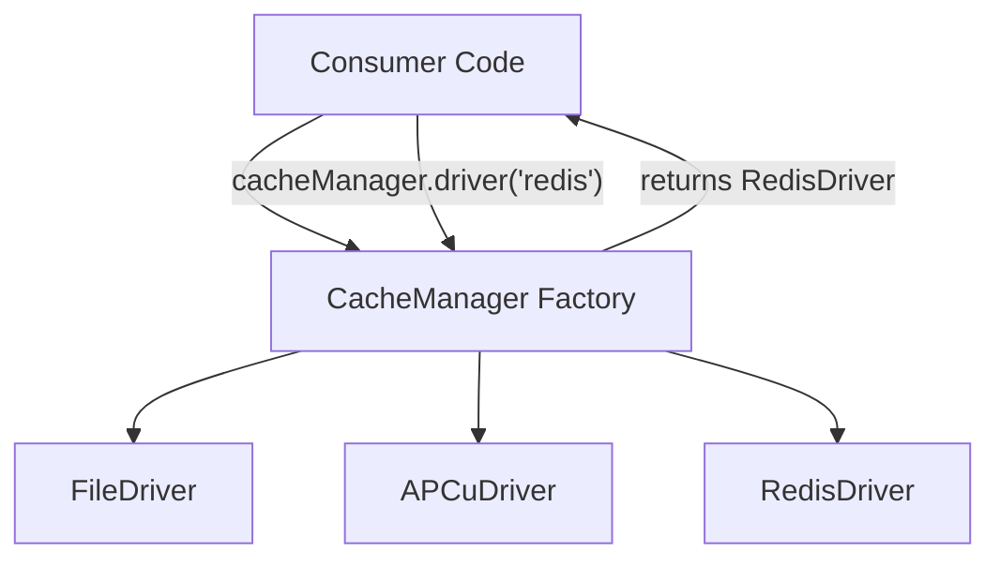

# Design Pattern: Factory

## Purpose
Encapsulate object creation logic behind a single interface, allowing subclasses or implementations to alter the type of objects created without modifying consumer code.

## When to Use
- Creating objects whose concrete type is determined at runtime
- Construction logic is complex (multiple steps, configuration, or conditional branches)
- Need to centralize object creation to avoid duplication across the codebase
- Testing requires swapping real implementations with mocks

**Used in Core**: [CORE-15 Cache Abstraction](/docs/blueprints/Core/CORE-15.md) uses a `CacheManager` factory to create different cache driver instances.

## Diagram



## Code Example

```php
<?php
namespace Sovereign\Core\Cache;

// Product Interface
interface CacheDriverInterface {
    public function get(string $key): mixed;
    public function set(string $key, mixed $value, int $ttl): bool;
    public function delete(string $key): bool;
    public function clear(): bool;
}

// Concrete Products
class FileDriver implements CacheDriverInterface { /* ... */ }
class APCuDriver implements CacheDriverInterface { /* ... */ }
class RedisDriver implements CacheDriverInterface { /* ... */ }

// Factory
class CacheManager
{
    public function __construct(
        private ConfigRepository $config
    ) {}

    public function driver(?string $name = null): CacheDriverInterface
    {
        $name = $name ?? $this->config->get('cache.default', 'file');

        return match($name) {
            'file' => new FileDriver($this->config->get('cache.stores.file')),
            'apcu' => new APCuDriver(),
            'redis' => new RedisDriver($this->config->get('cache.stores.redis')),
            default => throw new \InvalidArgumentException("Unknown driver: {$name}"),
        };
    }
}

// Usage
$cacheManager = $container->make(CacheManager::class);
$cache = $cacheManager->driver('redis');  // Type: CacheDriverInterface
$cache->set('user:42', $userData, 3600);
```

## Anti-Patterns to Avoid

1. **Factory Overuse**: Don't create a factory for every single object. Reserve factories for scenarios where creation logic is genuinely complex or polymorphic.
2. **Static Factories**: Static factory methods cannot be mocked in tests. Always inject the factory through the constructor.
3. **Giant Switch/Match Blocks**: If your factory's match statement grows beyond 5-6 cases, consider a Registry pattern where drivers self-register.
4. **Leaking Configuration**: The factory should abstract away construction details. Don't expose driver-specific configuration to the factory's caller.

## Verification
- The factory returns the correct concrete type based on input
- Adding a new product type does NOT require modifying existing consumer code
- The factory can be replaced with a mock in unit tests
- Each product type can be configured independently