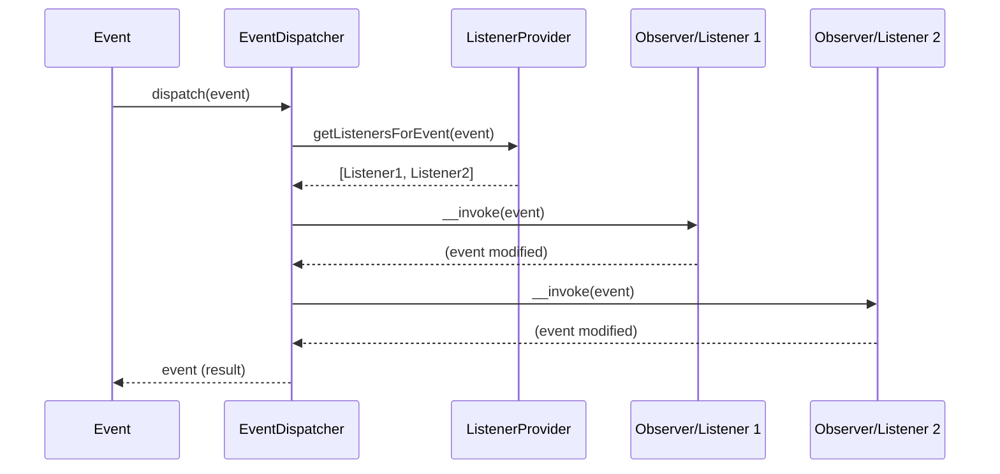

# Design Pattern: Observer

## Purpose
Define a one-to-many dependency between objects so that when one object changes state, all its dependents are notified and updated automatically without coupling the subject to its observers.

## When to Use
- A change to one object requires changing others, but you don't know how many objects need changing
- An object should notify other objects without making assumptions about who those objects are
- Event-driven architectures, publish-subscribe systems, and callback registration
- Audit trails, logging, metrics collection triggered by domain events

**Used in Core**: [CORE-03 Event Dispatcher](/ApprovedBlueprints/Core/CORE-03.md) implements the Observer pattern. Events are the "subject" and listeners are the "observers". The PSR-14 `ListenerProvider` decouples event emission from listener execution.

## Diagram



## Code Example

```php
<?php
// Subject (Observable) - In the Sovereign Stack, events are subjects
class UserLoginEvent extends Event
{
    public function __construct(
        public readonly User $user,
        public readonly string $ip,
        public bool $isSuspicious = false,
    ) {}
}

// Observer 1: Update last login timestamp
class UpdateLastLoginListener
{
    public function __construct(private UserRepository $users) {}

    public function __invoke(UserLoginEvent $event): void
    {
        $event->user->last_login_at = now();
        $event->user->last_login_ip = $event->ip;
        $this->users->save($event->user);
    }
}

// Observer 2: Check for suspicious activity
class SuspiciousActivityListener
{
    public function __construct(private SecurityService $security) {}

    public function __invoke(UserLoginEvent $event): void
    {
        if ($this->security->isSuspiciousLogin($event->user, $event->ip)) {
            $event->isSuspicious = true;
            $this->security->notifyAdmin($event->user, $event->ip);
        }
    }
}

// Observer 3: Log to analytics
class AnalyticsListener
{
    public function __invoke(UserLoginEvent $event): void
    {
        Logger::channel('analytics')->info('user.login', [
            'user_id' => $event->user->id,
            'ip' => $event->ip,
        ]);
    }
}

// Registration (via ServiceProvider)
$provider->addListener(UserLoginEvent::class, UpdateLastLoginListener::class, priority: 100);
$provider->addListener(UserLoginEvent::class, SuspiciousActivityListener::class, priority: 200);
$provider->addListener(UserLoginEvent::class, AnalyticsListener::class, priority: 10);
```

## Anti-Patterns to Avoid

1. **Observer Memory Leaks**: Failing to unregister observers when no longer needed. In PHP request lifecycle this is less of an issue, but for long-running processes (CLI workers), ensure observers can be deregistered.
2. **Observer Does Too Much**: If an observer is doing heavy lifting (DB writes, API calls, file I/O), it should dispatch a separate job/event rather than blocking the pipeline.
3. **Shared Mutable State**: Observers should not rely on execution order for correctness. If order matters, use explicit priorities but don't depend on implicit ordering.
4. **Exception Propagation**: A failing observer should not crash other observers. Use error isolation (try/catch per observer) as implemented in [CORE-03](/ApprovedBlueprints/Core/CORE-03.md).

## Verification
- New observers can be added without modifying the event or existing observers
- Observers run independently; one failure does not affect others
- Event carries all data observers might need (avoid global state lookups)
- Observers are lazily resolved (registered as class names, not instances)
- Priority system correctly orders execution when order matters