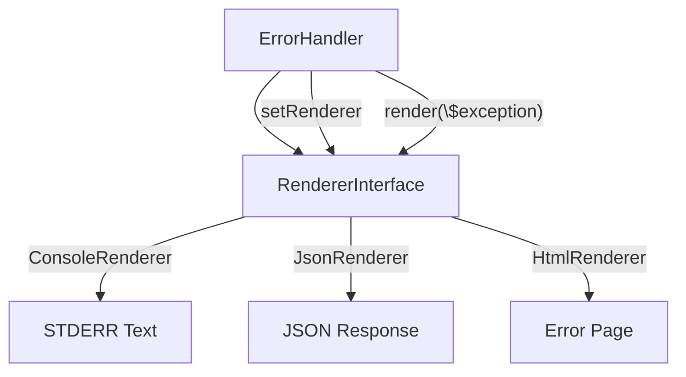

# Design Pattern: Strategy

## Purpose
Define a family of interchangeable algorithms, encapsulate each one, and make them swappable at runtime without modifying the client that uses them.

## When to Use
- Multiple algorithms exist for the same task (e.g., different rendering formats, validation strategies)
- The algorithm varies independently from the code that uses it
- Conditional logic (if/else or switch) for selecting behavior grows unwieldy
- You need to add new behaviors without changing existing, tested code

**Used in Core**: [CORE-08 Error Handler](/docs/blueprints/Core/CORE-08.md) uses a `RendererInterface` strategy pattern to switch between Console, JSON, and SuperPHP error page rendering depending on the context.

## Diagram



## Code Example

```php
<?php
namespace Sovereign\Core\Error;

// Strategy Interface
interface RendererInterface {
    public function render(\Throwable $exception): string;
}

// Concrete Strategies
class ConsoleRenderer implements RendererInterface {
    public function render(\Throwable $e): string {
        return sprintf(
            "[ERROR] %s in %s:%d\n%s\n",
            $e->getMessage(),
            $e->getFile(),
            $e->getLine(),
            $e->getTraceAsString()
        );
    }
}

class JsonRenderer implements RendererInterface {
    public function render(\Throwable $e): string {
        return json_encode([
            'error' => true,
            'message' => $e->getMessage(),
            'code' => $e->getCode(),
            // No stack trace in JSON for security
        ]);
    }
}

class HtmlRenderer implements RendererInterface {
    public function render(\Throwable $e): string {
        return <<<HTML
<!DOCTYPE html>
<html><body>
<h1>Server Error</h1>
<p>{$e->getMessage()}</p>
</body></html>
HTML;
    }
}

// Context/Client
class ExceptionHandler {
    private RendererInterface $renderer;

    public function __construct(
        private ConfigRepository $config
    ) {
        // Strategy selected based on environment
        $this->renderer = match ($this->config->get('app.env')) {
            'cli' => new ConsoleRenderer(),
            'api' => new JsonRenderer(),
            default => new HtmlRenderer(),
        };
    }

    public function handle(\Throwable $exception): void {
        $output = $this->renderer->render($exception);
        echo $output;
    }
}
```

## Anti-Patterns to Avoid

1. **Fat Strategy Interfaces**: If strategy interfaces have more than 2-3 methods, consider if they should be separate concerns.
2. **Context Passing Entire State**: Pass only what the strategy needs, not the entire application context.
3. **Strategy Explosion**: If you have 15+ strategies for the same interface, consider if a data-driven approach (e.g., rules engine) would be more appropriate.
4. **Runtime Switching Too Often**: Strategies should be selected at configuration/construction time, not swapped on every method call.

## Verification
- A new strategy can be added without modifying existing strategies or the client
- The client delegates algorithm execution entirely to the strategy
- Each strategy is independently testable
- Strategy selection is determined by a single point of configuration