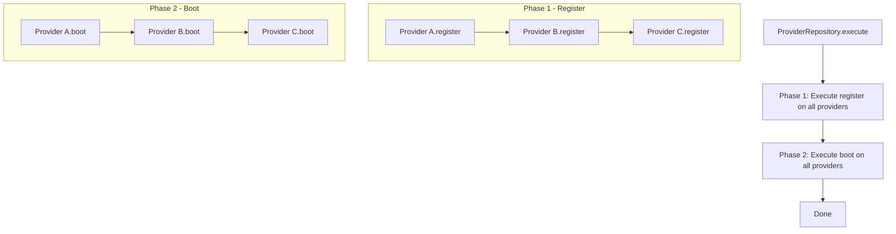

# Design Pattern: Template Method

## Purpose
Define the skeleton of an algorithm in a base class, letting subclasses override specific steps without changing the algorithm's structure. The base class controls the sequence and provides default implementations for optional steps.

## When to Use
- Multiple implementations share the same algorithmic structure but differ in specific steps
- You want to enforce a consistent process across different implementations
- The algorithm has invariant parts (always the same) and variant parts (customizable)
- Code reuse: avoid duplicating the common parts of an algorithm

**Used in Core**: [CORE-17 ServiceProvider](/ApprovedBlueprints/Core/CORE-17.md) uses Template Method. The `register()` and `boot()` methods are steps in the provider lifecycle. The `ProviderRepository` orchestrates the sequence, ensuring all `register()` calls complete before any `boot()` calls begin. [CORE-13 CLI Command](/ApprovedBlueprints/Core/CORE-13.md) also uses this pattern: `execute()` is the template method, while argument parsing and output formatting are fixed steps.

## Diagram



## Code Example

```php
<?php
// Abstract class with template method
abstract class Migration
{
    // Template Method - defines the algorithm skeleton
    final public function migrate(): MigrationResult
    {
        $this->beginTransaction();

        try {
            $this->verifyPrerequisites();   // Step 1: Check preconditions
            $this->up();                     // Step 2: Apply migration (abstract)
            $this->recordMigration();        // Step 3: Log the migration
            $this->commit();

            return MigrationResult::success($this->getVersion());
        } catch (\Throwable $e) {
            $this->rollback();
            return MigrationResult::failure($this->getVersion(), $e->getMessage());
        }
    }

    // Template Method for rollback
    final public function rollback(): MigrationResult
    {
        $this->beginTransaction();

        try {
            $this->down();                   // Step: Reverse migration (abstract)
            $this->removeMigrationRecord();
            $this->commit();

            return MigrationResult::success($this->getVersion());
        } catch (\Throwable $e) {
            $this->rollback();
            return MigrationResult::failure($this->getVersion(), $e->getMessage());
        }
    }

    // Abstract methods (must be implemented by subclasses)
    abstract protected function up(): void;
    abstract protected function down(): void;
    abstract protected function getVersion(): string;

    // Hook methods (optional override with default behavior)
    protected function verifyPrerequisites(): void
    {
        // Default: no prerequisites
    }

    // Private fixed steps (same for all migrations)
    private function beginTransaction(): void { /* ... */ }
    private function commit(): void { /* ... */ }
    private function recordMigration(): void { /* ... */ }
    private function removeMigrationRecord(): void { /* ... */ }
}

// Concrete implementation
class CreateUsersTableMigration extends Migration
{
    protected function getVersion(): string
    {
        return '2024_01_01_000001';
    }

    protected function up(): void
    {
        DB::statement('
            CREATE TABLE users (
                id BIGINT AUTO_INCREMENT PRIMARY KEY,
                name VARCHAR(255) NOT NULL,
                email VARCHAR(255) NOT NULL UNIQUE,
                password_hash VARCHAR(255) NOT NULL,
                created_at TIMESTAMP DEFAULT CURRENT_TIMESTAMP
            )
        ');
    }

    protected function down(): void
    {
        DB::statement('DROP TABLE IF EXISTS users');
    }

    // Override hook to add precondition
    protected function verifyPrerequisites(): void
    {
        if (DB::schema()->hasTable('users')) {
            throw new \RuntimeException('Users table already exists');
        }
    }
}

// Another concrete implementation
class AddMfaToUsersMigration extends Migration
{
    protected function getVersion(): string
    {
        return '2024_03_14_000003';
    }

    protected function up(): void
    {
        DB::statement('ALTER TABLE users ADD COLUMN mfa_secret VARCHAR(64) NULL');
        DB::statement('ALTER TABLE users ADD COLUMN mfa_enabled TINYINT(1) DEFAULT 0');
    }

    protected function down(): void
    {
        DB::statement('ALTER TABLE users DROP COLUMN mfa_secret');
        DB::statement('ALTER TABLE users DROP COLUMN mfa_enabled');
    }

    protected function verifyPrerequisites(): void
    {
        if (!DB::schema()->hasTable('users')) {
            throw new \RuntimeException('Users table must exist first');
        }
    }
}

// Usage - the framework calls the template method
$migration = new CreateUsersTableMigration();
$result = $migration->migrate();  // Template method orchestrates everything
```

## Anti-Patterns to Avoid

1. **Too Many Abstract Methods**: If subclasses must override 5+ methods, the template is too rigid. Consider Strategy pattern instead, where only one or two behaviors vary.
2. **Calling Overridable Methods from Constructor**: Subclass state isn't initialized yet when the parent constructor runs. Never call abstract or hook methods from the constructor.
3. **Hollywood Principle Violation** ("Don't call us, we'll call you"): The base class controls the flow. Subclasses should add behavior in the hooks, not control the sequence.
4. **Deep Template Hierarchies**: More than 2-3 levels of template inheritance becomes hard to trace. Prefer composition (Strategy) over deep inheritance chains.

## Verification
- The template method controls the algorithm sequence; subclasses cannot change the order
- Adding a new subclass requires implementing only the abstract methods
- Hook methods have sensible defaults so subclasses aren't forced to override them
- The template method handles common concerns (transactions, error handling, logging)
- Subclasses can be tested in isolation by calling their implemented steps directly