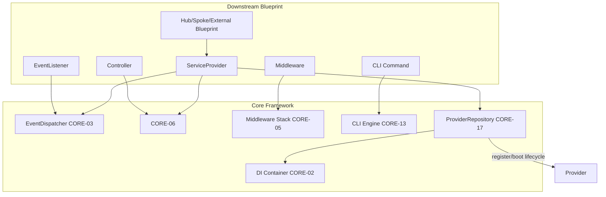

# Extensibility Points Map

## Overview
This document maps all extension hooks in the Sovereign Stack Core Framework, showing how downstream blueprint authors (Hub, Spoke, and External tiers) integrate with each extension point. Each entry includes the hook location, integration mechanism, and concrete code examples.

### Legend
| Symbol | Meaning |
|--------|---------|
| ServiceProvider | Register via `register()` / `boot()` in a Service Provider |
| DI Binding | Bind a concrete implementation to an interface |
| Event Listener | Register a listener for a core event |
| Middleware | Add middleware to the pipeline |
| Route Attribute | Define routes via PHP 8.3 Attributes |
| Config Key | Set configuration values |
| Interface Implementation | Implement a core interface |

---

## Extension Point Inventory

| # | Hook Name | Core Blueprint | Type | Integration Point |
|---|-----------|---------------|------|------------------|
| 1 | DI Container Bindings | [CORE-02](/ApprovedBlueprints/Core/CORE-02.md) | ServiceProvider / DI Binding | `$container->bind()` in `register()` |
| 2 | Service Provider Registration | [CORE-17](/ApprovedBlueprints/Core/CORE-17.md) | ServiceProvider | Extend `ServiceProvider`, add to `config/app.php` |
| 3 | Event Listener Registration | [CORE-03](/ApprovedBlueprints/Core/CORE-03.md) | Event Listener | `$provider->addListener()` in ServiceProvider |
| 4 | Middleware Registration | [CORE-05](/ApprovedBlueprints/Core/CORE-05.md) | Middleware | `#[Route(middleware: [...])]` or global kernel config |
| 5 | Route Definition | [CORE-06](/ApprovedBlueprints/Core/CORE-06.md) | Route Attribute | `#[Route(path, method)]` on controller methods |
| 6 | CLI Command Registration | [CORE-13](/ApprovedBlueprints/Core/CORE-13.md) | ServiceProvider | Extend `Command`, placed in `app/Console/Commands/` |
| 7 | Validation Custom Rules | [CORE-03](/ApprovedBlueprints/Core/CORE-03.md) | DI Binding | Implement `RuleInterface`, register via `addRule()` |
| 8 | Cache Driver Implementation | [CORE-15](/ApprovedBlueprints/Core/CORE-15.md) | Interface Implementation | Implement `CacheDriverInterface`, register via `CacheManager` |
| 9 | Filesystem Driver Implementation | [CORE-14](/ApprovedBlueprints/Core/CORE-14.md) | Interface Implementation | Implement `FilesystemInterface`, bind in container |
| 10 | Logger Handler | [CORE-09](/ApprovedBlueprints/Core/CORE-09.md) | DI Binding | Implement handler, add to `HandlerStack` |
| 11 | Error Renderer Strategy | [CORE-08](/ApprovedBlueprints/Core/CORE-08.md) | Interface Implementation | Implement `RendererInterface`, configure in config |
| 12 | Database Driver | [CORE-19](/ApprovedBlueprints/Core/CORE-19.md) | Interface Implementation | Implement `DriverInterface`, register with `ConnectionManager` |
| 13 | Migration Definition | [CORE-20](/ApprovedBlueprints/Core/CORE-20.md) | ServiceProvider | Extend `Migration`, placed in `database/migrations/` |
| 14 | Configuration Override | [CORE-10](/ApprovedBlueprints/Core/CORE-10.md) | Config Key | Set values in `config/*.php` or `.env` |
| 15 | Kernel Lifecycle Hooks | [CORE-18](/ApprovedBlueprints/Core/CORE-18.md) | Event Listener | Listen to `kernel.before_boot`, `kernel.after_boot`, `kernel.before_request`, `kernel.after_request` |
| 16 | Encryption Driver | [CORE-16](/ApprovedBlueprints/Core/CORE-16.md) | DI Binding | Implement `EncrypterInterface`, bind in container |
| 17 | Deferred Service Provider | [CORE-17](/ApprovedBlueprints/Core/CORE-17.md) | ServiceProvider | Set `$deferred = true` + `$provides` array |
| 18 | CompilerPass Extension | [CORE-02](/ApprovedBlueprints/Core/CORE-02.md) | ServiceProvider | Implement `CompilerPassInterface` for DI container optimization |
| 19 | Forge Command (Scaffolding) | [CORE-20](/ApprovedBlueprints/Core/CORE-20.md) | ServiceProvider | Extend `ForgeCommand`, auto-discovered by CommandRegistry |
| 20 | Health Check Provider | [CORE-20](/ApprovedBlueprints/Core/CORE-20.md) | ServiceProvider | Implement `HealthCheckInterface`, registered in `HealthChecker` |

---

## Detailed Extension Point Reference

### 1. DI Container Bindings

**Blueprint**: [CORE-02](/ApprovedBlueprints/Core/CORE-02.md)
**Type**: ServiceProvider / DI Binding
**Pattern**: [Factory](/docs/design-patterns/factory-pattern.md), [Adapter](/docs/design-patterns/adapter-pattern.md)

Register a custom service implementation:

```php
<?php
class MyHubServiceProvider extends ServiceProvider
{
    public function register(): void
    {
        // Bind interface to concrete implementation
        $this->app->bind(
            AnalyticsInterface::class,
            MyCustomAnalytics::class,
            singleton: true
        );

        // Bind a pre-configured instance
        $this->app->bind('cache.default', fn() => new RedisCache(
            host: config('cache.redis.host'),
            port: config('cache.redis.port')
        ));
    }
}
```

**Downstream blueprint integration**: Any Hub/Spoke blueprint with a ServiceProvider can register bindings.

---

### 2. Service Provider Registration

**Blueprint**: [CORE-17](/ApprovedBlueprints/Core/CORE-17.md)
**Type**: ServiceProvider
**Pattern**: [Template Method](/docs/design-patterns/template-method.md)

Every blueprint must include a ServiceProvider:

```php
<?php
class SpokeServiceProvider extends ServiceProvider
{
    protected bool $deferred = false;

    public function register(): void
    {
        // Step 1: Register bindings only
        $this->app->bind(SpokeService::class);
    }

    public function boot(): void
    {
        // Step 2: Interact with other services (all bindings exist)
        $router = $this->app->make(RouterInterface::class);
        // Register routes, event listeners, etc.
    }
}
```

Registration in `config/app.php`:
```php
'providers' => [
    // ... existing core providers
    App\Spoke\SpokeServiceProvider::class,
],
```

**Auto-discovery**: Providers in `app/Providers/` are auto-discovered. Providers in other directories must be registered manually or added to the scan paths in `config/app.php`.

---

### 3. Event Listener Registration

**Blueprint**: [CORE-03](/ApprovedBlueprints/Core/CORE-03.md)
**Type**: Event Listener
**Pattern**: [Observer](/docs/design-patterns/observer-pattern.md)

Listen to core framework events:

```php
<?php
class NotificationServiceProvider extends ServiceProvider
{
    public function register(): void
    {
        $provider = $this->app->make(ListenerProviderInterface::class);

        // Listen to core user.login event
        $provider->addListener(
            'user.login',
            SendPushNotificationListener::class,
            priority: 50
        );

        // Listen to lifecycle events
        $provider->addListener(
            'kernel.after_request',
            RequestTimingListener::class,
            priority: -100  // Run last for non-intrusive metrics
        );
    }
}
```

**Core events available for listening**:

| Event | Fired By | Payload | Stoppable |
|-------|----------|---------|-----------|
| `kernel.before_boot` | [CORE-18](/ApprovedBlueprints/Core/CORE-18.md) | Kernel instance | No |
| `kernel.after_boot` | [CORE-18](/ApprovedBlueprints/Core/CORE-18.md) | Kernel instance | No |
| `kernel.before_request` | [CORE-18](/ApprovedBlueprints/Core/CORE-18.md) | Request, Kernel | Yes |
| `kernel.after_request` | [CORE-18](/ApprovedBlueprints/Core/CORE-18.md) | Request, Response, Kernel | No |
| `kernel.terminate` | [CORE-18](/ApprovedBlueprints/Core/CORE-18.md) | Kernel instance | No |
| `security.error` | [CORE-08](/ApprovedBlueprints/Core/CORE-08.md) | Throwable | No |
| `router.match` | [CORE-06](/ApprovedBlueprints/Core/CORE-06.md) | Route, Request | Yes |
| `container.resolve` | [CORE-02](/ApprovedBlueprints/Core/CORE-02.md) | Service ID, Instance | No |

---

### 4. Middleware Registration

**Blueprint**: [CORE-05](/ApprovedBlueprints/Core/CORE-05.md)
**Type**: Middleware
**Pattern**: [Chain of Responsibility](/docs/design-patterns/chain-of-responsibility.md)

Add custom middleware at three levels:

**Global middleware** (in `config/app.php`):
```php
'middleware' => [
    \App\Http\Middleware\CorsMiddleware::class,
    \App\Http\Middleware\SecurityHeadersMiddleware::class,
],
```

**Route group middleware** (via `#[Group]`):
```php
#[Group('/api/v2', middleware: ['auth:api', 'throttle:120,1'])]
class V2Controller { /* ... */ }
```

**Route-specific middleware** (via `#[Route]`):
```php
#[Route('/admin/users', method: 'GET', middleware: ['admin', 'audit'])]
public function index() { /* ... */ }
```

**Middleware class**:
```php
<?php
use Psr\Http\Message\ResponseInterface;
use Psr\Http\Message\ServerRequestInterface;
use Psr\Http\Server\MiddlewareInterface;
use Psr\Http\Server\RequestHandlerInterface;

class CorsMiddleware implements MiddlewareInterface
{
    public function process(
        ServerRequestInterface $request,
        RequestHandlerInterface $handler
    ): ResponseInterface {
        // Handle preflight
        if ($request->getMethod() === 'OPTIONS') {
            return new Response(204, [
                'Access-Control-Allow-Origin' => '*',
                'Access-Control-Allow-Methods' => 'GET, POST, PUT, DELETE',
                'Access-Control-Allow-Headers' => 'Content-Type, Authorization',
            ]);
        }

        $response = $handler->handle($request);

        return $response->withHeader('Access-Control-Allow-Origin', '*');
    }
}
```

---

### 5. Route Definition

**Blueprint**: [CORE-06](/ApprovedBlueprints/Core/CORE-06.md)
**Type**: Route Attribute
**Pattern**: [Decorator](/docs/design-patterns/decorator-pattern.md)

Define endpoints with PHP 8.3 Attributes:

```php
<?php
#[Group('/api/hub', middleware: ['auth:api'])]
class HubUserController
{
    // Simple GET
    #[Route('/users', method: 'GET', name: 'hub.users.index')]
    public function index(): ResponseInterface { /* ... */ }

    // With parameter constraint
    #[Route('/users/{id:\d+}', method: 'GET', name: 'hub.users.show')]
    public function show(int $id): ResponseInterface { /* ... */ }

    // Multiple methods
    #[Route('/users', method: 'POST', name: 'hub.users.store')]
    public function store(ServerRequestInterface $request): ResponseInterface { /* ... */ }
}
```

**Scan configuration**: Add controller directories to `config/routing.php`:
```php
'scan_paths' => [
    'app/Http/Controllers',
    'app/Hub/Controllers',   // Hub tier controllers
    'app/Spoke/Controllers', // Spoke tier controllers
],
```

---

### 6. CLI Command Registration

**Blueprint**: [CORE-13](/ApprovedBlueprints/Core/CORE-13.md)
**Type**: ServiceProvider
**Pattern**: [Template Method](/docs/design-patterns/template-method.md)

Create a CLI command:

```php
<?php
namespace App\Console\Commands;

use Sovereign\Core\Console\Command;

class SyncExternalUsersCommand extends Command
{
    protected string $signature = 'sync:users {--source=api : Source endpoint}';
    protected string $description = 'Sync users from external system';

    public function handle(): int
    {
        $source = $this->option('source');

        $this->info("Syncing users from {$source}...");
        $this->task('Fetching remote users', function () {
            // Sync logic
        });
        $this->newLine();
        $this->table(
            ['Imported', 'Skipped', 'Failed'],
            [[$imported, $skipped, $failed]]
        );

        return 0; // Success
    }
}
```

**Auto-discovery**: Commands in `app/Console/Commands/` are auto-discovered and registered into the `s-cli` binary.

---

### 7. Validation Custom Rules

**Blueprint**: [CORE-03](/ApprovedBlueprints/Core/CORE-03.md)
**Type**: DI Binding
**Pattern**: [Strategy](/docs/design-patterns/strategy-pattern.md)

Create a custom validation rule:

```php
<?php
use Sovereign\Core\Validation\Contracts\RuleInterface;

class PhoneNumberRule implements RuleInterface
{
    public function validate(string $field, mixed $value, mixed $options = null): ?string
    {
        if (!preg_match('/^\+?[1-9]\d{1,14}$/', $value)) {
            return "The {$field} must be a valid E.164 phone number.";
        }
        return null;
    }
}
```

Register in ServiceProvider:
```php
$this->app->make(ValidatorInterface::class)->addRule('phone', new PhoneNumberRule());
```

Usage:
```php
#[Rule('phone')]
public string $phone;
```

---

### 8. Cache Driver Implementation

**Blueprint**: [CORE-15](/ApprovedBlueprints/Core/CORE-15.md)
**Type**: Interface Implementation
**Pattern**: [Factory](/docs/design-patterns/factory-pattern.md), [Adapter](/docs/design-patterns/adapter-pattern.md)

Implement a custom cache driver:

```php
<?php
use Sovereign\Core\Cache\Contracts\CacheDriverInterface;

class MemoryCacheDriver implements CacheDriverInterface
{
    private array $store = [];

    public function get(string $key): mixed
    {
        $item = $this->store[$key] ?? null;
        if ($item && $item['expires'] < time()) {
            unset($this->store[$key]);
            return null;
        }
        return $item['value'] ?? null;
    }

    public function set(string $key, mixed $value, int $ttl): bool
    {
        $this->store[$key] = [
            'value' => $value,
            'expires' => time() + $ttl,
        ];
        return true;
    }

    public function delete(string $key): bool
    {
        unset($this->store[$key]);
        return true;
    }

    public function clear(): bool
    {
        $this->store = [];
        return true;
    }
}
```

Register via ServiceProvider:
```php
$this->app->make(CacheManager::class)->extend('memory', function () {
    return new MemoryCacheDriver();
});
```

---

### 9-20 Extension Points

| # | Hook | Integration Snippet |
|---|------|--------------------|
| 9 | Filesystem Driver | `$container->bind(FilesystemInterface::class, CustomStorageAdapter::class)` |
| 10 | Logger Handler | `$container->make(Logger::class)->pushHandler(new SlackLogHandler($webhookUrl))` |
| 11 | Error Renderer | `'app.error_renderer' => CustomErrorRenderer::class` in `config/app.php` |
| 12 | Database Driver | `DriverManager::register('pgsql', function ($config) { return new PostgresDriver($config); })` |
| 13 | Migration | File in `database/migrations/` extending `Migration` class |
| 14 | Config Override | `config('myapp.custom_key', $value)` or `.env` variable |
| 15 | Lifecycle Hooks | `$dispatcher->addListener('kernel.before_request', MyListener::class)` |
| 16 | Encryption Driver | `$container->bind(EncrypterInterface::class, SodiumEncrypter::class)` |
| 17 | Deferred Provider | `protected bool $deferred = true; protected array $provides = [HeavyService::class];` |
| 18 | CompilerPass | Implement `CompilerPassInterface` with `process(Container $container)` |
| 19 | Forge Command | Extend `ForgeCommand`, placed in `app/Console/ForgeCommands/` |
| 20 | Health Check | Implement `HealthCheckInterface`, register via `$checker->register(MyCheck::class)` |

---

## Integration Flow Diagram



---

## Best Practices for Downstream Blueprints

1. **Always use ServiceProviders** for integration. Do not modify core framework files.
2. **Respect the two-phase lifecycle**: Use `register()` for bindings, `boot()` for inter-service wiring.
3. **Use Deferred loading** for heavy or rarely-used services to minimize per-request overhead.
4. **Listen to core events** instead of overriding core behavior. Prefer `kernel.before_request` over forking the Kernel.
5. **Extend via interfaces**, not classes. Implement `CacheDriverInterface` rather than extending `CacheManager`.
6. **Test your extensions in isolation**: Each ServiceProvider should have a unit test verifying its bindings.
7. **Avoid circular dependencies**: If Provider A needs Provider B, have them communicate via events rather than direct resolution.
8. **Name your routes uniquely**: Use prefixes (`hub.*`, `spoke.*`, `external.*`) to avoid route name collisions across tiers.

## Verification Checklist for Downstream Authors
- [ ] My blueprint's ServiceProvider is registered (manually or auto-discovered)
- [ ] `register()` contains only binding calls
- [ ] `boot()` contains inter-service wiring
- [ ] Event listeners are registered with appropriate priorities
- [ ] Routes are discovered by the scanner
- [ ] Middleware is wired at the correct level (global/group/route)
- [ ] Custom rules implement the expected interface
- [ ] Deferred providers declare both `$deferred` and `$provides`
- [ ] Extension does not modify any core framework file
- [ ] Extension works without core modifications and survives framework updates